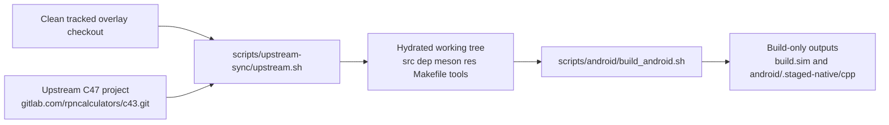

# Project And Upstream Contract

This page explains what R47 Android is, what the upstream C47 project is, what
this repository owns, and where the Android overlay interfaces with upstream-
owned sources and runtime behavior.

Read this page first. The build, Kotlin, JNI, rendering, and CI pages assume
this ownership boundary is already clear.

## At A Glance

- R47 Android is the independently maintained Android shell and maintainer
  overlay for the R47 variant.
- The authoritative upstream project is the C47 core configured in
  `upstream.source`.
- This repository owns Android-specific Kotlin, JNI, scripts, CI, and docs.
- The upstream project owns the shared calculator core and the upstream-shaped
  root source tree consumed by the Android lane.
- `android/.staged-native/cpp` is a build input root, not a source-of-truth
  root.

## Clean Overlay Checkout Before Hydration

Before hydration, Git tracking keeps the repo-owned overlay paths and excludes
the upstream payload at the repo root.

That tracked clean overlay state is:

```text
repo root, clean tracked overlay
|- .github/
|- .gitignore
|- COPYING
|- README.md
|- android/
|  |- app/src/main/java/io/github/ppigazzini/r47zen/
|  |  |- R47Geometry.kt
|  |  `- R47KeypadPolicy.kt
|  |- app/src/main/cpp/r47_android/
|  |- docs/dev/
|  `- r47-defaults.properties
|- scripts/
|  |- android/
|  |- r47_contracts/
|  |  `- data/
|  `- upstream-sync/
`- upstream.source
```

Maintainer-local ignored paths such as `__DEV/`, `.venv/`, or `upstream.lock`
may also exist in a local workspace, but they are not part of the tracked clean
overlay contract.

## Working Tree After Hydration

After `./scripts/upstream-sync/upstream.sh sync --auto --write-lock`, the
working tree also contains the upstream-shaped root inputs that the Android
overlay consumes.

That hydrated state adds paths such as:

```text
repo root, hydrated working tree
|- .github/
|- android/
|- scripts/
|- upstream.source
|- src/
|- dep/
|- meson.build
|- meson_options.txt
|- res/fonts/
|- Makefile
|- docs/code/
|- subprojects/
`- tools/
```

Hydration does not mean the Android build outputs already exist.

`build.sim/` and `android/.staged-native/cpp/` appear later when the Android
build regenerates simulator outputs and stages native compile inputs.

## Hydration And Build State Flow



## What This Repository Is

R47 Android is not a generic Android sample app and not a plain mirror of the
upstream calculator source tree.

It is the independently maintained Android shell, build pipeline, packaging
layer, and maintainer overlay for the R47 calculator variant.

It is not the official upstream Android release channel for C47. Store-facing
names, listing copy, and policy declarations should avoid implying that this
repository speaks for the upstream project team or for the wider R47
community.

Its main responsibilities are:

- the Android app module under `android/`
- the Android-owned native bridge under
  `android/app/src/main/cpp/r47_android`
- repo-only sync, staging, build, packaging, contract, and workload scripts
  under `scripts/`
- GitHub Actions workflow and release plumbing under `.github/`
- maintainer documentation under `android/docs/dev/`

## What The Upstream Project Is

The authoritative upstream project is the C47 calculator core configured in
`upstream.source`.

Current checked-in defaults:

- upstream URL: `https://gitlab.com/rpncalculators/c43.git`
- upstream ref: `HEAD`

That GitLab path still uses the historical `c43` repository name, but the
upstream project identifies itself as C47.

For this repository, the upstream project is the owner of the shared calculator
engine, simulator-oriented source tree, core keyboard and menu behavior,
generated native inputs, root Meson build graph, and related root assets used
by the Android lane.

## What This Repository Owns Versus What It Consumes

This repository owns the Android overlay.

Upstream owns the shared calculator behavior.

In practice, that split looks like this:

- repo-owned overlay paths: `android/`, `scripts/`, `.github/`, `__DEV/`, and
  `upstream.source`
- upstream-shaped shared inputs when hydrated: `src/`, `dep/decNumberICU`,
  `meson.build`, `meson_options.txt`, repo-root `res/fonts`, and other root
  build inputs used by the active lane
- build-only Android staged native inputs:
  `android/.staged-native/cpp`

Do not treat the build-only staged tree as a source-of-truth boundary. It is a
compiled-input boundary, not the owner of shared calculator logic.

## Ownership Table

| Surface | Owner | Purpose |
| --- | --- | --- |
| `android/app/src/main/java/io/github/ppigazzini/r47zen` | this repo | Android lifecycle, UI, storage, and shell behavior |
| `android/app/src/main/cpp/r47_android` | this repo | JNI, Android HAL seams, and Android runtime compatibility |
| `scripts/android/` | this repo | Android staging, build, and packaging automation |
| `scripts/upstream-sync/` | this repo | upstream resolution and overlay restore boundary |
| `src/`, `dep/`, `meson.build`, `res/fonts` | upstream when hydrated | shared calculator core and build inputs |
| `android/.staged-native/cpp` | generated build input | Android native compile input only |

## Interface With The Upstream Project

This repo interfaces with upstream in three layers.

### 1. Source Sync Boundary

`scripts/upstream-sync/upstream.sh` resolves the authoritative upstream URL and
commit, hydrates the required upstream-shaped root inputs, and restores only
the repo-owned overlay paths from this repository.

That boundary is about source ownership and refresh policy.

### 2. Build And Staging Boundary

`scripts/android/build_android.sh` and its helpers consume the upstream-shaped
root tree, rebuild the required `build.sim` outputs, and stage shared-native
inputs into `android/.staged-native/cpp` for the Android native build.

That boundary is about compile inputs and staging, not about Android runtime
behavior yet.

### 3. Runtime Interface Boundary

The Android app and bridge layers call into the staged upstream core through
JNI and Android-owned HAL compatibility code.

At runtime, the Android overlay is responsible for:

- lifecycle and settings coordination in Kotlin
- input dispatch from touch, keyboard, and menus
- SAF-backed storage UI and file-descriptor handoff
- Android event-loop compatibility shims around the staged `PC_BUILD` core
- LCD projection and keypad-scene rendering on Android views

The upstream core remains the owner of calculator state, command execution,
menu logic, and most shared keypad or display semantics.

## Runtime Boundary Summary

- Kotlin owns lifecycle, settings, storage UI, and Android view rendering.
- JNI and `r47_android` own registration, marshalling, and Android runtime
  compatibility.
- The staged upstream core owns calculator execution and shared runtime state.

## What To Read Next

- Read `10-build-and-source-layout.md` next for how the overlay builds and
  compiles.
- Read `50-upstream-interface-surfaces.md` when you need the detailed Android-
  to-upstream interface map.
- Read `60-runtime-hot-paths.md` when you need the redraw, lock-boundary, and
  loop-sensitive runtime paths.

## Maintenance Rules

- Fix shared calculator behavior in canonical upstream-owned sources, not in the
  build-only staged Android tree.
- Fix Android runtime integration in Kotlin, JNI, HAL, CMake, or script
  surfaces owned by this repository.
- Explain the upstream project and the ownership boundary before describing
  build steps or implementation details in new maintainer docs.
