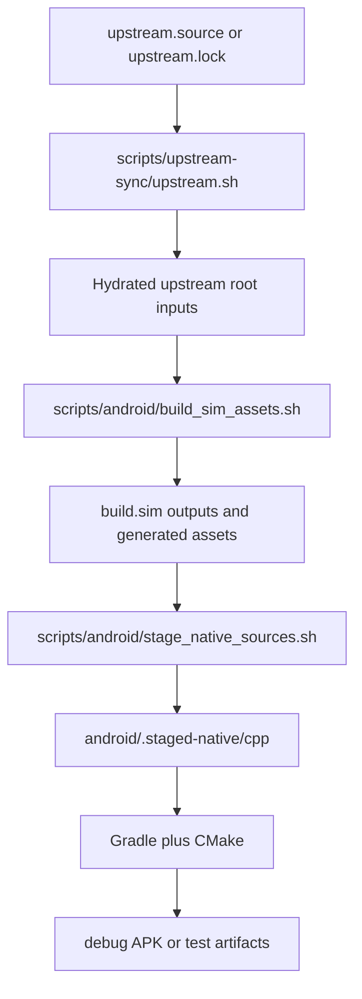

# Build And Source Layout

This page is the canonical Android ownership, build, and rebuild contract for
this repository. Do not split that contract into a second guide.

Read `00-project-and-upstream.md` first. This page starts after the project,
upstream, and ownership boundary are already established.

Use this page for build entrypoints, source ownership, staged-input boundaries,
and checkout-sensitive root surfaces. Read
`07-ci-and-release-workflow.md` for the GitHub Actions lane split and
`03-upstream-interface-surfaces.md` for the Android-facing upstream
interface map. Read `08-tests-and-contracts.md` for the contract-to-test and
rerun-lane map.

## Build At A Glance

- `scripts/upstream-sync/upstream.sh` resolves and hydrates upstream inputs.
- `scripts/android/build_android.sh` is the canonical full Android build path.
- `scripts/android/build_sim_assets.sh` rebuilds the required `build.sim`
  outputs.
- `scripts/android/stage_native_sources.sh` and related helpers refresh
  `android/.staged-native/cpp`.
- Gradle and CMake then compile the Android app against the staged native tree.
- The upstream Meson graph already hard-enables `b_lto=true` for the desktop
  `c47` and `r47` simulator executables in `src/c47-gtk/meson.build`.
- The Android-owned `r47zen` CMake target keeps one shared library load
  path and applies target-scoped ThinLTO compile and link flags on the
  release-native configs, `Release` and `RelWithDebInfo`, using `lld` for the
  link step.

## Python Maintainer Tooling

- The grouped contract lane under `scripts/r47_contracts/` is maintained
  through the repo root `pyproject.toml` and should be run with `uv run
  --group dev ...`.
- Keep the full Python `3.14` dev tool set available in that environment:
  `ruff`, `ty`, and `fontTools`.
- The font-policy, visual-policy, and top-label derivation scripts inspect the
  shipped calculator fonts through `fontTools`, so a partial Python setup is
  not enough for the full contract lane.

## Build-Relevant File Layout

```text
repo root
|- upstream.source
|- meson.build
|- meson_options.txt
|- src/                                       # hydrated upstream core
|- dep/decNumberICU                           # hydrated upstream dependency
|- res/fonts/                                 # hydrated upstream build input
|- build.sim/                                 # generated Meson outputs
|- scripts/
|  |- android/
|  |  |- build_android.sh
|  |  |- build_sim_assets.sh
|  |  `- stage_native_sources.sh
|  |- r47_contracts/
|  |  |- data/
|  |  |  |- r47_physical_geometry.json
|  |  |  `- r47zen_ui_contract.json
|  |  |- validate_geometry_dataset.py
|  |  |- derive_touch_grid.py
|  |  |- derive_shell_geometry.py
|  |  |- derive_key_label_geometry.py
|  |  |- derive_key_visual_policy.py
|  |  `- derive_top_label_lane_layout.py
|  `- upstream-sync/upstream.sh
`- android/
  |- app/src/main/java/io/github/ppigazzini/r47zen/
  |  |- C47TextRenderer.kt
  |  |- CalculatorKeyView.kt
  |  |- CalculatorSoftkeyPainter.kt
  |  |- KeyRenderPainter.kt
  |  |- KeyRenderSpec.kt
  |  |- MainKeyLabelMirrors.kt
  |  |- SoftkeyOverlayPainter.kt
  |  |- R47Geometry.kt
  |  |- R47KeypadPolicy.kt
  |  `- TopLabelLaneLayout.kt
    |- app/src/main/cpp/r47zen/
  |- docs/dev/
  |- .staged-native/cpp/
  |- gradle/wrapper/
  `- r47-defaults.properties
```

## Build Flow



## Checkout-sensitive root surfaces

Public and partial checkouts do not always keep the full upstream-shaped root
tree present at rest. `scripts/upstream-sync/upstream.sh` and
`scripts/android/build_android.sh` hydrate or verify the required root inputs
for the active lane.

Do not treat the absence of one root file in one checkout as proof that the
Android contract changed. Verify whether the surface is checked in locally,
hydrated on demand, or only exercised in CI before updating the docs.

## Checked-in defaults

- machine-readable Android tool defaults live in
  `android/r47-defaults.properties`; the checked-in values currently cover
  Java `17`, `compileSdk 37`, `targetSdk 37`, `minSdk 24`, build tools
  `37.0.0`, `ndkVersion 29.0.14206865`, CMake `3.22.1`, default ABI filter
  `arm64-v8a`, hosted Android test API `34`, hosted Android test ABI filters
  `arm64-v8a,x86_64`, and the pinned xlsxio URL plus commit.
- settings-owned repositories via `android/settings.gradle`
- version catalog `android/gradle/libs.versions.toml`, which owns the checked-in
  AGP `9.2.1` plugin coordinate plus AndroidX and Material library versions.
- Jetifier explicitly disabled in `android/gradle.properties`
- base `namespace` and `applicationId` `io.github.ppigazzini.r47zen`
- Android app, debug, release, JVM-test, and instrumentation-test sources live under
  `app/src/**/java/io/github/ppigazzini/r47zen` so manifest, layout, and JNI class
  wiring stay aligned with that checked-in identity
- debug builds add `applicationIdSuffix ".debug"`
- release version inputs come from `r47.versionCode`, `r47.versionName`, and
  `r47.coreVersion`
- release minify and resource shrinking default to on via
  `r47.releaseMinify` and `r47.releaseShrinkResources`
- `r47.releaseChannel=dev` switches the release install identity to `.dev`,
  appends `-dev.<token>` to `versionName`, defaults `testBuildType` to
  `release`, and uses dedicated prerelease signing when the full
  `R47_PRERELEASE_*` or `r47.prerelease*` input set is present
- release native debug symbols default to `FULL` via
  `r47.releaseNativeDebugSymbolLevel`

## Dependency update cadence

- Update `android/r47-defaults.properties` when SDK, NDK, CMake, build-tools,
  hosted-emulator, or xlsxio pins change, then rerun `./scripts/android/build_android.sh --doctor`
  before a broader build.
- Review AGP compatibility and JDK requirements whenever a new AGP stable line
  is adopted; keep `android/gradle/libs.versions.toml` and
  `android/r47-defaults.properties` aligned when that happens.
- Review compile and target SDK levels when Android publishes the next stable
  API level, and keep local plus hosted test lanes on explicit API images.
- Review NDK and CMake pins when Android's AGP/NDK guidance or CMake release
  notes move, and rerun packaging checks before landing the update.
- Kotlin is intentionally unpinned in `android/gradle/libs.versions.toml`: the
  build rides the Kotlin compiler bundled with the pinned AGP line (AGP `9.2.1`)
  rather than a standalone Kotlin plugin, so there is no `kotlin` catalog entry
  to drift against AGP. This avoids AGP/compiler skew, where an explicit Kotlin
  pin newer or older than the one AGP expects can break the build. Add a
  `kotlin` catalog entry and the Kotlin Gradle plugin only when a concrete task
  needs a compiler newer than the AGP line bundles; until then, reviewing
  Kotlin's current stable line on the JetBrains release page during quarterly
  maintenance is informational, not a pin to bump.
- Review the xlsxio pin only when upstream font-generation behavior, security
  fixes, or CI breakage require it.

## Repository ownership map

Top-level repo-owned overlay paths:

- `android/` owns the Android shell, compat inputs, compliance assets, and
  maintainer docs. That includes the repo-owned notice inventory used for
  Android packaging and the shared `mini-gmp` notice text consumed by
  simulator CI artifacts. It also owns the policy for copying notice text from
  hydrated upstream submodules such as `dep/jimtcl` when those modules become
  part of maintained CI package evidence.
- `scripts/` owns repo-only automation, including the stable maintainer
  entrypoints `scripts/android/build_android.sh` and
  `scripts/upstream-sync/upstream.sh`, plus grouped implementations under
  `scripts/android/`, `scripts/r47_contracts/`, `scripts/upstream-sync/`,
  `scripts/keypad-fixtures/`, `scripts/package-notices/`, and
  `scripts/workload-regressions/`.
- `.github/` and `upstream.source` are repo-owned overlay paths outside the
  Android module.

Shared upstream-shaped top-level surfaces when the active lane hydrates them:

- `src/`
- `dep/decNumberICU` and related upstream root build inputs
- `meson.build` and `meson_options.txt`
- repo-root `res/fonts`
- fuller-hydration or CI-owned upstream surfaces such as `Makefile`,
  `docs/code/meson.build`, `subprojects/`, and `tools/`

Maintenance rule:

- add new repo-owned automation under `scripts/` and its grouped feature
  folders, not under `tools/`, `src/`, or other upstream-shaped folders.

## Android Root Dependency Split

When auditing top-level stale paths for Android, do not use repo-wide activity
as proof that Android still needs a path. The current Android lane has a
narrower dependency set.

Current full-lane hard dependencies:

- the hydrated upstream root Meson inputs `meson.build`,
  `meson_options.txt`, and `dep/meson.build`, because the Android-owned helper
  configures the root Meson build graph directly for `build.sim`
- hydrated upstream `dep/decNumberICU`, because Android staging and the staged
  native CMake build both consume it

Current full-lane Android-owned build entry:

- `scripts/android/build_sim_assets.sh`, which reconfigures `build.sim` with
  `-DRASPBERRY=false -DDECNUMBER_FASTMUL=true` and runs `ninja sim`. When the
  explicit test mode is enabled, it also builds `testPgms`, stages
  `build.sim/src/generateTestPgms/testPgms.bin` into `res/testPgms/`, and runs
  `meson test -C build.sim --print-errorlogs`.

Current root surfaces no longer on the Android lane:

- `Makefile`
- `tools/onARaspberry`
- `subprojects/gmp-6.2.1/mini-gmp`

Current `--android-only` lane behavior:

- does not execute `Makefile` or Meson
- still verifies freshness against current canonical `src/c47`,
  `dep/decNumberICU`, generated outputs under `build.sim`, canonical fonts
  under `res/fonts`, and the tracked Android mini-gmp staging source before
  Gradle reuses the staged tree

Current non-Android root surfaces that should not be used to justify Android
ownership claims:

- `dist.sh`
- upstream DMCP SDK submodule paths under `dep/DMCP_SDK` and
  `dep/DMCP5_SDK`, which the current repo does not carry locally and the
  Android lane never stages
- cross-build helper tools such as `tools/add_pgm_chsum`, `tools/modify_crc`,
  `tools/gen_qspi_crc`, and `tools/size.py`

## Build entry points

Public maintainer entrypoints:

- `./scripts/upstream-sync/upstream.sh sync --auto --write-lock` is the
  authoritative upstream hydration entry point. It
  reads Git-tracked defaults from `upstream.source`, uses a Git-ignored local
  `upstream.lock` only when it contains `upstream_commit`, otherwise resolves
  the latest commit from the configured upstream ref, writes the resolved state
  back to `upstream.lock`, overlays the resolved upstream tree, restores only
  repo-owned files from `HEAD`, leaves shared upstream-shaped root files such as
  `Makefile`, `meson.build`, `meson_options.txt`, `dep/`,
  `docs/code/meson.build`, `subprojects/`, and `tools/` upstream-owned, and
  refuses dirty tracked worktrees unless `--force` is passed.
- `./scripts/android/build_android.sh` is the authoritative Android debug-build
  entry point. It detects Java and the Android NDK, resolves one shared
  upstream commit through `scripts/upstream-sync/upstream.sh`,
  hydrates that resolved core when `src/c47`, the root Meson inputs,
  `dep/decNumberICU`, or canonical calculator fonts are missing, runs
  `scripts/android/build_sim_assets.sh` to reconfigure `build.sim` through
  Meson and build `ninja sim`,
  stages native inputs into
  `android/.staged-native/cpp`, regenerates staged native metadata there,
  requires the canonical calculator font assets under repo-root `res/fonts`, writes
  `android/local.properties`, and runs Gradle clean plus `assembleDebug` through
  the repo `./gradlew` launcher backed by the tracked wrapper runtime under
  `android/gradle/wrapper/`. Missing wrapper files are a repo-integrity
  failure, not a signal to fall back to host Gradle. It
  also exposes `--doctor` for SDK, NDK, CMake, xlsxio, upstream-lock, and
  staged-input plus font-source status, `--run-sim-tests` for the explicit
  Android and NDK parity lane that forwards test execution into
  `scripts/android/build_sim_assets.sh --run-tests`, and `--android-only` for
  the fast module-local lane that refuses stale staged native inputs.
  `--collect-host-pgo` and `--validate-release-pgo` are full-build-only flags
  that let the wrapper own the host-side PGO collector and the Android
  release-native consumer check in one pass, while `--host-pgo-output-dir`
  chooses the emitted `.profdata` location.
  It also forwards optional extra Gradle arguments from `R47_GRADLE_ARGS`, which
  is how hosted CI applies the temporary multi-ABI emulator override. Add
  `--verify-packaging` when you want the local build to write the same release
  evidence files CI publishes for Android APK artifacts.
- `./scripts/android/build_android.sh --android-only` is the preferred fast Android-only path.
  It skips Meson and native restaging, and refuses to continue unless
  `android/.staged-native/cpp/STAGED-INPUTS.properties` still matches the
  canonical root, generated inputs, the tracked Android mini-gmp staging
  source, and the current calculator font source.
- `./scripts/android/build_android.sh --run-sim-tests` is the preferred local
  reproduction path for Android-lane simulator parity. It requires the full
  build path, stages `res/testPgms/testPgms.bin` before the suite runs, and is
  intentionally incompatible with `--android-only`.
- `./scripts/android/build_android.sh --run-sim-tests --collect-host-pgo --validate-release-pgo`
  is the CI-matching Android build lane when you need the wrapper to own the
  host-core PGO collector and the release-native consumer check in one pass.
- `cd android && ./gradlew assembleDebug` is appropriate only when the staged
  build-only native tree under `android/.staged-native/cpp` is already current
  and the change is isolated to the Android module.
- `cd android && ./gradlew lint` is the maintained Android Lint lane when
  Kotlin, Java, manifest, resource, or Android Gradle files change and the
  staged build-only native tree is already current. Lint is not run
  automatically by `assembleDebug`, so CI and local maintainer verification
  need to call it explicitly.
- `cd android && ./gradlew :app:bundleRelease` or
-  `cd android && ./gradlew :app:assembleRelease` is the module-local release
  lane only when the staged build-only native tree is already current. Release
  builds remain unsigned unless all `r47.releaseStore*` and `r47.releaseKey*`
  inputs are supplied together.
- `cd android && ./gradlew :app:testDebugUnitTest` validates the Robolectric
  and fixture-backed Android JVM suite when the build-only staged native tree
  is already current.
- `cd android && ./gradlew :app:assembleDebugAndroidTest` compiles and
  packages the instrumentation suite and stages generated
  `program-fixtures/PROGRAMS` assets through `generateProgramFixtureAssets`.
  `:app:connectedDebugAndroidTest` requires a device or emulator, and
  `-Pr47.abiFilters=arm64-v8a,x86_64` is the supported override when that
  emulator is `x86_64`. The current required emulator-backed coverage includes
  the repo-owned `scripts/android/run_connected_android_tests.sh` wrapper,
  which runs the non-fixture instrumentation classes plus one filtered
  `ProgramFixtureInstrumentedTest` method per required `.p47` file. That keeps
  `BinetV4.p47`, `GudrmPL.p47`, `MANSLV2.p47`, `NQueens.p47`, and
  `SPIRALk.p47` in isolated `connectedDebugAndroidTest` selections under GNU
  `timeout --kill-after` so a hung fixture degrades coverage instead of
  wedging the whole emulator step. Inside each selection,
  `ProgramFixtureInstrumentedTest` still loads the program through the Android
  `READP` path, and the `MANSLV2` selection remains bounded: once the harness
  observes real run activity it publishes a direct stop through the same
  native stop seam that backs live `R/S` and `EXIT`. The required emulator
  coverage also includes `DisplayLifecycleInstrumentedTest`, which proves that
  background save and a Settings-style pause or resume preserve the visible
  packed LCD snapshot on a staged `SPIRALk` graph.
- `ProgramFixtureInstrumentedTest` also treats LCD redraw activity from the JNI
  snapshot as valid run evidence for fast-returning fixtures such as
  `GudrmPL.p47`, matching the host workload harness instead of requiring only
  step, pause, wait, or `VIEW` markers.
- `MANSLV2.p47` remains an upstream example program whose public export text
  still calls it a manual solver with no checks and stabilisations, so the repo
  treats it as a bounded interrupt contract rather than a completion contract.
  Both the host and Android-owned lanes must let it show post-load activity,
  then publish a direct stop inside a maintained budget and require a clean
  stop verdict without calculator error.
- `make sim` is the canonical root simulator and generator validation path for
  the upstream-shaped desktop lane. Android full builds now drive the same
  `build.sim` Meson/Ninja targets through `scripts/android/build_sim_assets.sh`
  instead of routing through the root Makefile, while parity on the Android
  build/test/package lane comes from
  `./scripts/android/build_android.sh --run-sim-tests`, which stages the
  generated `testPgms.bin` into `res/testPgms/` before running
  `meson test -C build.sim`.

Internal helpers:

- `scripts/upstream-sync/upstream.sh` owns the grouped upstream resolution and
  sync implementation. Document the grouped path directly when the task is
  about upstream resolution or restore-boundary internals.
- `scripts/android/build_android.sh` owns the grouped Android build
  implementation.
- `scripts/android/build_sim_assets.sh` owns the Android full-lane
  `build.sim` Meson/Ninja generation step, plus the optional simulator-native
  test lane when `--run-tests` is set, and is normally invoked by
  `scripts/android/build_android.sh` or
  `scripts/android/prepare_native_build_inputs.sh`.
- `scripts/android/stage_native_sources.sh` stages canonical native inputs into
  `android/.staged-native/cpp` and is normally invoked by
  `scripts/android/build_android.sh`.
- `scripts/android/generate_staged_native_metadata.sh` refreshes
  `STAGED-SOURCE-MANIFEST.txt` and `staged_native_sources.cmake` inside the
  build-only staging root. It is an internal helper, not a primary maintainer
  entrypoint.
- `scripts/android/compute_staged_native_inputs.sh` fingerprints the canonical root,
  generated, calculator-font, and mini-gmp inputs behind `--android-only`
  freshness checks and writes `STAGED-INPUTS.properties` during staging.
- `scripts/android/stage_program_fixture_assets.sh` stages canonical upstream
  `res/PROGRAMS` fixtures into generated Android runtime assets for
  instrumentation coverage and is invoked by `generateProgramFixtureAssets` in
  `android/app/build.gradle`.
- `scripts/keypad-fixtures/export_upstream_keypad_fixtures.sh` owns the grouped
  keypad-fixture exporter implementation.
- `scripts/android/run_connected_android_tests.sh` owns the grouped hosted
  emulator instrumentation wrapper. It runs the non-fixture Android test
  classes directly and executes each canonical `PROGRAMS` fixture as its own
  filtered `connectedDebugAndroidTest` selection under GNU `timeout`.
- `scripts/workload-regressions/run_workload_regressions.sh` owns the grouped
  workload-regression implementation: it compiles the host harness once, runs
  each required fixture in its own host process, and applies the same outer
  timeout-and-kill safety net to every canonical `PROGRAMS` fixture. This is
  the focused host compatibility harness, not the normal pull-request owner of
  the collector-driven host-core PGO contract.
- `scripts/workload-regressions/collect_host_pgo_profile.sh` owns the lower-
  level host-core PGO collector implementation: it builds instrumented
  upstream `src/testSuite/testSuite` with the pinned NDK Clang plus ThinLTO,
  trains on the maintained `broad-ci` corpus of `programs`, `tvm`,
  `jacobi_audit`, `normal_i`, `gamma`, `trig`, `prime`, `factorial`, and an
  upstream-derived `matrix_prefix_85` slice from `src/testSuite/tests/matrix.txt`,
  stages `res/testPgms/testPgms.bin` into a runtime root when `programs.txt`
  is included, then runs the imported `.p47` fixture overlay through the host
  compatibility path so those workloads also contribute raw profiles to the
  same merged `.profdata`, and is normally invoked through
  `scripts/android/build_android.sh --collect-host-pgo`.
- `scripts/package-notices/generate_simulator_notice_artifacts.sh` owns the
  grouped simulator-package notice implementation.

## Canonical versus staged native inputs

Canonical inputs for shared core work:

- `src/c47`
- `dep/decNumberICU`
- generated outputs under `build.sim`
- Android-only code under `android/app/src/main/java`
- Android bridge, HAL, and stub code under `android/app/src/main/cpp/r47zen`
- the tracked Android mini-gmp staging source under
  `android/compat/mini-gmp-fallback`

Staged Android inputs built by CMake:

- `android/.staged-native/cpp/c47`
- `android/.staged-native/cpp/decNumberICU`
- `android/.staged-native/cpp/generated`
- `android/.staged-native/cpp/gmp`

Development rule:

- Change the canonical root sources for shared calculator behavior.
- Change the build-only staged tree directly only when working on staging logic
  or generated metadata.
- Change tracked Android-specific code under
  `android/app/src/main/cpp/r47zen` for shims, stubs, and bridge logic.

Build-safety rule:

- The synced upstream `src/**` tree, including `src/**/meson.build`, is
  authoritative for the shared native build graph.
- `scripts/upstream-sync/upstream.sh sync --auto --write-lock` and hosted CI
  overlay the resolved upstream tree first and
  then restore repo-owned files from Git, so restore allowlists and generic
  restore loops must never restore `src/**` or other shared upstream-shaped
  root files such as `Makefile`, `meson.build`, `meson_options.txt`, `dep/`,
  `docs/code/meson.build`, `subprojects/`, or `tools/`.
- `scripts/upstream-sync/upstream.sh verify-restore-boundary` is the focused
  guard for that contract, and `sync` runs the same check before it restores
  tracked repo-owned paths.
- Android-only native fixes belong under
  `android/app/src/main/cpp/r47zen` or in staging logic, not in tracked
  root `src/**` overrides.
- The former tracked directories
  `android/app/src/main/cpp/{c47,decNumberICU,generated,gmp}` are retired
  snapshot paths and must stay absent during normal builds.

## Android build flow

1. `scripts/upstream-sync/upstream.sh sync --auto --write-lock` overlays the
   resolved upstream core into the working tree,
  validates that the restore allowlist stays off upstream-owned root surfaces,
  hydrates the ignored upstream-owned root build inputs, restores tracked
  Android-port files, and refreshes the local ignored `upstream.lock` with the
  commit used for that run.
2. `scripts/android/build_android.sh` runs `scripts/android/build_sim_assets.sh`, which
  reconfigures `build.sim` through Meson with Android-owned options and then
  builds `ninja sim` directly.
3. `scripts/android/stage_native_sources.sh` copies the synced core tree,
  `dep/decNumberICU`, generated outputs, `vcs.h`, and mini-gmp inputs into
  `android/.staged-native/cpp`, then regenerates
  `STAGED-SOURCE-MANIFEST.txt`, `staged_native_sources.cmake`, and
  `STAGED-INPUTS.properties` there.
4. `android/app/build.gradle` invokes CMake at
   `android/app/src/main/cpp/CMakeLists.txt` and passes
   `-DR47_STAGED_CPP_DIR=<repo>/android/.staged-native/cpp`.
5. CMake regenerates the staged metadata when needed, selects `-DOS32BIT` or
  `-DOS64BIT` from `ANDROID_ABI`, and builds the `r47zen` shared library from
  the build-only staged core, explicit decNumberICU sources, generated files,
  Android bridge files, and mini-gmp without using recursive globs.
6. Gradle packages the debug APK as
  `android/app/build/outputs/apk/debug/app-debug.apk`.
7. When the caller requests packaging verification, the repo-owned helper
  `scripts/android/collect_packaging_evidence.sh` copies that APK to the
  published Android debug artifact name
  `r47zen-<upstream short>-<android short>-debug.apk` and writes ABI,
  zipalign, ELF `LOAD` segment, SHA256, and provenance evidence beside it. The
  expected ABI list comes from `R47_VERIFY_PACKAGING_ABIS` when set, else the
  active `-Pr47.abiFilters=...` override forwarded through `R47_GRADLE_ARGS`,
  else `R47_DEFAULT_ANDROID_ABI_FILTERS`.

## Local Start-To-End Pipeline

Use this order when you want the same local maintainer flow that the repo now
expects from a clean shell:

1. Run `./scripts/android/build_android.sh --doctor` to confirm SDK, NDK, CMake,
   font-source, and staged-input readiness.
2. Run `./scripts/upstream-sync/upstream.sh sync --auto --write-lock` to
  hydrate the authoritative upstream core,
   the upstream-shaped root build inputs, and the canonical calculator font
   tree.
3. If `xlsxio_xlsx2csv` is not installed system-wide, export the cached pinned
   helper before the simulator lane:

   ```bash
   export PATH="$HOME/.cache/r47/xlsxio/$(sed -n 's/^R47_DEFAULT_XLSXIO_COMMIT=//p' android/r47-defaults.properties)/bin:$PATH"
   ```

4. Run `make test` for the root simulator and native suite.
5. Run `./scripts/android/build_android.sh` for the full Android lane. That regenerates
   `build.sim`, refreshes `android/.staged-native/cpp`, writes
  `android/local.properties`, and assembles the debug APK through `./gradlew`.
6. Run the Android JVM and instrumentation-assembly lane from `android/` with
  `./gradlew`:

   ```bash
   cd android
   ./gradlew --max-workers 8 \
     :app:testDebugUnitTest :app:assembleDebugAndroidTest
   ```

   Host `gradle` is not a supported fallback. If `./gradlew` or
   `android/gradle/wrapper/` is missing, restore the tracked wrapper files.

7. Check `adb devices`. Only run `:app:connectedDebugAndroidTest` when at least
   one device or emulator is attached. If the emulator is `x86_64`, add
   `-Pr47.abiFilters=arm64-v8a,x86_64`.
8. When the task needs runtime proof on a real 16 KB target, run the focused
  connected-device lane:

  ```bash
  bash ./scripts/android/run_16kb_runtime_smoke.sh
  ```

  The script fails unless the target reports `16384`-byte pages, then runs the
  explicit activity-recreation lifecycle probe.

Practical note:

- `./scripts/android/build_android.sh --doctor` validates the pinned xlsxio cache, but
  `make test` still needs `xlsxio_xlsx2csv` on `PATH` unless it is installed
  system-wide.

## CI lane

The GitHub Actions workflow at `.github/workflows/android-ci.yml` keeps the same
ownership model as the local build. `07-ci-and-release-workflow.md` owns the full
lane split, per-job descriptions, artifact names, and release gating; this
section records only the build-layout details that live here.

- Each consuming job recreates its own `Load shared Android defaults` step. Step
  outputs stay local to the current job unless they are promoted through
  `jobs.<job_id>.outputs` and consumed via `needs.<job_id>.outputs.*`.
- The Windows simulator lane keeps any bootstrap step that runs before
  `msys2/setup-msys2` on an explicit host shell, then uses the job-level
  `msys2 {0}` default only after MSYS2 is installed.

The CI lane verifies packaged ABIs and 16 KB alignment. Runtime execution on a
real 16 KB target stays a local maintainer lane through
`scripts/android/run_16kb_runtime_smoke.sh`. This is not a store-release lane.

Store-release signing lives in the separate protected workflow
`.github/workflows/android-release.yml`. That workflow is manual-dispatch only,
is bound to the `production-release` environment, and expects protected
production signing secrets there. See `07-ci-and-release-workflow.md`.

## Release and packaging policy

This section keeps the build-configuration policy that lives with the build
layout. See `07-ci-and-release-workflow.md` for the CI lane split, the signed
dev-prerelease publication, the protected production release workflow, artifact
names, and release gating.

- The Android app keeps the default checked-in lane debug-first. Release work is
  opt-in and remains a maintainer lane.
- `android/app/build.gradle` defines release signing from
  `r47.releaseStoreFile`, `r47.releaseStorePassword`, `r47.releaseKeyAlias`,
  and `r47.releaseKeyPassword`. Supplying only some of those values is a hard
  configuration error.
- Release builds default `minifyEnabled` and `shrinkResources` to `true` and
  request `ndk.debugSymbolLevel "FULL"`.
- `bundleRelease` is the canonical AAB command. `assembleRelease` remains
  available when an APK is required for local inspection or GitHub distribution.
- `scripts/android/collect_packaging_evidence.sh` is the canonical provenance
  collector for both CI and local packaging checks. For debug it verifies ABI
  contents, zip alignment, and ELF `LOAD` segment alignment. For release it also
  accepts a bundle, mapping file, and native-symbol archive so provenance can
  travel with the output.

## Verification by change type

- Kotlin-only Android UI changes: `cd android && ./gradlew assembleDebug` when
  the build-only staged native tree is already current.
- Android module-only changes with the staged tree already current:
  `./scripts/android/build_android.sh --android-only`.
- Host or cache diagnosis before building: `./scripts/android/build_android.sh --doctor`.
- Robolectric, release-test-helper, or runtime-seam changes:
    `cd android && ./gradlew :app:testReleaseUnitTest -Pr47.releaseChannel=dev -Pr47.testBuildType=release -Pr47.releaseMinify=false -Pr47.releaseShrinkResources=false`
  when the build-only staged native tree is already current.
- PROGRAMS fixture, SAF, release-source-set helper, or Activity Result
  lifecycle changes:
    `cd android && ./gradlew :app:assembleReleaseAndroidTest -Pr47.releaseChannel=dev -Pr47.testBuildType=release -Pr47.releaseMinify=false -Pr47.releaseShrinkResources=false`,
  then run `scripts/android/run_connected_android_tests.sh` on a device or
  emulator with the same prerelease signing inputs CI uses. Add
  `-Pr47.abiFilters=arm64-v8a,x86_64` when that emulator is `x86_64`. The
  current hosted gate now runs one grouped non-fixture selection plus one
  bounded `ProgramFixtureInstrumentedTest` selection that still covers
  `BinetV4.p47`, `GudrmPL.p47`, `MANSLV2.p47`, `NQueens.p47`, and
  `SPIRALk.p47`. That grouped PROGRAMS selection must still observe run
  activity, stop cleanly through the direct-stop seam, and fail the Android
  lane if its outer timeout is hit. When the change touches background save,
  Settings return, or packed-LCD lifecycle preservation, the same release-path
  wrapper lane must also pass `DisplayLifecycleInstrumentedTest`.
- JNI, HAL, CMake, or packaging changes: `./scripts/android/build_android.sh`.
- packaging evidence changes with local proof: `./scripts/android/build_android.sh --verify-packaging`
- root core or generator changes: `make test` and then `./scripts/android/build_android.sh`.
  If `xlsxio_xlsx2csv` is only available in the pinned cache, export the cached
  `~/.cache/r47/xlsxio/<commit>/bin` path first.
- CI-only changes: verify the touched workflow files against the local build
  contract and the artifact names described above. Keep Android artifact names
  on the `upstream short + Android short` rule and keep Linux plus Windows
  simulator package names upstream-only. When one job needs data from
  another, promote it through `jobs.<job_id>.outputs` and consume it via
  `needs.<job_id>.outputs.*` instead of reading another job's
  `steps.<step_id>.outputs.*`. In the Windows lane, keep any step that runs
  before `msys2/setup-msys2` on a host shell such as `pwsh` or `bash`. Keep the
  protected release workflow on the same wrapper-owned host-core optimization
  flow as `android-build-test-package`, and keep the signed bundle on the
  collected `r47-host-core.profdata` path.
- sync or restore-boundary changes: confirm restore logic still excludes `^src/`
  and does not reintroduce tracked local overrides under `src/**`; confirm the
  build-only staged metadata under `android/.staged-native/cpp` regenerates and
  the retired `android/app/src/main/cpp/{c47,decNumberICU,generated,gmp}`
  snapshot paths stay absent.

## When to rebuild from the top

Use `./scripts/android/build_android.sh` after any of the following:

- a sync from upstream
- changes under `src/c47`
- changes under `dep/decNumberICU`
- changes that affect generated files
- changes to `scripts/android/stage_native_sources.sh`
- changes to `android/app/src/main/cpp/CMakeLists.txt`
- changes that alter Android packaging or the JNI bridge surface

## Practical maintenance rules

- Treat the debug APK as a derived artifact, not as the source of truth.
- Keep `android/settings.gradle`, `android/gradle/libs.versions.toml`, and the
  app module in sync when dependency ownership changes.
- Keep `README.md`, `android/r47-defaults.properties`,
  `android/gradle/libs.versions.toml`, and CI defaults aligned when toolchain
  versions or package identity change.
- If a change affects both the canonical root tree and the staged Android tree,
  change the canonical owner first and restage the build-only Android tree.
- Keep the Android artifact identity and the upstream-only simulator package
  identity aligned across workflow code, release notes, and docs.
