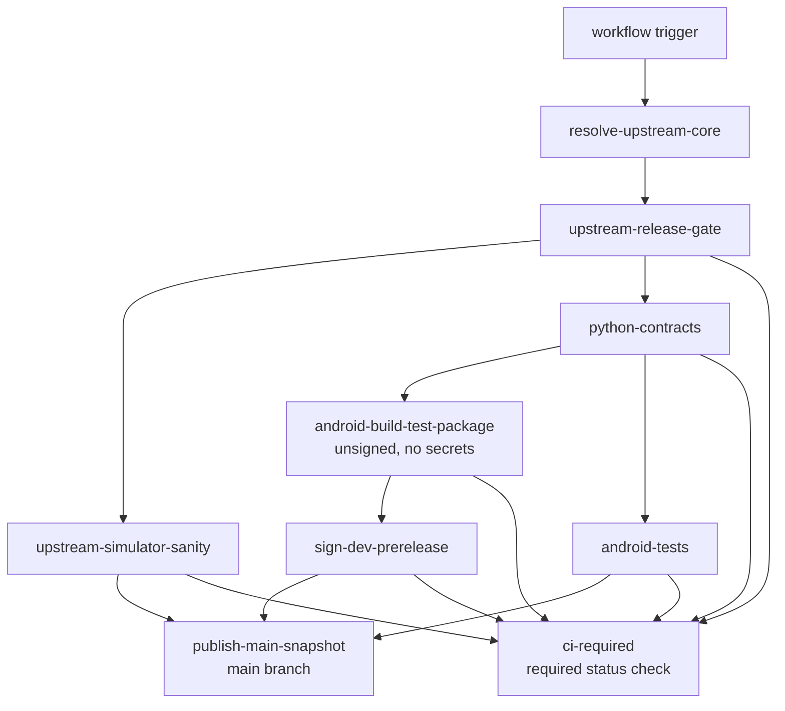
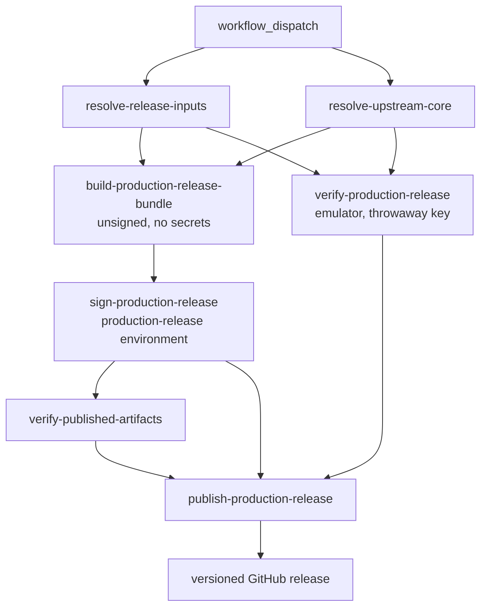

# CI And Release Workflow

This page explains the GitHub Actions lane split for the Android overlay, the
separate protected production-release workflow, what each job verifies, which
artifacts it publishes, and how to reproduce the same checks locally.

Read `00-project-and-upstream.md` first and
`01-build-and-source-layout.md` second. This page assumes the project and build
ownership boundary is already clear.

Read this page when a task touches `.github/workflows/android-ci.yml`, Android
build scripts, packaging evidence, instrumentation coverage, or release
publication. Read `08-tests-and-contracts.md` for the contract-to-suite map
behind those lanes.

## Workflow Graph



## CI At A Glance

- resolve one authoritative upstream commit per workflow run
- run the maintained Python contract suite as its own lane that gates the
  Android build and test lanes
- keep upstream simulator correctness separate from Android packaging and tests
- keep the Android build lane as the normal-CI owner of the collector-driven
  host-core PGO artifact and release-native consumer check without making that
  lane depend on emulator profiling
- make the protected release workflow rerun the same wrapper-owned host-core
  optimization flow before it signs the store bundle
- run Android lint explicitly instead of assuming Gradle builds cover it
- keep external `uses:` pins on full-length commit SHAs and keep the reviewed
  tag comment on the same line so the workflow stays auditable and
  Dependabot-readable; the repository's Actions setting `sha_pinning_required`
  fails any run that uses a tag-pinned action
- publish logs and packaging evidence as first-class artifacts
- publish the main snapshot only after all required lanes pass
- keep production signing and user-facing release publication in a separate
  protected manual-only workflow
- keep every signing key off any runner that syncs, compiles, or runs the
  upstream core: build jobs produce unsigned bytes and a dedicated signing job
  per lane signs them (see [Signing isolation](#signing-isolation))

## Workflow triggers and gating

The main workflow is `.github/workflows/android-ci.yml`.

It runs on:

- manual dispatch
- the nightly schedule
- pushes to `main` and to `github_ci`, the on-demand pre-merge branch:
  `git push --force-with-lease origin main:github_ci` runs every lane on a
  change before it reaches `main`
- pull requests

`linux-ci.yml` runs on the same pushes and pull requests plus its own nightly
schedule; `windows-ci.yml` runs on the same pushes and its nightly schedule, not
on pull requests.

The workflow uses one concurrency group per pull request or ref and cancels
superseded runs.

Before any heavy job runs, the workflow resolves the current authoritative
upstream commit and applies a release gate:

- `resolve-upstream-core` resolves the upstream URL and commit through
  `scripts/upstream-sync/upstream.sh resolve --latest`, so the lane always
  tracks the newest upstream HEAD rather than a frozen revision. Unless an
  explicit `upstream_commit` pin is supplied, the resolver **refuses** any mode
  other than `latest` and fails loudly, so a stale or locked configuration can
  never silently ship a non-HEAD core. It also logs the resolved commit
  (`Resolved upstream commit: <sha> (mode latest)`) so the shipped revision is
  visible in the resolve job before the heavy build runs. Because GitHub builds
  the workflow file at the ref a run is dispatched from, this latest-by-default
  behaviour only applies once the change is present on that ref; a release
  dispatched from an older ref runs that ref's older resolution logic
- `upstream-release-gate` computes the downstream Android prerelease tag from
  the resolved upstream commit plus the current Android repository commit, then
  decides whether the heavy lanes run:
  - a `push` moves the Android commit and a `workflow_dispatch` is an explicit
    rebuild request, so both always proceed
  - a `schedule` run proceeds only when no GitHub release exists yet for the
    computed `release_tag`. Because the tag is keyed on the resolved upstream
    short commit and the Android overlay short commit, an unchanged upstream and
    overlay means the prerelease already exists, so the nightly run skips the
    build, test, and publish lanes (`should_run=false`). A new upstream commit
    yields a new tag, which has no release yet, so the nightly run builds and
    tests the new artifact and surfaces any upstream regression

### Dev pre-release retention

Because a new `-dev` pre-release is minted for every new upstream/overlay
pair, the set grows over time. GitHub has no native release or tag TTL, so
`.github/workflows/prune-dev-releases.yml` enforces one. It runs on a daily
schedule (after the nightly build lanes) and on manual dispatch, and deletes
`-dev` pre-releases older than a TTL (default 7 days) while always retaining
the newest few (default 3). It removes each deleted release's git tag with
`gh release delete --cleanup-tag`, so no orphan tags remain.

The filter matches only `isPrerelease` releases whose tag ends in `-dev`, so
it can never touch a signed `*-signed` production release, and retaining the
newest pre-releases preserves the recent tags that `upstream-release-gate`
relies on as its rebuild-idempotency key. A `dry_run` dispatch input lists
what would be deleted without deleting. The job uses only the first-party
`gh` CLI and needs `contents: write`.

Production signing does not run in `.github/workflows/android-ci.yml`.
The separate protected workflow `.github/workflows/android-release.yml` owns
the signed release lane for the installable APK, the Play upload AAB, and the
versioned GitHub release publication. It runs on manual dispatch only, and its
one secret-holding job, `sign-production-release`, is the only job bound to the
`production-release` environment.

## Signing isolation

A signing key never shares a runner with upstream code. Every job that syncs,
compiles, tests, or emulates the upstream core runs it unreviewed at upstream
HEAD, and a compile step alone can embed any file the runner can read (a
decoded keystore, `/proc/self/environ`) into the shipped native library. A
later step on the same runner is no boundary either: an earlier step can leave
a process behind or rewrite the workspace. So each lane splits in two:

| lane | builds, unsigned, no secrets | signs, one key |
|---|---|---|
| dev prerelease (`android-ci.yml`) | `android-build-test-package` | `sign-dev-prerelease`, prerelease key off `pull_request`, throwaway key on a pull request |
| production (`android-release.yml`) | `build-production-release-bundle` | `sign-production-release`, release upload key, `production-release` environment |

A build job uploads AGP's unsigned output as an artifact named
`<artifact stem>-unsigned` and fails if AGP reports a signed APK or the bundle
carries a JAR signature. A signing job checks out this repository alone,
provisions the JDK and the pinned SDK packages, downloads those bytes, decodes
the key into `RUNNER_TEMP` for one step, and signs with
`scripts/android/sign_android_artifacts.sh`: `apksigner` from the pinned
build-tools for the APK (v1 through v3, native libraries page-aligned to 16 KB),
`jarsigner` for the bundle. The script reads passwords from
`R47_SIGNING_STORE_PASSWORD` and `R47_SIGNING_KEY_PASSWORD` only and fails
unless each output verifies and its signer equals the keystore's certificate for
the alias. The job then removes the key, runs
`collect_packaging_evidence.sh` over the signed bytes, and uploads them under
the artifact names the downstream jobs already read. The emulator jobs sign
their test installs with a throwaway key generated in-job.

Two host contracts in the `run_workflow_contracts.sh` group, which
`python-contracts` runs under `ci-required`, lock this, and each first proves
it can fail on seeded fixtures:

- `scripts/android/run_production_signing_scope_contract.sh` fails when a
  signing secret is named outside its owning job, scanning every workflow and
  composite action;
- `scripts/android/run_signing_isolation_contract.sh` fails when a job that
  names a signing secret also runs the upstream sync, the build wrapper,
  Gradle, a compiler, the simulator build, or the emulator, or when a secret
  sits in workflow-level `env`.

The limits. The isolation contract matches command names, so a step that
reaches upstream code through a name it does not list passes it; the signing
jobs stay short so a reviewer can read them whole. A signing job still runs the
pinned third-party `android-actions/setup-android` inside the SDK composite
before the key is decoded. And the environment only gates what it holds: a
repository-scoped secret is readable by every job in every workflow, so store
the four `R47_RELEASE_*` secrets in the `production-release` environment, not
at repository scope, and delete the repository copies.
`gh api repos/<owner>/<repo>/actions/secrets` must not list them.

## Job graph

### `upstream-simulator-sanity`

This job validates the upstream-shaped desktop or host contract before Android
packaging enters the picture.

It:

- checks out the repo
- installs Linux simulator build dependencies
- provisions the pinned build JDK and the pinned `xlsxio` toolchain
- syncs the authoritative upstream tree
- runs `make test`

Use this lane as the first reference when a change looks like shared core,
Meson, or upstream test drift rather than Android overlay drift.

### `python-contracts`

This job runs the maintained Python contract suite that locks Kotlin geometry,
layout, and font owners to their checked-in contract sources.

It:

- checks out the repo
- syncs the authoritative upstream tree
- provisions Python 3.14 and `uv`
- runs `bash ./scripts/r47_contracts/run_contract_suite.sh`
- runs `bash ./scripts/android/run_workflow_contracts.sh`, the host CI
  contracts (signing isolation, release provenance, pinned toolchains, test
  integrity); this is the run that gates, because `ci-required` needs this job
- writes the upstream provenance report to the job summary

It gates `android-build-test-package` and `android-tests`, so a contract drift
fails fast before the Android build and instrumentation lanes run. See
`08-tests-and-contracts.md` for the contract-to-suite map.

The provenance summary step is deliberately report-only and runs with
`if: always()`. The failure it would otherwise gate on - the ledger and the
suite disagreeing about which upstream inputs exist - is already a hard failure
inside the suite through `test_upstream_provenance_contract.py`. What is left is
drift, and this lane resolves upstream HEAD on every run, so drift is the normal
state; gating on it would paint the lane red for working as designed. Putting it
in the job summary means an upstream advance that moves a derived golden is
visible at a glance instead of buried in the suite log. See
[08-tests-and-contracts.md](08-tests-and-contracts.md) for the ledger itself.

### `android-build-test-package`

This is the main Android build, packaging, and artifact lane.

It:

- provisions Java, the Gradle cache, the Android SDK, NDK, CMake, and xlsxio.
  The Android SDK provisioning (writable SDK root, setup-android for adb,
  license acceptance, pinned-package install, and SDK cache) is centralized in
  the `./.github/actions/setup-android-sdk` composite action shared by every
  Android job; an `include-emulator` input adds the emulator and system image
  for the test and release jobs and leaves them out of this build lane
- derives the Linux host LLVM major from the pinned NDK `clang`, then installs
  matching `clang-<major>`, `clang-tools-<major>`, `lld-<major>`, and
  `libclang-rt-<major>-dev` packages so the host PGO runtime shim does not
  drift onto the runner-default LLVM toolchain
- syncs the authoritative upstream tree
- runs `./scripts/android/build_android.sh --run-sim-tests --collect-host-pgo --validate-release-pgo`
- runs `cd android && ./gradlew lint` explicitly because normal Gradle builds do
  not run lint automatically
- verifies that retired app-module native snapshot paths stay absent and that
  staging remains build-only under `android/.staged-native/cpp`
- builds the dev-prerelease APK unsigned: the job holds no prerelease signing
  input, so AGP writes `app-release-unsigned.apk`, and the job fails if it
  reports anything else
- uploads the build log, the host-core PGO artifact, and the unsigned APK as
  `r47zen-<upstream short>-<android short>-unsigned` for `sign-dev-prerelease`

That means the dev-prerelease packaging lane owns the full
normal-pull-request host-core optimization sequence:

- the Android wrapper testSuite rerun still proves the repo-owned simulator
  parity path before Gradle packaging
- the host-side PGO collector runs under the same wrapper-owned lane,
  produces the `.profdata` artifact uploaded by CI, and builds instrumented
  upstream `src/testSuite/testSuite` with the maintained `broad-ci` corpus of
  `programs`, `tvm`, `jacobi_audit`, `normal_i`, `gamma`, `trig`, `prime`,
  `factorial`, and the generated `matrix_prefix_85` slice derived from
  `src/testSuite/tests/matrix.txt`
- the collector stages `res/testPgms/testPgms.bin` into its runtime root when
  `programs.txt` is present so the built-in `Prime`, `Fact`, and `SPIRAL`
  cases exercise the real generated program bundle rather than a stubbed path,
  then runs the imported `.p47` fixture overlay through the host compatibility
  path so graph, pause, wait, and LCD-style workloads are merged into the same
  uploaded `.profdata`
- the canonical host workload set of the five imported `.p47` fixtures remains
  the focused Android bridge compatibility harness exposed by
  `scripts/workload-regressions/run_workload_regressions.sh`, not the CI PGO
  corpus. The broad `broad-ci` base already covers `prime` and `factorial`
  through upstream `testSuite` inputs. That harness also runs as the dedicated
  `host-workload-regressions` lane in `linux-ci.yml` on every pull request and
  every push to `main` or `github_ci` (no
  emulator), where it both proves fixture liveness and asserts the seeded
  `NQueens.p47` (`N = 8`) numeric result against the independently verified
  8-queens solution; a wrong result fails that lane
- the same `host-workload-regressions` lane then reruns the corpus through
  `scripts/workload-regressions/run_workload_regressions_sanitized.sh`, which
  rebuilds the staged core and Android bridge under AddressSanitizer (the hard
  gate -- a memory error fails the lane) and UndefinedBehaviorSanitizer
  (recoverable report mode, so upstream-owned core UB surfaces for triage
  without failing). The dense, non-deterministic `SPIRALk` plot is bounded by
  the outer timeout and degraded to coverage; the other four fixtures must
  complete. No emulator
- the same `host-workload-regressions` lane then runs
  `scripts/workload-regressions/build_bridge_tsan_harness.sh`, which rebuilds the
  staged core and Android bridge under ThreadSanitizer and races the live input
  and refresh producer path against the UI read path -- the concurrency surface
  the single-threaded ASan/UBSan run never exercises. A data race or lock-order
  inversion in the Android-owned bridge fails the lane; upstream-core races are
  deferred to the empty, upstream-scoped `bridge_tsan_suppressions.txt`. No
  emulator
- the collector still resolves `clang` and `llvm-profdata` from that same
  pinned NDK, while the Linux lane installs the matching host
  `libclang_rt.profile` runtime for the derived LLVM major through the explicit
  CI package step
- the Android emulator lane remains narrower and still owns only the five
  staged `.p47` `PROGRAMS` fixtures
- the Android release-native PGO consumer check runs inside that same
  wrapper-owned build step, so the build log records the full collector-to-
  consumer sequence in one place

This lane is the canonical reference for the full Android dev-prerelease build
contract.

Because this lane syncs the authoritative upstream core before staging and
native build, it is also the first owner of Android HAL drift against new
upstream `PC_BUILD` helper symbols. A recent concrete failure was the latest-
upstream addition of `create_dir`, `_ioFileNameOverride`, and
`lcd_buffer_pixel_on`; the Android lane failed at `:app:buildCMakeRelWithDebInfo`
 until the Android HAL exported all three. Treat that class of failure as a
 repo-owned Android HAL compatibility defect, not as an upstream-core bug.

### `sign-dev-prerelease`

This job signs the APK `android-build-test-package` built and packages it for
publication. It runs whenever the build lane runs, pull requests included.

It:

- checks out this repository only and provisions the build JDK and the pinned
  SDK packages; it runs no upstream sync, Gradle, compiler, or emulator
- signs with the prerelease key on push, schedule, and dispatch, and with a
  throwaway key generated in-job on a pull request, so PR-head scripts never
  see the real key and fork pull requests, which receive no secrets, still
  produce an installable APK
- collects packaging evidence for the signed APK: expected ABIs, 16 KB zip
  alignment, ELF `LOAD` segment alignment, compliance assets, and the signer
  certificate digest
- uploads the Android packaging artifact bundle
  `r47zen-<upstream short>-<android short>`

### `android-tests`

This job covers the Android-owned JVM and instrumentation suites.

It:

- provisions the same toolchains and upstream sync inputs as the build lane
- runs one focused Gradle invocation for `:app:assembleRelease`,
  `:app:assembleReleaseAndroidTest`, `:app:testReleaseUnitTest`, and the Kover
  coverage reports (`:app:koverXmlReportRelease`, `:app:koverHtmlReportRelease`,
  `:app:koverLogRelease`) with `r47.releaseChannel=dev`,
  `r47.testBuildType=release`, and temporary `r47.releaseMinify=false` plus
  `r47.releaseShrinkResources=false`. The Kover step publishes a per-class JVM
  unit-test coverage report so the JNI-facing Kotlin coverage is visible
- then runs `scripts/android/coverage_gate.sh`, which parses that Kover release
  report and fails the lane if overall line coverage drops below the floor
  (`R47_DEFAULT_COVERAGE_MIN_TOTAL_LINE_PERCENT` in
  `android/r47-defaults.properties`, currently 82 %, below the current
  measurement so it ratchets against regressions) or if the live program-stop
  routing seam loses full line coverage
- then runs `scripts/android/mutation_spot_check.sh` on every event, which
  fails the job when a seam mutant survives (see
  [08-tests-and-contracts.md](08-tests-and-contracts.md))
- uses that single task graph to refresh staged native inputs, build the
  dev-release APK, assemble the instrumentation APKs, and run the JVM suite without a
  second full `build_android.sh` pass
- generates a throwaway keystore in-job on every event for the connected-test
  installs: the emulator needs installable release-path APKs, not the
  published signing identity, and this job compiles and runs the upstream core,
  so it never receives the prerelease key
- creates or restores an `x86_64` emulator snapshot
- runs `scripts/android/run_connected_android_tests.sh`, which invokes
  `connectedReleaseAndroidTest` once for the grouped non-fixture Android
  instrumentation class filter and once for the full
  `ProgramFixtureInstrumentedTest` class with the temporary ABI override from
  `r47.abiFilters`, that throwaway key, and configuration cache enabled
- uploads logs plus JVM, instrumentation, and Kover coverage
  (`android/app/build/reports/kover`) reports in the Android test artifact
  bundle `r47zen-tests-<upstream short>-<android short>`

The hosted instrumentation lane currently relies on:

- `ProgramFixtureInstrumentedTest` plus
  `scripts/android/run_connected_android_tests.sh` for the READP load-and-run
  matrix over `BinetV4.p47`, `GudrmPL.p47`, `MANSLV2.p47`, `NQueens.p47`, and
  `SPIRALk.p47`. The wrapper keeps full fixture coverage but reduces Gradle
  startup cost by batching the five non-fixture Android instrumentation
  classes into one filtered selection and the complete
  `ProgramFixtureInstrumentedTest` class into one second bounded
  `connectedReleaseAndroidTest` selection. That grouped PROGRAMS selection
  still includes the `MANSLV2` bounded-stop regression: it resets to the
  upstream `doFnReset(CONFIRMED, false)` baseline before load, reuses the same
  native `fnStopProgram(0)` publisher as live `R/S` and `EXIT`, and fails the
  Android lane if the grouped fixture selection hits the outer timeout. The
  fixture harness itself must not call blocking `snapshotState()` after a
  timed-out `READP` worker, because that worker can still own `screenMutex`.
  The grouped harness falls back to non-blocking state reads until the worker
  quiesces and performs bounded stop-and-reset cleanup before the
  activity closes so one long-running fixture cannot strand the next grouped
  case on CI
- the grouped non-fixture release-path selection containing
  `FactorsInstrumentedTest`, `DisplayLifecycleInstrumentedTest`,
  `GraphRedrawInstrumentedTest`, `GraphTouchStressInstrumentedTest`, and
  `StorageAccessCoordinatorInstrumentedTest` for Android math, passive
  lifecycle LCD preservation, redraw-path sanity, extreme graph-touch
  restore-bounds stress, and SAF coordination on the same signed release test
  install path

The JVM segment of this lane also keeps graph-touch gating regression coverage
in the same run through `GraphGestureAccumulatorTest`,
`ReplicaOverlayGoldenTest`, and `MainActivityPreferenceControllerTest`,
including bounded queued-pan backlog capping, bounded per-apply pan
splitting, settings-gate behavior, multi-touch pointer continuity, graph-touch
preference dispatch, and the widened queue-clamp zoom configuration shipped by
`MainActivity`.

Use this lane when the task touches SAF, lifecycle, activity behavior,
instrumentation fixtures, or Android-only test seams.

### `publish-main-snapshot`

This job runs only on `main` after the release gate passes and all required
verification jobs succeed.

It publishes on `main` for push, schedule, and manual-dispatch CI runs after
the required verification lanes pass.

It downloads the packaging artifact bundle `sign-dev-prerelease` uploaded,
archives the packaging evidence, and publishes the signed dev-prerelease tagged
`r47zen-<upstream short>-<android short>-dev`.

This prerelease is intentionally separate from the manual production release
channel. The APK uses a dedicated prerelease signing key and never reuses the
production release key.

The real prerelease key reaches `sign-dev-prerelease` alone, and only off
`pull_request`. `publish-main-snapshot` is `main`-only, so a throwaway-signed
pull request build is never published.

### `ci-required`

This is the job to require as a status check if `main` ever gets branch
protection, not the individual test jobs. Nothing requires it today: `main`
takes direct pushes by maintainer decision, so a red `ci-required` reports the
failure but blocks no push. It runs with `if: always()` and
`needs` the release gate plus every test lane
(`upstream-simulator-sanity`, `python-contracts`,
`android-build-test-package`, `sign-dev-prerelease`, `android-tests`).
`sign-dev-prerelease` is in the set because it runs the packaging evidence
checks on the bytes that ship.

GitHub reports a skipped required job as passing, so requiring the test jobs
directly could report green when the release gate skipped them
(a re-run of an already-released upstream and overlay state). `ci-required`
closes that: it passes when the gate legitimately skipped the lane
(`should_run != true`), and otherwise fails unless every test job genuinely
succeeded, so a skipped, cancelled, or failed test job cannot report green
through a required check. `publish-main-snapshot` is intentionally not one of
its dependencies because it is a publish lane, not a verification lane.

## Production release workflow

The protected production workflow is `.github/workflows/android-release.yml`.



### `build-production-release-bundle`

This workflow:

- resolves the upstream commit through
  `scripts/upstream-sync/upstream.sh resolve --latest`, so a production release
  ships the same newest upstream HEAD that CI builds and tests, never a frozen
  older revision; the resolved commit is recorded in the release tag and
  `BUILD-METADATA.txt` so the artifact stays traceable after the fact
- accepts an optional `upstream_commit` dispatch input as a CI-reachable
  roadblock pin: when set to a commit SHA, `resolve-upstream-core` resolves
  `--locked --commit <sha>` and the release is built from exactly that revision.
  This is the supported way to reproduce or re-release a past
  `BUILD-METADATA.txt` commit. Leaving it blank ships the latest HEAD. Holding a
  revision locally instead is done through the Git-ignored `upstream.lock`, never
  by pinning the Git-tracked `upstream.source`
- syncs the resolved authoritative upstream tree
- derives the Linux host LLVM major from the pinned NDK `clang`, then installs
  the matching `clang-<major>`, `clang-tools-<major>`, `lld-<major>`, and
  `libclang-rt-<major>-dev` packages before collecting host profiles
- reruns `./scripts/android/build_android.sh --run-sim-tests --collect-host-pgo --validate-release-pgo`
  so the protected release lane uses the same wrapper-owned host-core
  optimization flow as the Android CI release-path lane and writes
  `ci-artifacts/pgo/r47-host-core.profdata`
- holds no signing input: no environment, no secret, no keystore (see
  [Signing isolation](#signing-isolation))
- resolves `version_code` and `version_name` from manual workflow inputs
- uses a monotonic positive-integer `version_code` for Play uploads; the
  maintainer pattern is `YYYYMMDDVV`
- uses `version_name` as the user-facing release label and the derived GitHub
  tag basis; keep it semver-shaped with a signed date suffix:
  `major.minor.patch-signed.YYYYMMDDVV`
- follows the current guidance behind that pattern: Android requires each
  release to use a higher integer `versionCode`, treats `versionName` as the
  user-visible string, and points to Semantic Versioning as a common basis;
  keeping the underlying release version semver-shaped also makes the derived
  prefixed GitHub tag easier to read and maintain
- builds `:app:assembleRelease :app:bundleRelease
  -Pr47.pgoProfilePath=...` unsigned, so the release APK and AAB consume the
  same collected host-core profile that the wrapper already validated, and
  fails if AGP reports a signed APK or the bundle carries a JAR signature
- uploads the release build logs, the host-core PGO artifact bundle, and the
  unsigned APK, unsigned AAB, `mapping.txt`, and `native-debug-symbols.zip` as
  `r47zen-<upstream short>-<android short>-release-unsigned`

### `sign-production-release`

The only job that reads the release upload key, and the only job bound to the
`production-release` environment. It:

- checks out this repository only and provisions the build JDK and the pinned
  SDK packages; it runs no upstream sync, Gradle, compiler, or emulator
- decodes `R47_RELEASE_STORE_FILE_BASE64` into `RUNNER_TEMP` for the signing
  step alone and signs the unsigned APK and AAB with
  `scripts/android/sign_android_artifacts.sh`, reading
  `R47_RELEASE_KEY_ALIAS`, `R47_RELEASE_STORE_PASSWORD`, and
  `R47_RELEASE_KEY_PASSWORD`
- removes the decoded key in the signing step's exit trap and again in an
  `if: always()` step
- collects packaging evidence over the signed bytes and uploads the signed AAB
  artifact bundle `r47zen-<upstream short>-<android short>-release` and the
  signed APK artifact bundle
  `r47zen-<upstream short>-<android short>-release-apk`, which ship
  `r47zen-<upstream short>-<android short>-release.aab`,
  `r47zen-<upstream short>-<android short>-release.apk`,
  `BUILD-METADATA.txt`, `SHA256SUMS.txt`, `mapping.txt`,
  `native-debug-symbols.zip`, and the compliance-assets payload

### `publish-production-release`

This workflow job:

- downloads the signed AAB and APK workflow artifact bundles after
  `sign-production-release`, `verify-production-release`, and
  `verify-published-artifacts` succeed
- repacks maintainers' packaging-evidence zips for the AAB and APK from the
  collected compliance assets, provenance, mapping, symbols, and packaging
  reports
- creates or updates the GitHub release tag
  `r47zen-v<sanitized version_name>` titled `R47 Zen <version_name>`
- keeps the derived tag predictable when `version_name` stays ASCII and follows
  the maintained semver-shaped signed-release pattern
- attaches the signed installable APK, the signed Play upload AAB, and both
  packaging-evidence archives to that GitHub release
- keeps Play Console upload manual after review; this workflow does not push to
  Google Play
- writes release notes that state the GitHub release came from the manual
  protected production lane

The manual Play handoff still requires the maintainer-owned publication inputs
that do not live in the Gradle workflow itself:

- a stable privacy-policy URL and the in-app privacy-policy surface
- a reviewed Data safety declaration
- final target-audience and content-rating answers
- final store title, description, screenshots, and feature graphic
- any account-level testing or production-access prerequisites enforced by the
  Play developer account type

Configure the `production-release` environment with a required reviewer, a
`main`-only deployment branch policy, and the four `R47_RELEASE_*` secrets, not
repository-scoped copies (see [Signing isolation](#signing-isolation)). Only
`sign-production-release` uses it, so the reviewer approves use of the key
after the build succeeds, not the whole run.

Enable the repository's **Immutable Releases** setting (Settings -> General ->
Releases). It locks a published release's tag and assets against
post-publication rewrite, closing the tag-rewrite attack class (the 2025
tj-actions and 2026 trivy-action incidents) against this repo's own releases.
It is a one-time repository setting, not a workflow change.

### `verify-production-release`

Runs on `main` in parallel with the build job (it needs only
`resolve-release-inputs` and `resolve-upstream-core`) and without the
environment, because it holds no secret. It rebuilds the release build type,
runs Android lint, `:app:assembleReleaseAndroidTest`, and
`:app:testReleaseUnitTest` with `r47.testBuildType=release` and CI-only
`r47.releaseMinify=false` / `r47.releaseShrinkResources=false`, signs the
installs with a throwaway verification keystore generated in-job (never the
production key), and runs the grouped `connectedReleaseAndroidTest` selections
through `scripts/android/run_connected_android_tests.sh` on an emulator, so a
release-only regression is caught before the store handoff rather than after
publication. It does not test the published bytes: those are minified and
signed by `sign-production-release`.

### `verify-published-artifacts`

Runs on `main` after `sign-production-release`. It downloads the
published release APK and AAB and verifies they match the recorded packaging
evidence (signing mode, ABIs, version, checksums, and the signer certificate
SHA-256) via `scripts/android/verify_published_release_artifacts.sh`, so a
mismatch between what was built and what was attached to the release fails the
lane. This is the post-publish integrity gate that complements the SLSA
provenance attestation.

The signer certificate is derived cryptographically in
`sign-production-release` by `collect_packaging_evidence.sh` (`apksigner` for
the APK, `keytool` for the AAB) and recorded as
`artifact_signing_cert_sha256`. The verify lane requires a signed release to
carry it, asserts the APK and AAB share one signer, and asserts both equal the
repository variable `R47_RELEASE_EXPECTED_CERT_SHA256`, the upload key's public
certificate fingerprint. A release signed by any other key fails before
publication. Rotating the upload key means updating that variable in the same
change; `gh variable list` shows the current value.

## Reproducing or re-releasing a past build

Every published build records the exact upstream core revision it was built from
in `BUILD-METADATA.txt` (`upstream_commit=<sha>`), packaged inside the
`*-packaging-evidence.zip` evidence archive and linked from the release notes.
That recorded commit, fed back through the `upstream_commit` roadblock-pin input
(see `build-production-release-bundle`), is the supported way to rebuild a build
from a specific upstream revision instead of the latest HEAD.

1. **Find the upstream commit.** Open the release whose core you want to
   reproduce. Read the linked upstream commit in the release notes, or download
   its packaging-evidence archive and read `upstream_commit=` from
   `BUILD-METADATA.txt`. Note `android_source_commit=` too if you need to match
   the overlay (see the caveat below).
2. **Re-release the signed production build.** Dispatch
   `.github/workflows/android-release.yml` from `main` with the recorded commit
   as `upstream_commit`, plus a fresh monotonic `version_code` and a
   `version_name`:

   ```sh
   gh workflow run android-release.yml --ref main \
     -f upstream_commit=<recorded-sha> \
     -f version_code=<YYYYMMDDVV> \
     -f version_name=<major.minor.patch-signed.YYYYMMDDVV>
   ```

   `resolve-upstream-core` then resolves `--locked --commit <sha>`, so the build
   uses exactly that upstream revision. The new release records the same
   `upstream_commit` in its own `BUILD-METADATA.txt`, keeping the chain
   traceable. Through the GitHub UI: Actions -> Android Release -> Run workflow,
   set the same three inputs.
3. **Reproduce a dev prerelease instead.** Dispatch
   `.github/workflows/android-ci.yml` with `-f upstream_commit=<recorded-sha>`
   (optionally `dev_version_code` / `dev_version_name`). A manual dispatch always
   builds, even if a release for the derived tag already exists.
4. **Verify.** Confirm the produced `BUILD-METADATA.txt` reports
   `upstream_commit=<recorded-sha>`. Leaving `upstream_commit` blank on any
   dispatch resolves the latest HEAD, which is the normal path.

Caveat: the `upstream_commit` input pins only the **upstream calculator core**.
The Android overlay (this repository) is built from the dispatched workflow ref,
and `build-production-release-bundle` only runs on `main`
(`if: github.ref == 'refs/heads/main'`), so a production re-release combines the
pinned upstream core with the current `main` overlay. For a bit-exact rebuild of
an old artifact you would also need the overlay at the recorded
`android_source_commit`; the pin reproduces upstream drift, not the overlay.

The local-only counterpart to this CI input is the Git-ignored `upstream.lock`
(`scripts/upstream-sync/upstream.sh resolve --latest --write-lock`, then trim to
the commit you want), which pins resolution for a developer's own builds without
affecting CI.

## Shared CI inputs

The workflow keeps its shared toolchain pins in `android/r47-defaults.properties`.

Those defaults feed:

- the build JDK every `actions/setup-java` step installs, read as
  `steps.defaults.outputs.build_jdk_version` rather than written as a literal.
  The same key drives the Gradle Java toolchain, so a runner and a maintainer
  host compile and run the JVM tests on the same JDK;
  `scripts/android/run_build_jdk_pin_coherence_contract.sh` (in the
  `run_workflow_contracts.sh` group of the `linux-ci` host lane) fails the build
  if a workflow, the toolchain, or the doctor drifts from the pin
- compile and target SDK setup
- build-tools, CMake, and NDK package selection
- hosted emulator API and ABI selection
- `xlsxio` source URL and commit

Outside the Android workflows, the Linux and Windows simulator package lanes
keep their existing package or toolchain caches and add `ccache` so compiler
results survive across runs as well.

The Windows lane installs its MSYS2 packages with `update: true`, so the runner
toolchain moves with no commit here, just as the upstream core does. A red
Windows run with no commit here can therefore be an MSYS2 package rather
than an upstream change; the package versions pacman logs in the MSYS2
setup step are what tell the two apart.

When CI behavior changes because of a toolchain update, update the defaults file
and the docs together.

## Artifacts And Logs

The workflow publishes three main artifact classes:

- Android build logs from the packaging lane
- signed dev-prerelease APK packaging evidence and compliance outputs
- Android JVM and instrumentation test reports and logs
- host-core PGO profiles from the Linux packaging lane and the protected
  release workflow; each lane's build log records the wrapper-owned collector
  and release-native validation output, and the protected release workflow also
  records the final signed-bundle consumer path
- protected-release workflow artifact bundles for the signed AAB and the signed
  APK, plus the versioned GitHub release assets published from those bundles
- the unsigned `*-unsigned` hand-off bundles each build job uploads for its
  signing job, kept for seven days

Android artifact names use the two-commit Android identity
`upstream short + Android short`. Linux and Windows simulator package workflows
stay upstream-only because they ship the synced core without the Android
overlay. The public production GitHub release tag uses the sanitized
`version_name` instead so user-facing version discovery does not depend on the
two commit tokens.

The build lane also records packaging metadata such as expected ABIs and source
provenance. Packaging-sensitive doc changes should stay aligned with those
artifacts, not only with the Gradle or CMake text.

## Local Reproduction Map

Use the smallest local lane that matches the failure surface:

- shared core or Meson drift in a hydrated checkout: `make test`
- diagnostic host wait or progress regression:
  `scripts/workload-regressions/run_workload_regressions.sh`
- full Android dev-prerelease build and staged-input refresh:
  `./scripts/android/build_android.sh --run-sim-tests`
- CI-matching Android build plus host-core PGO collection and release-native
  validation:
  `./scripts/android/build_android.sh --run-sim-tests --collect-host-pgo --validate-release-pgo`
- CI-matching Android pre-emulator build plus JVM slice:
  `cd android && ./gradlew :app:assembleRelease :app:assembleReleaseAndroidTest :app:testReleaseUnitTest -Pr47.releaseChannel=dev -Pr47.releaseChannelBuildToken=<token> -Pr47.testBuildType=release -Pr47.releaseMinify=false -Pr47.releaseShrinkResources=false`
- Android lint-only regression with current staged inputs:
  `cd android && ./gradlew lint`
- Android JVM tests with current staged inputs:
  `cd android && ./gradlew :app:testReleaseUnitTest -Pr47.releaseChannel=dev -Pr47.releaseChannelBuildToken=<token> -Pr47.testBuildType=release -Pr47.releaseMinify=false -Pr47.releaseShrinkResources=false`
- release-path instrumentation packaging with current staged inputs:
  `cd android && ./gradlew :app:assembleReleaseAndroidTest -Pr47.releaseChannel=dev -Pr47.releaseChannelBuildToken=<token> -Pr47.testBuildType=release -Pr47.releaseMinify=false -Pr47.releaseShrinkResources=false`
- release-path connected instrumentation with current staged inputs:
  use the same `R47_CONNECTED_ANDROID_TEST_*` and signing environment block as
  the hosted lane, then run
  `cd android && bash --noprofile --norc ../scripts/android/run_connected_android_tests.sh`
- protected-release parity with a collected host profile:
  `./scripts/android/build_android.sh --run-sim-tests --collect-host-pgo --validate-release-pgo`, then
  `cd android && ./gradlew lint :app:assembleRelease :app:assembleReleaseAndroidTest :app:testReleaseUnitTest -Pr47.testBuildType=release -Pr47.releaseMinify=false -Pr47.releaseShrinkResources=false`, then
  rerun `scripts/android/run_connected_android_tests.sh` with the same
  `R47_CONNECTED_ANDROID_TEST_*` environment and a throwaway `R47_RELEASE_*`
  keystore, as `verify-production-release` does, then build and sign as in the
  next item
- CI-matching signed production APK and bundle with current staged inputs:
  `cd android && ./gradlew :app:assembleRelease :app:bundleRelease -Pr47.pgoProfilePath=/abs/path/to/r47-host-core.profdata`
  with explicit `r47.versionCode` and `r47.versionName` inputs and no
  `R47_RELEASE_*` in the environment, then sign
  `app/build/outputs/apk/release/app-release-unsigned.apk` and
  `app/build/outputs/bundle/release/app-release.aab` with
  `scripts/android/sign_android_artifacts.sh`, passwords in
  `R47_SIGNING_STORE_PASSWORD` and `R47_SIGNING_KEY_PASSWORD`. The four
  `r47.releaseStore*` / `r47.releaseKey*` inputs still make Gradle sign in one
  step on a maintainer host; CI does not use them

If the task touches staging, generated inputs, or upstream hydration, prefer
the full build script over isolated Gradle invocations.

## CI Change Rules

- Keep the lane split explicit. Do not hide lint, instrumentation, or packaging
  evidence behind one generic build step.
- Keep upstream resolution shared across downstream jobs so the workflow talks
  about one authoritative core revision per run.
- Keep logs uploadable even on failure. Build and emulator issues are harder to
  triage when the workflow stops before publishing its logs.
- Keep the collector-driven host-core fixture contract in
  `android-build-test-package`; do not reintroduce the plain host workload
  runner into the normal pull-request path.
- Keep emulator-only ABI overrides temporary and scoped to the Android test
  lane.
- Keep the `android-tests` pre-emulator Gradle work in one focused task graph
  unless staged-native prep becomes incrementally cheap enough to justify
  splitting it again.
- Keep full Android fixture coverage in `ProgramFixtureInstrumentedTest`; if
  runtime regresses, inspect bounded READP timeout handling and reduce repeated
  Gradle startup or release-lane overhead before cutting fixture coverage.
- Keep the protected release workflow on the same wrapper-owned host-core
  optimization flow as `android-build-test-package`, and keep the signed bundle
  on the collected `r47-host-core.profdata` path instead of silently falling
  back to a non-PGO release-native build.
- Keep the protected release workflow on the same full Android test envelope as
  the release-path dev-prerelease lane: lint, JVM tests, Android test
  packaging, and connected instrumentation must all pass before publication.
- Keep compiler-result caching in the Linux and Windows simulator lanes unless
  it is being replaced by an equivalent cache with the same warm-build benefit.
- Keep store-release signing in the dedicated protected workflow. Do not fold
  production secrets into `.github/workflows/android-ci.yml`.
- Keep the dev-prerelease lane signed with dedicated prerelease key material
  and keep it separate from production `R47_RELEASE_*` signing inputs.
- Keep every signing key in a job that runs no upstream code: build unsigned,
  then sign in a job that checks out only this repository. The signing scope
  and isolation contracts fail a change that moves a key back; move the work,
  not the contract.
- Keep the Android artifact identity separate from the upstream-only simulator
  package identity.
- Update this page when job names, release gating, artifact names, or local
  reproduction commands change.
