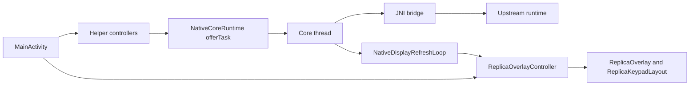

# Kotlin Shell Architecture

## Top-level model

The Android app is a single-activity, view-based shell around a long-lived
native core. `MainActivity` coordinates Android lifecycle, preferences, slot
selection, settings, and external integrations. It does not own the calculator
engine loop.

Use this page for Kotlin-side ownership, coordinator structure, lifecycle, and
storage flow. Read `50-upstream-interface-surfaces.md` for the upstream bridge
contract, `60-runtime-hot-paths.md` for the hottest runtime loops, and
`80-tests-and-contracts.md` for the focused parity and lifecycle regression
surfaces.

## Kotlin Structure At A Glance

- activity entrypoints: `MainActivity.kt`, `SettingsActivity.kt`
- runtime loops: `NativeCoreRuntime.kt`, `NativeDisplayRefreshLoop.kt`
- shell coordination: `ReplicaOverlayController.kt`,
  `MainActivityPreferenceController.kt`, `DisplayActionController.kt`,
  `WindowModeController.kt`
- rendering and geometry: `ReplicaOverlay.kt`, `ReplicaKeypadLayout.kt`,
  `CalculatorKeyView.kt`, `CalculatorSoftkeyPainter.kt`, `R47Geometry.kt`,
  `TopLabelLaneLayout.kt`
- storage and slots: `StorageAccessCoordinator.kt`, `WorkDirectory.kt`,
  `SlotSessionController.kt`, `SlotStore.kt`
- keyboard and keypad models: `PhysicalKeyboardInputController.kt`,
  `PhysicalKeyboardMapper` support files, `KeypadSnapshot.kt`,
  `KeypadTopology.kt`

## Kotlin Runtime Flow

## Ownership by slice

| Concern | Primary Kotlin owner | Boundary this page cares about | Read next |
| --- | --- | --- | --- |
| activity and settings coordination | `MainActivity`, `SettingsActivity` | startup, preferences, PiP, intent routing, helper wiring | `50-upstream-interface-surfaces.md` |
| native execution coordination | `NativeCoreRuntime`, `NativeDisplayRefreshLoop` | one core thread, one task queue, one UI-side poller | `60-runtime-hot-paths.md` |
| overlay and scene coordination | `ReplicaOverlayController`, `ReplicaOverlay`, `ReplicaKeypadLayout` | scene application after layout, including PiP-exit geometry replay, not the geometry formulas themselves | `40-ui-rendering-and-gtk-mapping.md` |
| storage and slot coordination | `StorageAccessCoordinator`, `WorkDirectory`, `SlotSessionController`, `SlotStore` | SAF routing, startup and recovery work-directory picker ownership, slot metadata, save and load ordering | `50-upstream-interface-surfaces.md`, `80-tests-and-contracts.md` |
| Android input adapters | `DisplayActionController`, `PhysicalKeyboardInputController`, mapping tables | convert Android events into core-thread work or small Android-side actions | `50-upstream-interface-surfaces.md` |

## Architecture boundary

- the native core owns calculator state, command execution, softmenu semantics,
  and most shared keypad state
- `KeypadSnapshot` is the Kotlin projection of native keypad arrays, so
  downstream Android code consumes named fields instead of re-indexing raw
  metadata offsets
- `KeypadLabelModes.kt` plus the stored keypad-label preferences are
  Android-local presentation policy: the main-key mode selects the app-facing
  native snapshot mode and may apply Kotlin-side `user` or `virtuoso`
  composition after decode, while the softkey mode masks decoded softkey scene
  bits before rendering
- `KeypadTopology`, slot metadata, work-directory preferences, and shell
  preferences are Android-local models
- geometry constants, label placement formulas, painter policy, and chrome
  projection are rendering contracts owned by
  `40-ui-rendering-and-gtk-mapping.md`, not by this page
- JNI signatures, cached callbacks, and lock-sensitive bridge behavior are
  native-interface contracts owned by `30-native-core-and-jni.md` and
  `50-upstream-interface-surfaces.md`

## Main coordination flow

Calculator state does not live in `Activity` fields. The durable owner is the
native core plus `NativeCoreRuntime`'s shared thread and task queue.

Main flow:

1. `MainActivity` and helper controllers receive lifecycle, touch, keyboard,
   menu, PiP, and settings work.
2. Native work enters `NativeCoreRuntime` through `offerCoreTask(...)` or the
   small direct bridge methods exposed by `MainActivity`.
3. `NativeCoreRuntime` serializes calculator execution on one shared core
   thread.
4. `NativeDisplayRefreshLoop` is the single UI-side poller for LCD and keypad
   scene state.
5. `NativeDisplayRefreshLoop` requests keypad metadata with the current
  main-key mode code from `ReplicaOverlayController`.
6. `ReplicaOverlayController.currentKeypadSnapshot()` converts the native arrays
  into `KeypadSnapshot`, applies any `user` or `virtuoso` keypad composition
  plus the softkey graphic or static mask, and `ReplicaKeypadLayout` applies
  scene changes after a real layout boundary.

This page stops at the coordination boundary. Read
`60-runtime-hot-paths.md` for cadence, skip gates, and lock-sensitive loops;
`40-ui-rendering-and-gtk-mapping.md` for geometry formulas and label placement;
and `50-upstream-interface-surfaces.md` for the exact JNI entry points and
callbacks.

## Lifecycle contract

- `onCreate()` executes five startup phases in order:
  `configureActivityShell()` sets the music stream, inflates view binding,
  sets content view, and applies display-cutout mode; `initializeStartupControllers()`
  wires `WindowModeController`, `FactoryResetController`,
  `StorageAccessCoordinator`, `DisplayActionController`,
  `PhysicalKeyboardInputController`, and `SlotSessionController`;
  `initializeOverlayAndPreferences(...)` binds `ReplicaOverlay`,
  `ReplicaOverlayController`, `MainActivityPreferenceController`, deferred
  overlay preference application, and the settings-discovery tap handler;
  `startCoreRuntime()` creates `NativeCoreRuntime`, attaches it, and starts
  `AudioEngine`; `handleInitialIntent()` routes factory-reset intents after the
  shell and runtime are ready.
- `onNewIntent()` is the reuse path for root-activity actions such as the
  controlled factory-reset request.
- `onResume()` revalidates the work-directory contract and lets the overlay-side
  resume path run without forcing a native LCD redraw. On first run,
  `StorageAccessCoordinator` may show the welcome dialog and launch
  `OpenDocumentTree()` directly from the activity-result registry instead of
  routing that startup picker through `SettingsActivity`. A normal Settings
  round-trip must preserve the current calculator snapshot.
- `onPause()` performs a synchronous native save when auto-save on minimize is
  enabled and the app is not moving into PiP or a reset-driven relaunch. That
  save is lifecycle-passive from the LCD point of view and must not rebuild the
  visible screen.
- `onDestroy()` stops the shared runtime when the activity is actually
  finishing, and the factory-reset path also clears internal app data after the
  runtime has been told to stop.
- `onPictureInPictureModeChanged()` routes PiP state through
  `ReplicaOverlayController`, which switches the overlay between normal shell
  mode and PiP mode and treats PiP exit as a geometry-replay boundary for the
  current keypad snapshot.
- `WindowModeController.enterPictureInPicture()` is the PiP entry seam. It
  always builds `PictureInPictureParams` with the LCD's fixed `400 x 240`
  width-over-height ratio instead of the portrait shell bounds, so Android PiP
  tracks the native LCD contract rather than a device-window snapshot.

Activity Result launchers are registered during
`initializeStartupControllers()` when `createStorageAccessCoordinator()` calls
`StorageAccessCoordinator.registerLaunchers()`. Helper construction must stay
side-effect free after resume so tests can call `deliverNativeFileResult()`
without violating the Activity Result lifecycle contract.

Focused verification for this lifecycle contract lives in
`DisplayLifecycleInstrumentedTest.kt`, `StorageAccessCoordinatorTest.kt`,
`WorkDirectoryTest.kt`, `StorageAccessCoordinatorInstrumentedTest.kt`, and
`MainShellThemeTest.kt` as mapped in `80-tests-and-contracts.md`.

## Input surfaces

The Kotlin shell currently accepts input from five paths:

- on-screen keys built by `ReplicaKeypadLayout`
- accessibility click activation on those same key views once they hold focus
- physical keyboard mappings handled by `PhysicalKeyboardInputController`,
  `PhysicalKeyboardMapper`, and `PhysicalKeyboardBindingTables`
- display long-press actions coordinated by `DisplayActionController`
- PiP touch mapping handled by `ReplicaOverlay`

Each path ultimately resolves to core-thread work or a small Android-side action.

## Persistence and slot model

- slot metadata lives in `SlotStore`
- the active slot ID is mirrored into native code through `setSlotNative(...)`
- slot switching follows one ordered background flow: save current state, update
  slot ID, load target state
- SAF-backed user files remain outside the internal app directory contract
- `StorageAccessCoordinator` owns the first-run welcome dialog, the direct
  startup picker path, and missing-work-directory recovery; `SettingsActivity`
  owns only explicit manual work-directory changes from the preferences UI
- `WorkDirectory.persistSelectedTreeUri(...)` centralizes the persistable URI
  grant plus the stored work-directory tree write shared by startup and manual
  selection paths
- the work-directory contract is a user-facing SAF tree, not a replacement for
  the app-internal native base path
- manifest backup rules intentionally exclude `R47Slots` and the work-directory
  URI preferences because slot URIs and SAF grants are device-specific; general
  shell preferences remain migratable

## Current platform shape

- the app is view-based and uses view binding
- `MainActivity` remains portrait-first in the manifest for shell fidelity
- the application is explicitly resizable, so large screens and foldables may
  letterbox or window the shell according to Android compatibility behavior
- Picture-in-Picture is enabled
- settings live in a separate non-exported `SettingsActivity`
- `SettingsActivity` stays Preference-based, but its host layout is now
  adaptive: the base `settings_activity.xml` uses `ConstraintLayout`, and
  `layout-w600dp/settings_activity.xml` centers the preferences inside a
  bounded `MaterialCardView` panel for larger or resizable windows
- the settings-owned activity stack uses the dedicated
  `Theme.R47.Settings` dark Material 3 theme from `AndroidManifest.xml`, so
  settings, notices, OSS-license screens, and settings-owned dialogs do not
  fall back to white surfaces when the device stays in light theme
- `SettingsFragment` owns the user-facing behavior copy for
  `fullscreen_mode` and `force_close_on_exit`; those summaries stay fixed and
  describe what enabling each toggle does instead of duplicating the visible
  on or off state
- `MainActivity` keeps the calculator shell dark even on a light-themed
  device: `WindowModeController` applies a dark visible system-bar treatment
  when fullscreen is off, and `ReplicaOverlay` keeps the first-run
  settings-discovery hint cards on fixed dark shell surfaces
- LCD appearance stays on a curated Android-local theme list owned by
  `LcdThemePolicy.kt`; `MainActivityPreferenceController.kt` normalizes stored
  `lcd_theme` values, clamps `lcd_luminance` to the XML-declared `20..120`
  range, and routes the optional `lcd_negative` inverse-display toggle before
  `MainActivity.kt` applies the selected palette
- keypad haptics are Android-view concerns first: `ReplicaKeypadLayout`
  now uses press-only keypad haptics for calculator interaction. `ACTION_DOWN`
  uses `HapticFeedbackConstants.VIRTUAL_KEY`, while `ACTION_UP` and
  `ACTION_CANCEL` only clear pressed state and send key `0` with no release
  pulse. `HapticFeedbackController` owns the two preference-driven modes behind
  that press path: `haptic_enabled` is the master gate, while
  `haptic_keypress_duration_ms` is a dependent keypress-strength slider where
  `0` keeps the Android-default view-first path and positive values switch to
  short app-owned one-shot press pulses that intentionally override the system
  touch-haptics setting
- haptics, audio, fullscreen state, LCD display theme, scaling mode, keypad
  label modes, and touch-zone overlays are preference-driven Android concerns

- `SettingsFragment` keeps the haptics surface intentionally lean and
  Gboard-like: `Haptic feedback on keypress` is the master switch,
  `Vibration strength on keypress` is a dependent `SeekBarPreference` that
  greys out with the switch off, and the leftmost `0` value resolves to the
  summary text `Android default`

## Kotlin-side change rules

- Keep `MainActivity` as a coordinator, not as a second calculator engine.
- Keep blocking work off the main thread.
- Add new Android integrations through focused helper types when they do not
  belong in `MainActivity`.
- Keep `registerForActivityResult()` calls in the unconditional activity or
  fragment initialization path, not in helper constructors or late callbacks.
- When adding a native call, update the Kotlin external declaration and the JNI
  registration table together.
- When a feature needs both Android lifecycle logic and native execution,
  prefer a small Kotlin coordinator plus core-thread work instead of splitting
  state across both sides.
- If a new feature needs durable calculator state, decide first whether the true
  owner is the native core, Android preferences, or Android-side slot metadata.
