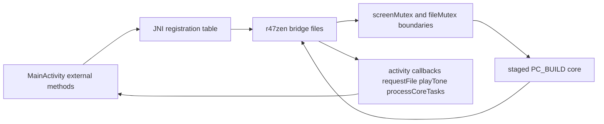

# Native Core And JNI

This page covers the Android-owned native bridge, CMake integration, JNI
registration, HAL seams, and packaging constraints. Read
`30-upstream-interface-surfaces.md` for the broader map of which upstream core
entry points the Android shell actually depends on. Read
`80-tests-and-contracts.md` for the JNI, SAF, and host-regression verification
surfaces.

## JNI And Native Flow

## Native library shape

The Android module builds one shared library: `r47zen`. `MainActivity`
loads it from a static initializer via `System.loadLibrary("r47zen")`.

The Android-owned CMake target keeps that single-library load path. It does
not ship same-ABI CPU-specific variants or a runtime dispatcher. When
`android/app/src/main/cpp/CMakeLists.txt` applies target-scoped ThinLTO compile
and link flags to the release-native target configs, `Release` and
`RelWithDebInfo`, and uses `lld` for the link step. That keeps Android
shipping builds on the optimized shared-library path while debug builds stay on
the normal non-LTO lane.

When a reviewed indexed LLVM profile is available, the Android build can now
also consume it through Gradle property `r47.pgoProfilePath` or environment
variable `R47_PGO_PROFILE_PATH`, which feed CMake cache entry
`R47_PGO_PROFILE_PATH`. Only the release-native configs consume that profile;
the default debug lane remains profile-free.

CMake builds the library from:

- build-only staged core sources under `android/.staged-native/cpp/c47`
- build-only staged decNumber sources under
  `android/.staged-native/cpp/decNumberICU`
- build-only staged generated sources under
  `android/.staged-native/cpp/generated`
- Android-specific bridge and HAL files under
  `android/app/src/main/cpp/r47zen`
- build-only staged mini-gmp sources under `android/.staged-native/cpp/gmp`
- the tracked Android mini-gmp staging source under
  `android/compat/mini-gmp-fallback`

Tracked Android stub headers under `r47zen/stubs` and the forced include
of `android_mocks.h` let the Android build satisfy upstream GTK, GDK, and Cairo
includes without rewriting staged source files during the Gradle build.

The Android native module currently compiles the staged upstream core in
`PC_BUILD` mode. That means the Android-owned bridge layer must provide the
GLib and GTK compatibility behavior used by upstream pause, wait, and progress
paths instead of treating those entry points as no-op stubs.

That `PC_BUILD` choice also makes the Android HAL responsible for any desktop-
side helper symbols that upstream starts exporting through `src/c47/hal/*.h`.
The current concrete examples are `create_dir(char *dir)` and
`_ioFileNameOverride[]` from `hal/io.h`, plus
`lcd_buffer_pixel_on(uint32_t x, uint32_t y)` from `hal/lcd.h`. When an
upstream sync advances those HAL contracts, update the Android HAL in
`android/app/src/main/cpp/r47zen/hal/` in the same change instead of assuming
the staged core will keep linking against older Android-owned exports.

`android/app/src/main/cpp/CMakeLists.txt` passes and consumes
`R47_STAGED_CPP_DIR` so the live Android native build reads shared-native inputs
from the build-only staging root rather than any retired app-module snapshots.

The former tracked directories
`android/app/src/main/cpp/{c47,decNumberICU,generated,gmp}` are retired
snapshot paths and must stay absent during normal builds.

The Android bridge code is intentionally split by responsibility:

- `jni_lifecycle.c` for init, deadline-driven tick, refresh, and slot-state lifecycle work
- `jni_input.c` for key and menu dispatch
- `jni_display.c` for packed LCD generations, pixels, keypad snapshots, and
  clipboard-export queries for X, stack, and all-register payloads
- `jni_storage.c` for SAF-backed blocking file handoff
- `jni_registration.c` for `JNI_OnLoad()` and explicit native registration
- `jni_activity_bridge.c` for shared JVM, activity callbacks, and bridge globals

## JNI contract

JNI registration is explicit. `JNI_OnLoad()` initializes the JVM handle, the
recursive `screenMutex`, and calls `register_main_activity_natives(...)`. The
bridge does not rely on name-based native lookup.

The registered native surface includes:

- activity reattachment and final runtime release
- native pre-init, init, and tick
- key, menu, and function dispatch, plus direct live-program stop publication
- LCD graph-touch dispatch for drag-pan and pinch-zoom, gated to the proven
  graph-active path (`CM_GRAPH` with menus `-MNU_PLOT_FUNC` and
  `-MNU_GRAPHS`) and defined as a no-op outside supported graph screens
- native-owned graph-touch sensitivity calibration for pan and pinch, with
  Kotlin forwarding normalized deltas and scale factors through the
  `MainActivity` queue, where `GraphGestureAccumulator` splits queued pan into
  bounded `<= 1.0f` normalized steps after capping queued pan backlog to a
  `+/-4.0f` recent range per axis, and clamps queued pinch factors to
  `0.4f..2.5f` before native apply
- native graph-touch admission checks that reject non-finite or oversized
  per-apply inputs before candidate bound math (`|dx|, |dy| <= 1.0f`,
  `scaleFactor` in `0.4f..2.5f`)
- transactional graph-bounds commit checks for pan and pinch so candidate
  bounds must remain finite and inside the shared-core-compatible
  `+/-1.0e38f` domain before state is written
- restore-time graph-bounds sanitization after `restoreCalc()` on startup and
  explicit state load so a bad saved graph window cannot poison the first
  refresh of the next launch or slot switch; repaired bounds are resynced into
  `LX`, `UX`, `LY`, and `UY` before refresh
- state save, load, and force refresh
- packed LCD generation reads and packed LCD transfer
- keypad snapshot generation reads and whole-snapshot copy, plus the legacy
  keypad metadata and label getters kept for bridge compatibility
- slot selection plus clipboard-export fetches for X register, stack
  registers, and all registers
- SAF file selection callbacks

The clipboard-export getters are Android-owned bridge seams. They mirror the
upstream desktop clipboard payload shapes for `Copy X Register`, `Copy Stack
Registers`, and `Copy All Registers` without moving Android menu policy into
the upstream core. When those payloads change, keep
`DisplayActionController.kt`, `jni_display.c`, and the formatter helpers in
`android_helpers.c` aligned with the upstream reference behavior in
`src/c47/screen.c`.

Shared helpers in `jni_bridge.h` centralize `JNIEnv` acquisition,
detach-on-scope-exit for native-owned threads, exception detection and clearing
after Java calls, and fallback Java-string creation. New Android bridge code
should use those helpers instead of open-coded `GetEnv`, `AttachCurrentThread`,
or unchecked `Call*Method` paths.

Development rule:

- Keep the Kotlin external declarations, `JNINativeMethod` table, signatures,
  and implementations aligned in one change.
- Keep app-class lookups and registration failures early in `JNI_OnLoad()` so a
  broken bridge fails at library load time rather than on first use.
- Use `jni_acquire_env(...)`, `jni_release_env(...)`, and
  `jni_check_and_clear_exception(...)` for native-owned JVM work instead of
  duplicating attach, detach, and exception logic at each call site.
- Keep graph-touch sensitivity in one layer. If touch feel must change,
  update native calibration constants in `jni_input.c`; keep Kotlin gesture
  forwarding linear except for the bounded queue accumulator and pinch clamp
  used by `MainActivity` queue flush.

That alignment rule is the main Android-owned seam. The upstream core remains
the source of calculator behavior, while the bridge owns registration,
marshalling, and Android runtime compatibility.

## Threading and synchronization

`NativeCoreRuntime` runs the engine loop on a background thread. The JNI bridge
supports that model by keeping shared synchronization in native code:

- `NativeCoreRuntime` drains queued work, calls `tick()`, then waits on
  `coreTasks.poll(nextDelay, ...)` for the returned deadline instead of
  sleeping a fixed 10 ms; `dispose(stopApp = true)` clears the queue and
  offers a sentinel runnable so a blocked wait wakes promptly
- `screenMutex` is recursive
- `Java_com_example_r47_MainActivity_tick(...)` keeps
  `pthread_mutex_trylock(&screenMutex)` semantics, advances due timer and LCD
  work, and returns the next required wake delay through
  `r47_next_tick_delay_ms(...)`; when the lock is busy it returns `1` so the
  Kotlin side stays responsive without reviving the rejected async scheduler
- `yieldToAndroidWithMs()` refreshes the LCD, releases the recursive screen
  lock, advances due timer callbacks, lets Android process queued work, sleeps
  briefly, and then reacquires the lock
- `NativeDisplayRefreshLoop` uses `Choreographer.postFrameCallback(...)` on the
  main looper, first reads `getPackedDisplayGeneration()`, only calls
  `getPackedDisplayBuffer(...)` when the generation changes, retries the same
  generation after a failed non-blocking copy, and now reads keypad refreshes
  through `getKeypadSnapshotGeneration()` plus the cached
  `NativeKeypadSnapshotStore`; `copyKeypadSnapshotNative(...)` assembles one
  logical keypad scene under one `pthread_mutex_trylock(&screenMutex)` window,
  USER mode composition stays inside that one native copy, and busy results
  reuse the last accepted Kotlin snapshot until the same generation is copied
  successfully
- `ReplicaOverlayController` now consumes that same cached whole-snapshot store
  for overlay replay and dynamic-key refresh, so the UI thread no longer builds
  one logical keypad scene through multiple blocking JNI calls
- `android_runtime.c` also supplies Android-backed `PC_BUILD` event-loop shims
  for `g_main_context_iteration()`, `g_timeout_add()`,
  `gtk_events_pending()`, and `gtk_main_iteration()` so staged upstream pause
  and progress loops keep yielding on Android instead of hanging behind no-op
  mocks; treat these entry points as required compatibility behavior, not as
  optional stubs, because upstream program workloads depend on them for pause
  and progress responsiveness
- `scripts/workload-regressions/run_workload_regressions.sh` is the repo-owned
  Linux host harness for that compatibility contract. It compiles the staged
  core plus the Android bridge in `HOST_TOOL_BUILD` and `PC_BUILD`, probes the
  wait or progress shims in `android_runtime.c`, then runs the canonical host
  workload set through the host-side Android compatibility path in isolated
  host processes: the imported `.p47` fixtures `BinetV3.p47`, `GudrmPL.p47`,
  `MANSLV2.p47`, `NQueens.p47`, and `SPIRALk.p47`. Every workload now runs
  under the same outer GNU `timeout --kill-after` safety net so a hung
  workload degrades coverage instead of wedging the host lane. Inside that
  shared framework, the maintained `MANSLV2` scenario still waits for observed
  run activity and then publishes a direct stop through `fnStopProgram(0)`.
  The script remains the focused host-compatibility rerun surface, not the
  normal pull-request owner of the collector-driven PGO contract; the broad
  `broad-ci` base already covers `prime` and `factorial` through upstream
  `testSuite` inputs
- `scripts/workload-regressions/collect_host_pgo_profile.sh` builds that same
  upstream `src/testSuite/testSuite` target in Meson `release` with the pinned
  NDK Clang and `llvm-profdata` pair under ThinLTO plus LLVM IRPGO
  instrumentation, runs the maintained `broad-ci` corpus of `programs`, `tvm`,
  `jacobi_audit`, `normal_i`, `gamma`, `trig`, `prime`, `factorial`, and the
  generated `matrix_prefix_85` slice from `src/testSuite/tests/matrix.txt`,
  stages `res/testPgms/testPgms.bin` into a runtime root for the built-in
  program cases, then runs the imported `.p47` fixture overlay through the
  host compatibility path so the same indexed profile also covers graph,
  pause, wait, and LCD-style workloads, injects a temporary resource-dir shim
  so the Linux host link can reuse a host-installed `libclang_rt.profile`
  archive that the NDK does not ship, then produces the indexed profile
  artifact now consumed by the release-native Android build path. The
  maintained full-lane owner of that collector plus consumer sequence is now
  `./scripts/android/build_android.sh --collect-host-pgo --validate-release-pgo`
- `jni_program_load_test.c` exposes the instrumentation-only bridge used by
  `ProgramFixtureInstrumentedTest`, `DisplayLifecycleInstrumentedTest`, and
  `GraphTouchStressInstrumentedTest`. It provides READP or RUN worker control,
  explicit refresh and background-save helpers, LCD refresh count, a
  packed-LCD snapshot hash, the synthetic `00` key path used to resume staged
  `SPIRALk` runs, the direct-stop publisher plus explicit refresh helper
  reused by the per-fixture `ProgramFixtureInstrumentedTest` methods and
  `DisplayLifecycleInstrumentedTest`, an extreme graph-touch stress helper
  that repeatedly submits very large pan and pinch deltas while asserting the
  bridge rejects those out-of-family inputs without mutating the current graph
  bounds, and a restore-path helper that injects invalid graph bounds and
  proves the Android-owned restore sanitizer repairs them before refresh.
- `snapshotStateNative()` in that bridge is a blocking `screenMutex` reader.
  Use it only after the READP or key worker has quiesced. If a test worker has
  already timed out and may still own `screenMutex`, callers must use the
  non-blocking `snapshotStateIfAvailableNative()` or Kotlin
  `trySnapshotState()` path instead of waiting on the mutex.
- The lifecycle snapshot helper hashes only visible packed LCD bytes. It does
  not hash the row-dirty transport flag that `getPackedDisplayBuffer(...)`
  clears after each successful UI poll.
- The staged `SPIRALk` lifecycle probe retries the simulated `00` resume while
  the program remains paused and uses a `90 s` hosted-emulator budget so a
  missed short pause pulse does not strand CI at the terminal `PAUSE 99`.
- The Android fixture seam still uses LCD redraw activity as valid run evidence
  for fast-returning fixtures such as `GudrmPL.p47` when step, pause, wait, or
  `VIEW` markers never surface before a clean return.
- `yieldToAndroidWithMs()` in `android_runtime.c` is currently the only
  Android-owned mid-run seam that both releases the recursive `screenMutex` and
  drains `processCoreTasksNative()` while shared-core execution is still in
  flight
- `MainActivity.dispatchLiveKey(...)` now routes live positive `R/S` and
  `EXIT` presses to `requestStopProgramNative()` before queue fallback.
  `requestStopProgramNative()`
  publishes stop intent through the existing upstream `fnStopProgram()` path
  without taking `screenMutex` or queueing onto `NativeCoreRuntime`, and it
  also marks a pending stop-refresh request.
- `requestStopProgramNative()` is gated on `programRunStop` through the pure
  `r47_direct_stop_allowed(runState)` predicate and fires the out-of-band stop
  **only** for the genuinely-busy run states `PGM_RUNNING` (executing) and
  `PGM_PAUSED` (inside a timed `PSE` loop) — the states that cannot drain the
  queued `sendKey` in time. For the interactive parked states `PGM_WAITING` and
  `PGM_RESUMING` (a graphing program holding its plot, a program between
  `PSE`/`VIEW` steps, an open `f`/`g`/`I/O` menu) it returns `JNI_FALSE`, so
  `dispatchLiveKey(...)` falls through to `sendKey` and the core receives the
  keystroke: `R/S` resumes/replots and `EXIT` leaves the menu. This mirrors
  `src/c47/programming/input.c`, which only treats `R/S`(36)/`EXIT`(33) as a
  stop request while `*prevStop == PGM_RUNNING`. Widening the gate to accept
  `PGM_WAITING`/`PGM_RESUMING` swallows those live keystrokes and strands the
  user (REPORT-23 runtime-regression annex). The shared predicate is probed
  side-effect-free through the instrumentation bridge
  (`ProgramLoadTestBridge.directStopAllowedForRunState(...)`), so
  `DisplayLifecycleInstrumentedTest.directStopGateDeclinesInteractiveWaitStates`
  asserts the decline contract deterministically across every run state, and
  `busySpiralkAcceptsLiveDirectStop` proves the live seam still accepts a stop
  for a genuinely-busy program.
- That lock-free property is required, not optional. The grouped Android
  `MANSLV2` fixture can still be executing inside the asynchronous `R/S`
  worker while that worker owns `screenMutex`; a blocking or try-lock stop
  publisher will miss the stop window and can strand the bounded-stop test.
- `tick()` in `jni_lifecycle.c` and `yieldToAndroidWithMs()` in
  `android_runtime.c` are the two core-owned consumption points for that
  pending stop-refresh request. They re-arm `SCRUPD_AUTO`, set
  `reDraw = true`, run `refreshScreen(190)`, `refreshLcd(NULL)`, and
  `lcd_refresh()`, then push `nextScreenRefresh` forward so the first direct
  stop on a staged `SPIRALk` graph already matches `forceRefreshNative()`
  without moving redraw work onto the UI thread.
- Android's official ANR guidance explicitly calls out main-thread lock
  contention as a foreground input-dispatch failure mode. The landed whole-
  snapshot try-copy repair removes the previous split blocking keypad export
  path from the UI thread.
- If a shared-core loop still never observes `programRunStop`, Android still
  cannot preempt it. After this landing, that remaining limitation is a
  shared-core stop-observation gap, not Android queue starvation or UI-thread
  keypad export blocking.
- native-owned JVM work acquires `JNIEnv` through `jni_acquire_env()` and
  `jni_release_env()` so attach and detach remain scope-bound
- the bridge can update the current activity reference when the activity is
  recreated
- file I/O handoff uses a condition-based native wait path so the calculator
  core can request a file without inventing a second storage protocol

Practical rule:

- when a native change can block on Android UI or storage, make the lock
  boundaries explicit before changing behavior

Final app shutdown uses `releaseNativeRuntime()` to delete the global
`MainActivity` reference and clear the cached method IDs. Activity recreation
continues to use `updateNativeActivityRef()` without tearing down the native
core. That reattach helper refreshes JNI references and cached method IDs only;
it must stay display-passive and must not synthesize a redraw.
`DisplayLifecycleInstrumentedTest.kt` exercises that contract through full
`ActivityScenario.recreate()` coverage
(`activityRecreationPreservesSpiralkGraphSnapshot`). The native runtime persists
across recreation (`NativeCoreRuntime`'s `isCoreThreadStarted` /
`isNativeInitializedShared` are process-shared, so the recreated Activity
re-attaches rather than re-initialising), but recreation **does re-render
`packedDisplayBuffer` from calculator state** -- REPORT-24 Milestone 4b Slice C
tried to assert recreation preserves a raw injected framebuffer and CI proved
otherwise (the injected pattern was replaced by the state render). So the
recreation snapshot test keeps a real `SPIRALk` graph: a graph display is
cursor-free and byte-stable, so re-rendering it from the persisted graph state
reproduces the same framebuffer. The *Settings-style pause/resume* transition,
by contrast, is display-passive -- it does not re-render -- so
`pauseResumePreservesInjectedDisplaySnapshot` uses a deterministic injected
framebuffer (`injectDeterministicDisplayBuffer`) and passes. The local 16 KB
runtime smoke script reuses the recreation probe on a connected 16 KB target.

## Lifecycle Save And Explicit Refresh Contract

`jni_lifecycle.c` owns two different display-affecting paths and they do not
share the same contract.

- `saveStateNative()` routes pause-side and background persistence through
  `r47_save_background_state_locked()`. That path must stay display-passive for
  Settings entry, normal background save, and other lifecycle-only transitions.
  `r47_save_background_state_locked()` only calls `saveCalc()` and never touches
  `packedDisplayBuffer`, so
  `DisplayLifecycleInstrumentedTest.backgroundSavePreservesInjectedDisplaySnapshot`
  proves the display-passive contract deterministically: it injects a non-trivial
  framebuffer pattern, hashes it, runs the background save, and re-hashes, all
  under `screenMutex` (via the `backgroundSaveKeepsInjectedDisplayBuffer` bridge),
  with no program run -- replacing the former emergent `SPIRALk` graph save test.
- `forceRefreshNative()` routes to `r47_force_refresh()`, which is the explicit
  native redraw path for real state-change owners such as runtime init,
  `loadStateNative()`, and test-owned refresh seams.
- runtime init and `loadStateNative()` now sanitize restored graph bounds
  before that first redraw so a corrupted auto-save cannot carry non-finite,
  collapsed, or out-of-range windows into the first graph refresh.
- The direct-stop pending refresh seam is a third owner in this area.
  `requestStopProgramNative()` publishes only the request; `tick()` and
  `yieldToAndroidWithMs()` later consume it under `screenMutex`, so first-stop
  cleanup stays off the UI thread and shares the same full-refresh primitives
  as `forceRefreshNative()`.

The key distinction is whether the calculator state changed.

- `loadStateNative()` may redraw because it reconstructs a different state.
- `saveStateNative()` must not redraw because persistence alone should not alter
  the visible LCD snapshot.

Do not reintroduce `requestForceRefresh()` or `forceRefreshNative()` into a
passive activity lifecycle callback such as a normal Settings return unless the
owner path can prove that calculator state really changed.

## File I/O boundary

`hal/io.c` uses two Android-specific paths:

- a runtime base path set by `set_android_base_path(...)` for app-internal files
  and subdirectories
- SAF handoff for state, program, RTF export, manual save, and related
  user-facing file operations

The SAF path works as follows:

1. Native code calls `requestAndroidFile(...)` with save or load mode, default
   name, and category.
2. Kotlin launches the correct SAF intent through `StorageAccessCoordinator`.
3. The selected file descriptor is detached from the
   `ParcelFileDescriptor` and returned to native code.
4. Native code wraps the descriptor with `fdopen(...)` and continues using
   standard file I/O.

Android instrumentation uses a one-shot detached-fd override in
`jni_storage.c` so `ProgramFixtureInstrumentedTest` can drive `READP` through
the same native load boundary with staged canonical fixtures instead of
launching a real SAF picker. The override is test-owned and must be cleared
after each load.

After `detachFd()`, the `ParcelFileDescriptor` wrapper no longer owns that file
descriptor. Native closes it on the existing `fdopen()` failure path or through
`fclose()` on success.

The runtime base path is separate from the user-selected work directory. The
base path supports internal files; the work-directory contract supports user
data organized through SAF.

For host workload runs, `HOST_TOOL_BUILD` bypasses the Android SAF interception
in `hal/io.c` and uses the runtime base path directly so canonical upstream
program files can be staged and loaded without an Android document-provider
round trip.

## JNI change checklist

1. Update the Kotlin external declaration.
2. Update the registered method table.
3. Update the bridge header and the owning C implementation.
4. Recheck thread and lock behavior if the call can touch UI, storage, or long
  native work.

## Change ownership

- For shared calculator behavior, change the canonical root core and restage it
  into `android/.staged-native/cpp` through the normal Android build flow.
- Change `android/app/src/main/cpp/r47zen` directly only for Android
  bridge, HAL, or stub behavior.
- Do not patch build-only staged upstream C files in place when a tracked
  Android stub or bridge-layer fix can own the compatibility rule.

## 16 KB and packaging contract

The checked-in Android build uses the supported NDK flexible-page-size path:

- `android/app/build.gradle` passes
  `-DANDROID_SUPPORT_FLEXIBLE_PAGE_SIZES=ON` to CMake
- the checked-in NDK pin is `29.0.14206865`
- the checked-in AGP version is `9.2.0`

The default checked-in APK target is `arm64-v8a`. The workflow and local
Gradle invocations can temporarily add `x86_64` through `r47.abiFilters` for
emulator-backed test runs, but the shipped debug artifact remains
`arm64-v8a` by default. Any added prebuilt native dependency must also satisfy
the 16 KB requirements for ELF and APK alignment.

The CI lane verifies that contract by checking zip alignment and native library
`LOAD` segment alignment in the built debug APK. The `android-tests` lane uses
the temporary multi-ABI override only for hosted `x86_64` emulator execution.

Local runtime proof for the same contract now lives in
`scripts/android/run_16kb_runtime_smoke.sh`. That script checks the connected
device or emulator page size through `adb shell getconf`, requires
`16384`-byte pages, and then runs only
`DisplayLifecycleInstrumentedTest#activityRecreationPreservesSpiralkGraphSnapshot`.

That artifact verification is the reason packaging changes should be documented
alongside the workflow and Gradle files, not only in the CMake layer.
