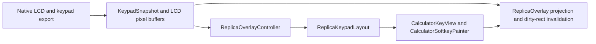

# UI Rendering And GTK Mapping

This page covers geometry ownership and rendering rules. Read
`20-kotlin-shell-architecture.md` for lifecycle ownership and
`50-upstream-interface-surfaces.md` for the scene-export contract and
`60-runtime-hot-paths.md` for the refresh hot paths. Read
`80-tests-and-contracts.md` for the geometry, fixture, and visual-regression
surfaces.

## Rendering Flow



## Geometry owners at a glance

- `R47Geometry.kt` owns the logical canvas, keypad constants, borderless shell
  geometry, and LCD pixel contract.
- `ReplicaChromeLayout` owns projection from logical canvas into the current
  window.
- `ReplicaOverlay` owns shell drawing, LCD bitmap updates, and touch-to-logical
  projection.
- `KeypadTopology` owns the Android-local 43-key lane, family, and column map.
- `ReplicaKeypadLayout` owns key placement, touch-cell geometry, and row-local
  label-lane solving.
- `CalculatorKeyView` and `CalculatorSoftkeyPainter` own per-key drawing,
  label placement, and softkey-specific rendering.

## Geometry contract stack

| Contract surface | Owner chain | Source of truth | Locked by |
| --- | --- | --- | --- |
| logical canvas, borderless shell frame, and LCD frame | `R47ReferenceGeometry`, `R47AndroidChromeGeometry`, `R47LcdContract` -> `ReplicaChromeLayout` -> `ReplicaOverlay` | `scripts/r47_contracts/data/r47_physical_geometry.json`, `scripts/r47_contracts/data/r47_android_ui_contract.json`, and `scripts/r47_contracts/derive_shell_geometry.py` | `scripts/r47_contracts/test_shell_geometry_contract.py`, `ReplicaOverlayGoldenTest.kt` |
| shared touch grid and key slots | `KeypadTopology` -> `ReplicaKeypadLayout` | `scripts/r47_contracts/data/r47_physical_geometry.json` plus `scripts/r47_contracts/derive_touch_grid.py` | grouped `scripts/r47_contracts` validation lane, `KeypadFixtureContractTest.kt` |
| top-label lane placement | `TopLabelLaneLayout` -> `ReplicaKeypadLayout` -> `CalculatorKeyView` | `scripts/r47_contracts/derive_top_label_lane_layout.py` | `scripts/r47_contracts/test_top_label_lane_layout_contract.py`, `DynamicKeypadParityFixtureTest.kt` |
| per-key label offsets and body geometry | `R47KeySurfacePolicy`, `R47LabelLayoutPolicy`, `R47TopLabelSolverPolicy` -> `CalculatorKeyView` | `scripts/r47_contracts/data/r47_android_ui_contract.json`, `scripts/r47_contracts/derive_key_label_geometry.py`, `scripts/r47_contracts/derive_key_visual_policy.py`, `scripts/r47_contracts/derive_top_label_lane_layout.py` | `scripts/r47_contracts/test_key_label_geometry_contract.py`, `scripts/r47_contracts/test_key_visual_policy_contract.py`, `scripts/r47_contracts/test_top_label_lane_layout_contract.py` |
| softkey visuals and overlay states | `CalculatorSoftkeyPainter` | native scene roles plus `KeyVisualPolicy` constants | `CalculatorSoftkeyPainterContractTest.kt`, `CalculatorSoftkeyPainterCanvasTest.kt`, `ExportedKeypadFixtureRenderTest.kt` |

## Shell projection contract

- the live logical canvas is the measured reference frame `1820 x 3403`
- all shell projection, LCD placement, keypad children, and touch zones resolve
  from that logical canvas before projection into the current window
- `chrome.native_shell_draw_corner_radius` is `0`, so the native shell keeps no
  painted outer body and retains only the top settings strip plus LCD frame as
  shared shell chrome
- `full_width` uses one shared visible-frame trim of `42 / 49 / 42 / 56`
- `chrome.lcd_windows` keeps one native LCD rectangle on that shared canvas:
  `85 / 229 / 1650 / 990`
- the native LCD stays horizontally centered on the `1820` logical canvas and
  preserves the exact integer `400 x 240` frame-buffer aspect ratio
- `physical` caps fit scale to the density-resolved `360 dp` shell width
  divided by `R47ReferenceGeometry.LOGICAL_CANVAS_WIDTH`
- `ReplicaOverlay` projects one borderless native shell surface from the shared
  logical contract
- `ReplicaKeypadLayout` owns one normalized shared touch-cell map, and
  `ReplicaOverlay` owns one shared settings-entry touch strip
- PiP uses the LCD-only contract: `WindowModeController` requests the exact
  native `400 x 240` width-over-height ratio, then `ReplicaOverlay` draws the
  LCD full-window and maps horizontal touches across that surface to the six
  softkeys, so the native shell projection does not change PiP geometry

Projection is the first owner to inspect when the whole shell, LCD frame, and
keypad all look correct locally but are globally misplaced together.

## Display and scene handoff

- the native core exports one `400 x 240` LCD pixel buffer plus separate keypad
  metadata and label arrays
- `KeypadSnapshot.fromNative(...)` decodes those arrays into named Kotlin
  fields; downstream Android code should not re-index raw metadata offsets
- `NativeDisplayRefreshLoop` is the only UI-side poller for LCD and keypad
  state; this page covers ownership while `60-runtime-hot-paths.md` covers the
  cadence and skip gates
- `ReplicaOverlayController` owns geometry-triggered same-snapshot replay for
  the keypad path. Scaling changes and PiP exit mark a geometry change, wait
  for a real overlay layout boundary, then replay the current scene once.
- `ReplicaChromeLayout` owns the native LCD rectangle and shell projection.
  Change that geometry there instead of branching the draw path in
  `ReplicaOverlay`.
- `ReplicaOverlay.updateLcd(...)` compares against the cached pixel buffer,
  computes the smallest changed rectangle, updates the backing `Bitmap`, and
  invalidates only that on-screen region
- keypad content and state stay native-owned, while Android owns measurement,
  projection, and drawing
- `LAYOUT_CLASS_ALPHA` hides the unused fourth-label text but keeps the spacer
  reserved so XEQ/PROG and related alpha scenes stay on the canonical painted
  key body width

## Measured keypad geometry

`ReplicaKeypadLayout` places all 43 keys from `R47ReferenceGeometry` in the
same `1820 x 3403` logical canvas used by shell projection. `KeypadTopology`
owns the Android-local 43-key lane, family, and column map that the layout code
consumes for view construction and touch-row membership. The live constants are:

- standard left: `134`
- standard pitch: `272`
- standard key body width: `192`
- matrix first visible left: `465`
- matrix pitch: `331`
- matrix key body width: `228`
- enter width: `462`
- measured row height: `144`
- row step: `260`
- softkey row top: `1290`
- first small-row top: `1550`
- enter-row top: `2070`
- first large-row top: `2330`
- non-softkey view height: `236`

The row families resolve as:

```text
softkey_x(c) = 134 + 272 * c      where c = 0..5
softkey_y = 1290

small_row_x(c) = 134 + 272 * c    where c = 0..5
small_row_y(r) = 1550 + 260 * r   where r = 0..1

enter_key_x = 134
enter_key_y = 2070
enter_key_width = 462
enter_row_small_x(c) = 134 + 272 * c   where c = 2..5

large_row_left_x = 134
large_row_matrix_x(c) = 465 + 331 * c where c = 0..3
large_row_y(r) = 2330 + 260 * r        where r = 0..3
```

Rendered slot and body rules:

- softkeys use `192 x 144` outer slots and a `2`-unit draw inset on each side
- small-row standard keys use `272`-unit slots and `192`-unit button views
  inside a `236`-unit non-softkey view height
- key `13` uses the measured `462`-unit width and is not re-derived from a
  nominal two-column gap model
- visible matrix keys use `331`-unit slots and `228`-unit button views
- base-operator keys use `192`-unit slots with no fourth-label spacer

The touch-cell map follows the same measured geometry but does not reuse the
rendered key-view bounds. The upper keypad uses a `4 x 6` touch grid with the
enter key spanning two columns, the lower keypad uses a `4 x 5` grid, and all
touch-row bands have height `260`. Android still maps GTK font roles and label
semantics, but the live coordinates now come from the measured reference canvas
rather than from a copied GTK screen layout.

## Per-key renderer

Each key is a `CalculatorKeyView`. Main keys keep their painted key surface,
label views, faceplate placement, and body-geometry rules there.

Softkeys stay on a dedicated function-key renderer path because the native
scene contract carries reverse-video, overlay, preview, and value-state rules
that the main-key path does not. `CalculatorSoftkeyPainter` owns that
softkey-only drawing and content-description path while `CalculatorKeyView`
continues to decide whether a key is on the main-key or function-key branch.

Render split:

- `CalculatorKeyView` owns the main-key painted body, primary legend, `f` and
  `g` faceplate labels, and the fourth-label anchor
- `CalculatorSoftkeyPainter` owns softkey text, auxiliary text, value text,
  preview accents, reverse-video states, strike marks, and overlay-state
  decorations
- `ReplicaOverlayController` owns the keypad label-mode policy split: it
  forwards `on`, `alpha`, and `off` main-key modes directly to the app-facing
  native snapshot export, composes `user` from the static `off` snapshot plus
  USER-mode `f` and `g` labels after decode, composes `virtuoso` from that
  same static `off` snapshot by blanking rendered key content, and applies
  softkey `graphic` or `off` masks before `ReplicaKeypadLayout.updateDynamicKeys()`
- `ReplicaKeypadLayout.updateDynamicKeys()` ignores snapshots until
  `sceneContractVersion > 0` and requests layout when scene changes can affect
  label widths, visibility, or layout class

## Label mode policy

The Android shell now applies two keypad label policies, and the special
`virtuoso` main-key mode intentionally forces blank softkey capsules too.

Main keys:

- `on`: fully dynamic main-key presentation
- `alpha`: dynamic relabeling only while the calculator is in an alphabetic
  state
- `user`: keep printed main-key legends and, while USER mode is active, overlay
  USER `f` and `g` top labels without relabeling the main key body
- `off`: fixed printed legends even while alpha, USER, or TAM states are active
- `virtuoso`: reuse the static `off` snapshot, blank all rendered main-key
  legends, and force softkeys to the blank-capsule presentation

Softkeys:

- `on`: full native softkey scene
- `graphic`: keep reverse video, overlays, preview accents, and strike marks
  but drop primary, auxiliary, and value text
- `off`: remove those dynamic softkey graphics and leave the default softkey
  capsule

The split is intentional. `on`, `alpha`, and `off` main-key presentation still
depend on upstream-owned key tables and label-role export, but the Android-only
`user` contract is now a renderer policy: the app keeps the printed-legends
snapshot for the main key body and overlays only the USER `f` and `g` labels
after decode. Softkey `graphic` and `off` remain renderer policy too, so the
app applies them as decoded scene masks instead of widening the softkey draw
logic in native code.

## Top-label lane contract

Owner chain:

- `TopLabelLaneLayout.solve(...)` computes per-lane horizontal placement and
  scale decisions
- `ReplicaKeypadLayout.applyTopLabelPlacementsAfterLayout()` applies those
  results only after a real overlay layout boundary
- `CalculatorKeyView` applies the final horizontal shift and per-label scales

Non-negotiable invariants:

- keep the `f` and `g` intragap fixed inside one group
- keep neighboring groups at or above the mandatory `2 * gap` inter-group rule
- keep each group inside its widened neighbor corridor: five intragaps before
  the left neighbor border to five intragaps after the right neighbor border
- clamp the first and last visible groups to the smartphone screen edges
  `0 .. overlay.width`
- keep vertical placement fixed; there is no runtime vertical lane solver or
  stagger model
- allow the two labels inside one group to differ by at most one fixed scale
  step

Solve order:

1. bounded local move of the current offender
2. bounded whole-row translation
3. fixed-step scale on the longest label of the worst offender
4. fixed-step scale on the sibling label if that same group is still worst
5. preferred-shift-budget overflow only after the preferred minimum scale is
   exhausted and overlap still remains

Regression surfaces:

- `scripts/r47_contracts/test_top_label_lane_layout_contract.py`
- `DynamicKeypadParityFixtureTest.kt`
- `80-tests-and-contracts.md` for the full contract-to-lane map

Any future faceplate-offset change must stay on those fixed formulas and layout
boundaries. Running label placement from a pre-layout `post { ... }`, a refresh
callback before layout, or reintroducing vertical solving, staggering, or
multi-label adaptive scaling recreates the first-run and mode-switch bug where
labels are wrong until some later UI event replaces the rendered scene.

Renderer process rules for live maintenance:

- if a change affects child size or placement, call `requestLayout()` at the
  owning view or view-group boundary and replay the scene after the next real
  layout if the snapshot payload itself is unchanged
- PiP exit is one of those geometry changes; keep it on the controller-owned
  replay path instead of repairing labels with direct view tweaks or a native
  redraw
- if a change affects drawing only, call `invalidate()` so underline, color,
  and text-shaping updates do not wait for the next key event

Main keys and softkeys still share one view class, but the seam is explicit:
`CalculatorKeyView` owns main-key geometry and `CalculatorSoftkeyPainter`
owns softkey text, overlays, value display, preview accents, and related
content descriptions.

Current native key-surface contract:

- default dark key fill is `RGB(64, 64, 64)`
- F accents use `RGB(255, 195, 111)` for faceplate labels, F-shift key fills,
  and the combined FG shift fill
- G accents use `RGB(142, 218, 254)` for faceplate labels and G-shift key
  fills
- those base accent values are fixed Android palette inputs; pressed F/G/FG
  fills keep the standard `+10` HSL lightness lift over that user-selected
  pair
- the Android touch path keeps no separate hover palette; F/G/FG styles use
  dedicated brighter pressed fills for touch feedback, while alpha keeps its
  base accent fill
- reverse-video states keep their state-specific fill colors
- main keys draw as plain rounded fills with no extra border, top bar, or
  bottom bar
- main-key corner radius is `20 * referenceBodyToViewWidthScale`
- softkey corner radius is `20 * softkeySurfaceScale`

Base text sizes before per-key scaling:

- primary label: `76` standard, `114` numeric, `94` shifted
- second and third labels: `64`
- fourth label: `66`

For main keys, the painted body rectangle is derived from the key's button view
and the shared optical width delta:

```text
referenceBodyToViewWidthScale = buttonView.width / designButtonWidth
inset = referenceBodyToViewWidthScale
half_width_bonus = (MAIN_KEY_BODY_OPTICAL_WIDTH_DELTA * referenceBodyToViewWidthScale) / 2

mainKeyRect.left = max(buttonView.left + inset - half_width_bonus, inset)
mainKeyRect.top = buttonView.top + inset
mainKeyRect.right = min(buttonView.right - inset + half_width_bonus,
                        view_width - inset)
mainKeyRect.bottom = buttonView.bottom - inset
```

That `mainKeyRect` then drives the label placement rules:

```text
button_center_x = mainKeyRect.centerX()
raw_button_center_x = buttonView.left + buttonView.width / 2
primary_translation_x = button_center_x - raw_button_center_x

gap = 10 * cell_scale
group_width = measured_f_width + gap + measured_g_width
group_left = mainKeyRect.centerX() - group_width / 2

f_top = -86 * cell_scale
g_top = -86 * cell_scale

letter_left = mainKeyRect.right + 16 * cell_scale
letter_top = 80 * cell_scale
```

The primary label is centered on the painted body, the `f` plus `g` pair is
centered as one group on that same body centerline, and the fourth label is
anchored from the painted body right edge rather than from the middle of the
spare lane. `CalculatorKeyView` applies the fixed `16`, `80`, and `86` values
from `R47LabelLayoutPolicy`; it no longer recomputes fourth-label placement from
runtime glyph width or font-height compensation.

For softkeys, the slot is intentionally larger than the painted body:

```text
softkey_view_width = STANDARD_KEY_WIDTH
softkey_view_height = ROW_HEIGHT
softkey_rect = [2, 2, width - 2, height - 2]

painted_softkey_width = width - 4
painted_softkey_height = height - 4
```

Softkeys therefore use the measured `192 x 144` function-key slot while keeping
a dedicated interior drawing path for text, value fields, preview accents,
overlays, strike marks, and reverse-video states.

When auxiliary text is visible, the softkey primary legend anchors in the upper
band at `softkeyRect.top + 0.28 * softkeyRect.height()` instead of using the
lower centered baseline.

The settings-owned activity stack uses `Theme.R47.Settings`, a dedicated dark
Material 3 theme wired from `AndroidManifest.xml`. It reuses the same fixed
accent pair through `colorPrimary = RGB(255, 195, 111)` and
`colorSecondary = RGB(142, 218, 254)`, but it applies those accents on dark
`colorSurface` and `colorSurfaceContainer` roles so settings screens and
`MaterialAlertDialogBuilder` prompts stay dark even when the device theme is
light. It also keeps the role split between `colorPrimary` and the blue
container or activated roles so the slider does not collapse to one color.

The calculator shell keeps the same dark presentation on the main activity even
when the device theme is light. `WindowModeController` applies a dark visible
system-bar color when fullscreen is off, and `ReplicaOverlay` draws the two
settings-discovery hint cards on fixed dark shell fills with light text rather
than on light-theme Material surfaces.

Typography and style come from scene data plus staged calculator fonts. Android
chooses how to measure and draw those roles; native code chooses which roles are
active.

For non-softkeys, inspect `CalculatorKeyView` first when label centering
diverges from the measured key body rather than from the full cell bounds.

## Softkey scene states

The softkey row can carry more than text:

- reverse video
- checkbox, radio-button, or memory-bank overlays
- `showText` and `showValue`
- function-preview targeting
- strike-out and strike-through states

The native snapshot also preserves top-line, bottom-line, menu, and dotted-row
flags. The current `CalculatorKeyView` softkey renderer does not draw those
four flags directly; audit the native scene contract and Android renderer
together before treating any of them as visible Android surfaces.

When the user selects softkey `graphic` or `off`, Android masks the decoded
scene before the painter sees it. `graphic` clears text and value lanes only.
`off` also clears reverse-video, overlay, preview, and strike flags so the key
falls back to the default softkey capsule.

## Typography and label roles

`CalculatorKeyView` uses the staged calculator fonts and scene roles rather than
hardcoding one text style for all keys. In practice that means:

- primary labels can use different visual roles from faceplate labels
- main-key primary labels stay on the staged standard calculator font,
  including Alpha-styled captions such as the left-shift `Alpha` label
- numeric and softkey roles can diverge without changing geometry ownership
- faceplate labels that open menus are underlined because the native snapshot
  marks them as dedicated underline roles, not because Android inspects label
  text or moves the labels
- label-role changes should come from native scene metadata, not from ad hoc
  Android string inspection

Style-role changes do not by themselves justify a font-family change for main
key primary legends. If one primary legend appears in a different face from the
rest of the keypad, inspect the Android typeface selection and the native label
export path before treating it as a typography rule.

For the faceplate legends specifically, Android follows the upstream GTK rule:
an underlined F or G label means that legend opens a menu, while a non-
underlined F or G label is a direct function. The underline lives in the
styling path only, so Android does not own a separate underline vertical-gap
constant. Faceplate spacing, centering, and size rules stay shared.

## PiP interaction model

PiP mode keeps the native LCD aspect ratio instead of the full portrait shell.
`WindowModeController` enters PiP with the exact `400 x 240` width-over-height
ratio, and `ReplicaOverlay` stops drawing the full shell and maps horizontal
touches across the LCD surface to the six softkeys.

That is an interaction contract, not a reduced copy of the full keypad layout.
PiP exit is also part of the rendering contract: the raw visual mode switch
stays in `ReplicaOverlay`, but `ReplicaOverlayController` replays the current
keypad scene after the restored full-window layout so faceplate-label placement
returns with the shell instead of waiting for a later UI event.

## Ownership of rendering decisions

When a visual rule is controlled by scene data, fix it in the native scene
contract. When it is controlled by Android-only projection or measurement, fix it
in the overlay, layout, or key renderer.

Use this split:

1. native scene data decides what a key means and which state is visible
2. `KeypadTopology` decides the Android-local row, family, and column contract
  for each key code
3. `ReplicaKeypadLayout` decides where the key lives in logical space
4. `ReplicaOverlay` decides how logical space maps into the current window
5. `CalculatorKeyView` decides how one key is measured and drawn

When a change touches more than one layer, prefer fixing the highest true owner
first.

## Debug by symptom

| Symptom | First owner to inspect |
| --- | --- |
| wrong text, wrong mode state, wrong menu semantics | native scene export and `KeypadSnapshot.fromNative(...)` |
| every key shifted together | `ReplicaKeypadLayout`, `ReplicaChromeLayout`, or `ReplicaOverlay` |
| one key drawn wrong but content is right | `CalculatorKeyView` |
| softkey overlay, preview, value, or strike mismatch | `CalculatorSoftkeyPainter` |
| shell and LCD both look locally correct but globally misplaced | projection in `ReplicaChromeLayout` or `ReplicaOverlay` |
