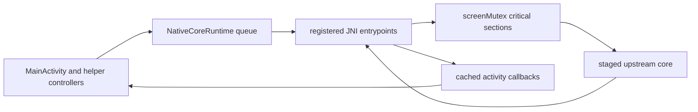

# Upstream Interface Surfaces

This page maps the exact Android-owned calls that cross into the staged
upstream core and the exact native callbacks that cross back into the activity.

Read `00-project-and-upstream.md` first. This page assumes the project and
ownership boundary is already clear.

Read this page when a task touches `MainActivity` external methods, JNI
registration, packed LCD export, lifecycle save or load entry points,
instrumentation-only bridge seams, keypad-scene export, SAF-backed file
requests, or pause and wait behavior in the staged `PC_BUILD` core. Read
`80-tests-and-contracts.md` for the focused bridge, READP, and storage
verification surfaces.

## Interface Inventory

| Surface | Android side | Native bridge | Shared-core side | Sensitive detail |
| --- | --- | --- | --- | --- |
| runtime boot and attach | `NativeCoreRuntime.attach()` calls `nativePreInit()`, `initNative()`, `tick()`, and `updateNativeActivityRef()` | `jni_registration.c` plus `jni_lifecycle.c` | `setupUI()`, `doFnReset()`, `restoreCalc()`, `fnTimerConfig(...)` | `tick()` only runs when `pthread_mutex_trylock(&screenMutex)` succeeds, and reattach stays display-passive |
| lifecycle save, load, and explicit refresh | `saveStateNative()`, `loadStateNative()`, `forceRefreshNative()` | `jni_lifecycle.c` | `saveCalc()`, `restoreCalc()`, `refreshScreen(190)`, `refreshLcd(NULL)`, `lcd_refresh()` | `saveStateNative()` must stay display-passive for background save; redraw belongs only to real state loads or explicit refresh owners |
| direct input dispatch | `sendKey()`, `sendSimKeyNative()`, `sendSimMenuNative()`, `sendSimFuncNative()` | `jni_input.c` | `btnPressed(...)`, `btnReleased(...)`, `showSoftmenu(...)`, `runFunction(...)` | input paths serialize on `screenMutex` and some skip while `isCoreBlockingForIo` is true |
| LCD and keypad snapshot export | `getPackedDisplayBuffer()`, `setLcdColors()`, `getKeypadMetaNative()`, `getKeypadLabelsNative()` | `jni_display.c` plus `hal/lcd.c` | `packedDisplayBuffer`, compatibility `screenData`, visible key tables, label resolvers | `getPackedDisplayBuffer()` exits early when `lcdBufferDirty` is false or the lock is busy, and a successful export clears packed-row dirty flags after copy |
| instrumentation-only runtime probes | `ProgramLoadTestBridge.forceRefresh()`, `saveBackgroundStateForTest()`, `captureDisplayHash()`, `beginSimFunction()`, `snapshotState()` | `jni_program_load_test.c` | `r47_force_refresh()`, `r47_save_background_state_locked()`, packed LCD snapshot state, READP or RUN workers | lifecycle snapshot hashes must ignore packed-row transport metadata so assertions compare visible LCD bytes only |
| native to activity callbacks | `requestFile()`, `playTone()`, `stopTone()`, `processCoreTasks()` | `updateNativeActivityRef()` refreshes the global activity reference and caches `jmethodID`s; `processCoreTasksNative()` calls back into Java | lets long native waits service Android work | cached method IDs and Kotlin method signatures must stay aligned, and reattach must not redraw the LCD |
| storage and yield boundary | `StorageAccessCoordinator` returns detached file descriptors through `onFileSelectedNative()` or `onFileCancelledNative()` | `jni_storage.c` plus `android_runtime.c` | `ioFileOpen(...)`, long-running waits, timer refresh | both paths release and later reacquire the recursive `screenMutex` |

## Bridge Flow

## Boot And Activity Reference Contract

- `register_main_activity_natives()` in `jni_registration.c` registers the full
  `MainActivity` external-method surface. Signature drift is a hard failure, so
  change Kotlin declarations, `JNINativeMethod` entries, and native
  implementations in the same edit.
- `NativeCoreRuntime.startOrAttachCoreThread()` initializes native state only
  once. The first attach calls `nativePreInit(...)` and `initNative(...)`; a
  later attach only refreshes the activity reference through
  `updateNativeActivityRef()` and keeps reattach display-passive.
- `r47_native_preinit_path(...)` sets the Android base path used by
  `hal/io.c` and installs the GMP allocator hooks before the shared core starts.
- `r47_init_runtime(...)` sets the current slot, calls `setupUI()`, initializes
  LCD buffers, resets and restores calculator state, sets both
  `nextScreenRefresh` and `nextTimerRefresh`, and registers the native timer
  callbacks that the staged core expects.
- `Java_com_example_r47_MainActivity_tick(...)` is the steady-state entry point
  from the Kotlin core thread. It uses `pthread_mutex_trylock(&screenMutex)`,
  advances timers every 5 ms, and refreshes the LCD every 100 ms when the lock
  is available.

## Lifecycle Save, Load, And Explicit Refresh Contract

- `MainActivity.onPause()` routes background persistence through
  `NativeCoreRuntime.saveStateOnPause(...)`, which posts `saveStateNative()` to
  the core thread and waits for completion.
- `saveStateNative()` locks `screenMutex` and delegates to
  `r47_save_background_state_locked()`, which now performs only `saveCalc()`.
  That path must stay display-passive for a normal background save or
  Settings-entry transition.
- `MainActivity.onResume()` no longer requests `forceRefreshNative()` for a
  normal Settings return. The existing display loop and overlay resume hook are
  sufficient to preserve the current snapshot.
- `loadStateNative()` remains a redraw owner because it reconstructs calculator
  state through `restoreCalc()` and then refreshes the LCD.
- `forceRefreshNative()` remains an explicit redraw seam for runtime init and
  test-controlled refresh owners. Do not reintroduce it into passive lifecycle
  callbacks that do not replace calculator state.

## Input Dispatch Contract

- Touch, PiP taps, physical-keyboard actions, and some display actions all land
  in `MainActivity`, then queue work through `NativeCoreRuntime.offerTask(...)`
  or call one of the direct JNI input entry points.
- `sendKey(int)` is the main numeric key path. It maps key codes `1..37` onto
  `btnPressed(...)` or `btnReleased(...)` and key codes `38..43` onto the
  dedicated function-key press and release handlers.
- `sendSimKeyNative(String, boolean, boolean)` is the string-key path used by
  the physical keyboard mapper and display actions. It bails out when
  `isCoreBlockingForIo` is set so Android does not inject keypad work while the
  core is suspended in a SAF file request.
- `sendSimMenuNative(int)` calls `showSoftmenu(...)` and then forces a screen
  refresh. `sendSimFuncNative(int)` calls `runFunction(...)` directly.
- All of these paths lock `screenMutex`, so they must stay short and must not
  add Android-side blocking work inside the native critical section.

## Display And Keypad Snapshot Export

- `NativeDisplayRefreshLoop.doFrame(...)` is the only continuous poller on the
  Android side. It requests packed LCD rows plus keypad metadata and labels
  from the native bridge while the app is active.
- `getPackedDisplayBuffer(...)` copies the packed LCD snapshot only when
  `lcdBufferDirty` is true. It uses `pthread_mutex_trylock`, so a busy native
  section simply skips one frame instead of blocking the UI thread.
- After a successful copy, the JNI export clears the packed-row dirty flag in
  each copied row. That flag is transport bookkeeping, not part of the visible
  LCD contract.
- `screenData` remains allocated only as a compatibility framebuffer for
  compiled upstream `PC_BUILD` helpers such as screenshot and menu-export
  paths. The Android UI no longer consumes it directly.
- `setLcdColors(...)` marks every native LCD row dirty for future exports while
  `ReplicaOverlay` immediately recolors the cached packed snapshot on the UI
  side.
- `getKeypadMetaNative(...)` fills one fixed `KEYPAD_META_LENGTH` integer array
  under `screenMutex`.
- `getKeypadLabelsNative(...)` walks the visible main-key table plus the six
  softkeys under `screenMutex` and exports the current label strings.
- Kotlin converts those raw arrays into `KeypadSnapshot`, and the renderer uses
  named fields from that model instead of indexing raw native arrays again.

## Instrumentation-Only Bridge Contract

- `ProgramLoadTestBridge` is the Android-owned instrumentation seam for both
  READP program execution coverage and passive lifecycle LCD preservation.
- `beginSimFunction(...)`, `snapshotState()`, and the file-descriptor override
  helpers drive the same READP or RUN worker paths used by
  `ProgramFixtureInstrumentedTest`.
- `saveBackgroundStateForTest()` routes directly to
  `r47_save_background_state_locked()` so lifecycle tests can assert that the
  pause-side save path is display-passive.
- `captureDisplayHash()` hashes only visible packed LCD bytes. It intentionally
  ignores the row-dirty transport flag that `getPackedDisplayBuffer(...)`
  clears after each successful UI poll.
- `forceRefresh()` remains the explicit redraw seam for tests that need to
  assert the opt-in native refresh path.

## Native Callbacks Into The Activity

- `updateNativeActivityRef()` stores a global reference to `MainActivity` and
  caches the method IDs for `requestFile(...)`, `playTone(...)`, `stopTone()`,
  and `processCoreTasks()`. It does not redraw the LCD on reattach.
- `processCoreTasksNative()` is the re-entry hook used by
  `yieldToAndroidWithMs(...)`. It calls back into `MainActivity.processCoreTasks()`
  so queued Android-side work can run while the native core is yielding.
- `requestFile(...)` posts onto the main handler and hands control to
  `StorageAccessCoordinator`, which owns the SAF launcher registration and the
  detached file-descriptor handoff. The same coordinator also owns the
  first-run welcome-dialog handoff into the direct work-directory tree picker
  and the missing-directory recovery picker path, while `SettingsActivity`
  remains the explicit manual work-directory surface.

These callbacks are part of the interface contract, not optional convenience
hooks. If their names or signatures drift, the bridge loses storage, tone, or
yield behavior.

## Storage, Yield, And Re-Entrancy Boundary

- `hal/io.c::ioFileOpen(...)` intercepts state, program, RTF-export, and manual
  save paths into `requestAndroidFile(...)` when the Android build is active.
- `requestAndroidFile(...)` in `jni_storage.c` fully releases the recursive
  `screenMutex`, marks `isCoreBlockingForIo = true`, calls back into
  `MainActivity.requestFile(...)`, waits on `fileCond`, then reacquires
  `screenMutex` exactly as many times as it was previously held.
- `Java_com_example_r47_MainActivity_onFileSelectedNative(...)` and
  `Java_com_example_r47_MainActivity_onFileCancelledNative(...)` wake that wait
  by updating `fileDescriptor`, `fileReady`, and `fileCancelled` under
  `fileMutex`.
- `yieldToAndroidWithMs(...)` in `android_runtime.c` uses the same release,
  process, sleep, and reacquire pattern for long-running native work. It also
  advances timers every 5 ms, refreshes the LCD, and calls
  `processCoreTasksNative()` before sleeping.
- The base path configured by `nativePreInit(...)` and the SAF work-directory
  URI owned by `WorkDirectory` are separate contracts. The docs and code must
  keep them separate.
- The startup and missing-directory work-directory tree picker route stays on
  the Kotlin side in `StorageAccessCoordinator` and `WorkDirectory`; it does
  not cross the native bridge unless a later file open request reaches the
  detached-fd SAF seam.

## Event-Loop Compatibility Contract

The staged upstream core runs in `PC_BUILD` mode, so the Android bridge must
provide the small GTK and GLib event-loop API surface that pause, wait,
progress, and timer-driven code expects.

`android_runtime.c` owns these compatibility symbols:

- `g_main_context_iteration(...)`
- `gtk_main_iteration()`
- `gtk_events_pending()`
- `g_timeout_add(...)`
- `g_source_remove(...)`
- `yieldToAndroidWithMs(...)`

These are active runtime behavior, not placeholders. Changes here can break the
host workload-regression lane and Android long-running program behavior even
when the app still launches.

## Interface Change Rules

- Change canonical upstream sources for shared calculator behavior.
- Change `c47-android` only for Android runtime compatibility, JNI, HAL, or
  marshalling behavior.
- Keep Kotlin external declarations, `JNINativeMethod` registration, cached
  `jmethodID`s, and native implementations aligned in one change.
- Keep lock release and reacquire boundaries explicit on storage, refresh, and
  pause or wait paths.
- Do not reintroduce `forceRefreshNative()` or other synthetic redraw work into
  a passive lifecycle callback such as a normal Settings return.
- Do not hand-edit the build-only staged native tree as a lasting fix.
