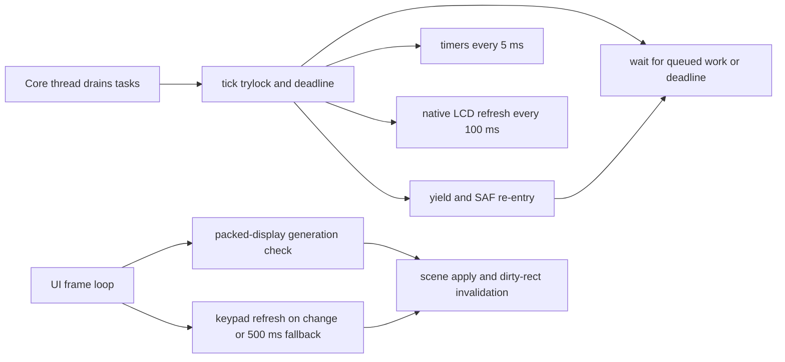

# Runtime Hot Paths

This page names the concrete runtime loops, redraw paths, cadence limits, and
lock-sensitive boundaries that are easiest to regress in the Android shell.

Read `00-project-and-upstream.md` first and
`50-upstream-interface-surfaces.md` second. This page assumes the ownership and
interface boundary is already clear. Read `80-tests-and-contracts.md` for the
contract-to-regression map that proves these loops.

## Hot Paths At A Glance

| Path | Trigger and cadence | Main files | Why it is hot | Main failure mode |
| --- | --- | --- | --- | --- |
| core-thread coordinator | `NativeCoreRuntime` loop while the app is running; drains tasks, calls `tick()`, then waits for queued work up to the returned deadline | `NativeCoreRuntime.kt`, `jni_lifecycle.c` | every Android-owned action reaches the core through this loop | blocking work or queue growth stalls native progress |
| live stop delivery during RUN | user presses live `R/S` or `EXIT` while a program is already running; `MainActivity` first tries direct stop publication and only falls back to the normal key queue when native state says the run is already idle | `MainActivity.kt`, `ReplicaOverlayController.kt`, `NativeCoreRuntime.kt`, `jni_input.c`, `android_runtime.c` | this is the control-plane path that decides whether Android can publish stop intent without waiting on the core-owner queue | shared-core loops that never observe `programRunStop` can still ignore the published stop and make the app appear hung |
| direct-stop refresh finalization | after live `R/S` or `EXIT` publishes stop during RUN or PAUSE, native code marks a pending stop-refresh request and the next `tick()` or `yieldToAndroidWithMs()` consumes it under `screenMutex` | `jni_input.c`, `jni_lifecycle.c`, `android_runtime.c` | this is the display-plane path that makes the first stop look finished instead of waiting for a second key press or explicit refresh | if `SCRUPD_AUTO` or `reDraw` is not rearmed here, graph pixels and post-stop text can mix on the first stop |
| native tick and timer path | `tick()` acquires `screenMutex` with `trylock`; timers every 5 ms, LCD refresh every 100 ms, then returns the next wake delay | `jni_lifecycle.c` | this is the steady-state native heartbeat | turning the lock into a blocking wait or adding heavy work lengthens every cycle |
| frame refresh loop | one `Choreographer` callback per UI frame while active; LCD polling first checks a packed-display generation and keypad snapshots refresh every 500 ms or on generation change | `NativeDisplayRefreshLoop.kt`, `NativeKeypadSnapshotStore.kt`, `jni_display.c`, `ReplicaOverlay.kt` | this is the continuous UI-side polling loop | breaking generation or busy-copy handling can regress to stale or blocking keypad refreshes |
| packed LCD row decode | each accepted LCD update copies only dirty packed rows, decodes them to the bitmap, and invalidates the touched display rows | `ReplicaOverlay.kt`, `jni_display.c`, `hal/lcd.c` | this runs on the UI thread and touches the LCD bitmap path directly | forced full-snapshot redraws on passive lifecycle edges or transport-metadata coupling create visible regressions |
| keypad scene apply | scene changes update all live key views, invalidate per-key specs, and may request layout | `ReplicaOverlayController.kt`, `ReplicaKeypadLayout.kt`, `CalculatorKeyView.kt`, `CalculatorSoftkeyPainter.kt`, `KeyRenderSpec.kt` | keypad labels, render specs, and layout are the largest recurring view updates outside the LCD | bypassing the refresh gate or forcing layout or invalidation on unchanged scenes creates churn |
| lifecycle save and explicit refresh | background save waits on the core thread; explicit redraw remains opt-in for real state changes | `NativeCoreRuntime.kt`, `MainActivity.kt`, `jni_lifecycle.c` | lifecycle callbacks are easy places to hide destructive redraw work | synthetic redraws during passive save or resume mutate the LCD without a real calculator transition |
| yield and SAF I/O boundary | long native waits release `screenMutex`, service Android work, and reacquire the recursive lock | `android_runtime.c`, `jni_storage.c`, `hal/io.c` | this is the most sensitive re-entrancy boundary in the bridge | deadlock, input races, or missed wakeups stall the app |

## Runtime Loop Graph

## Core-Thread Coordinator

- `NativeCoreRuntime` owns one shared `LinkedBlockingQueue<Runnable>` named
  `coreTasks`.
- `attach()` starts the core thread once, marks the app as running, and starts
  the display refresh loop.
- The thread body in `startOrAttachCoreThread()` does three things in order:
  drain queued work, call `tick()`, then wait on `coreTasks.poll(...)` for the
  returned delay.
- `saveStateOnPause(...)` is also routed through this queue and waits on a
  `CountDownLatch`, which means blocking or slow native save work is visible at
  the activity lifecycle boundary.
- `dispose(stopApp = true)` clears the queue and offers a sentinel runnable so
  a blocked wait wakes promptly during shutdown.
- The same queue still carries normal keypad input from touch, PiP, and
  physical keyboard controllers.
- Live touchscreen and PiP `R/S` or `EXIT` now bypass that queue through
  `requestStopProgramNative()`, but every other key still follows the normal
  queued path.
- The direct stop seam is therefore not "more work on the queue". It publishes
  stop intent immediately and leaves the first-stop full refresh to the native
  `tick()` or `yieldToAndroidWithMs()` consumption points under `screenMutex`.

Inspect this path when Android requests appear to arrive late, state saves time
out, or the app behaves as if work is happening on multiple native threads.

## Native Tick And Timer Path

- `Java_com_example_r47_MainActivity_tick(...)` in `jni_lifecycle.c` is the
  native heartbeat reached from the Kotlin core thread.
- It exits immediately when `pthread_mutex_trylock(&screenMutex)` fails. That
  is intentional: a busy native critical section skips one tick instead of
  blocking the core thread behind the lock.
- When the lock is available, timers advance every 5 ms through
  `refreshTimer(NULL)` and the LCD refresh path runs every 100 ms through
  `refreshLcd(NULL)` plus `lcd_refresh()`.
- Before the ordinary 100 ms LCD refresh, `tick()` now checks
  `r47_apply_pending_stop_refresh_locked()`. When a live direct stop has
  published a refresh request, that helper re-arms `SCRUPD_AUTO`, sets
  `reDraw = true`, runs `refreshScreen(190)`, `refreshLcd(NULL)`, and
  `lcd_refresh()`, then schedules the next steady-state LCD refresh.
- After servicing due work, `tick()` returns the next wake delay computed from
  `nextTimerRefresh` and `nextScreenRefresh`, so the Kotlin side can wait on a
  real native deadline instead of a fixed JVM sleep.
- `r47_init_runtime(...)` seeds `nextTimerRefresh` and `nextScreenRefresh`, so
  tick cadence after boot depends on that initialization remaining intact.

Changes here affect the full runtime even when the Android UI code is untouched.

## Frame Refresh Loop

- `NativeDisplayRefreshLoop` is the only continuous UI-thread poller for live
  native state.
- Each `doFrame(...)` call first reads `getPackedDisplayGeneration()`. Only when
  the generation changed does it attempt `getPackedDisplayBuffer(...)`, then it
  forwards accepted packed rows to `ReplicaOverlay.updatePackedLcd(...)`.
- If the non-blocking packed-buffer copy fails, the same generation is retried
  on the next frame instead of being treated as consumed.
- The loop reads `getKeypadSnapshotGeneration()` and refreshes keypad state
  only when the generation changed or more than 500 ms passed since
  `lastLabelRefresh`.
- `refreshKeypadSnapshot(...)` delegates to
  `NativeKeypadSnapshotStore.refreshSnapshot(...)`, which owns reusable
  metadata and label buffers plus one cached `KeypadSnapshot` per main-key
  mode.
- `copyKeypadSnapshotNative(...)` assembles one coherent keypad snapshot under
  a single `pthread_mutex_trylock(&screenMutex)` window. When the lock is busy,
  the store returns the last accepted snapshot for that mode instead of
  blocking the UI thread or synthesizing an empty scene.
- Only a refresh result marked `isUpToDate` advances `lastKeypadGeneration`.
  That keeps busy skips retryable on the next frame while still letting the
  renderer reuse the last good snapshot.
- `ReplicaOverlayController.currentKeypadSnapshot()` still applies the main-key
  mode transform plus the `virtuoso` blank-keycap composition and softkey
  `graphic` or `off` mask before the renderer path runs.

Do not add a second polling loop for LCD pixels, keypad labels, or scene state.
That would duplicate the most expensive JNI reads in the shell.

## Packed LCD Row Decode Path

- `jni_display.c::getPackedDisplayBuffer(...)` short-circuits when
  `lcdBufferDirty` is false, and `NativeDisplayRefreshLoop` only attempts the
  copy after `getPackedDisplayGeneration()` changes, so Kotlin does not receive
  a fresh packed snapshot on unchanged frames.
- After a successful copy, the JNI export clears each row's dirty flag in the
  packed transport buffer. That dirty flag is transport bookkeeping, not part of
  the visible LCD contract.
- `ReplicaOverlay.updatePackedLcd(...)` decodes only rows whose packed byte `0`
  is dirty, copies those rows into `lastPackedLcd`, repaints the changed rows
  into the bitmap, and invalidates the full LCD width across the touched row
  span.
- `ReplicaOverlay.redrawPackedSnapshot()` repaints the cached packed snapshot
  for palette changes without inventing a new native redraw path.
- the animated settings-discovery hint in `ReplicaOverlay` now keeps its
  `StaticLayout` and card geometry in a cache rebuilt from real size or layout
  changes, so the pulse animation no longer allocates text-layout objects on
  each draw pass.

This path is sensitive because it runs on the UI thread, owns the live packed
snapshot cache, and is the easiest place to reintroduce transport-level work as
if it were visible LCD state.

## Lifecycle Save And Explicit Refresh Path

- `NativeCoreRuntime.saveStateOnPause(...)` posts `saveStateNative()` to the
  core thread and waits for completion. That makes the save helper part of the
  activity lifecycle boundary.
- `r47_save_background_state_locked()` must stay persistence-only. Background
  save and Settings entry are passive transitions and must not redraw the LCD.
- `MainActivity.onResume()` for a normal Settings return must also stay passive
  from the native LCD point of view. The display loop is already running and the
  overlay resume path can handle geometry replay without a native force refresh.
- PiP mode changes stay UI-side as well. The PiP callback must route through
  `ReplicaOverlayController` so PiP exit reuses the pending geometry replay
  path for the current keypad snapshot instead of forcing a native redraw.
- `r47_force_refresh()` remains the explicit redraw path for real state-change
  owners such as runtime init, state load, and test-owned refresh seams.
- A live direct stop is not a passive lifecycle transition, but it is also not
  a UI-thread `forceRefreshNative()` call. `requestStopProgramNative()` only
  sets up the pending stop-refresh request, and `tick()` or
  `yieldToAndroidWithMs()` consume it later under `screenMutex` so the first
  post-stop LCD matches an explicit refresh without corrupting the hot path.

This is the place to inspect first when a theme, settings, or lifecycle change
corrupts a graph or mixes status text into an otherwise stable LCD snapshot.

## Keypad Scene-Application Path

- `ReplicaOverlayController.refreshDynamicKeys(...)` is the gatekeeper for
  scene application.
- `KeypadSnapshotRefreshGate.shouldApply(...)` skips unchanged snapshots by
  value so the shell does not relayout every time the frame loop polls.
- `ReplicaKeypadLayout.updateDynamicKeys(...)` updates every `CalculatorKeyView`
  only when `sceneContractVersion > 0`, then requests layout once.
- Geometry-affecting preference changes do not immediately replay the scene.
  `markGeometryChange()` sets a pending flag, and
  `schedulePendingGeometrySceneReplay()` waits until the next real overlay
  layout before forcing one replay.
- `CalculatorKeyView` keeps a cached `mainKeyRenderSpec` and refreshes it when
  label, layout-class, or size changes move main-key geometry.
- `CalculatorSoftkeyPainter` now caches the resolved `KeyRenderSpec` by the
  current snapshot, font set, size, pressed state, and draw-surface flag, so
  unchanged softkey frames can stay on the painter path without rebuilding the
  spec graph. Unnecessary softkey `invalidate()` churn is still expensive, but
  it no longer forces a full spec rebuild on every draw.
- PiP exit now uses that same contract. The restored full-window shell marks a
  pending geometry replay and the next real overlay layout reapplies the
  current scene once.
- After layout, `applyTopLabelPlacementsAfterLayout(...)` reruns the row-local
  top-label solver only for the visible key views in the affected lanes.

This path becomes expensive when unchanged snapshots stop being filtered, when
layout is requested more than once per scene change, or when scene work is
moved into the per-frame LCD path.

## Yield And SAF I/O Boundary

- `yieldToAndroidWithMs(...)` in `android_runtime.c` is the long-running native
  yield path.
- Before sleeping, it advances timers when the 5 ms cadence expires and then
  either consumes a pending stop-refresh request or runs the ordinary LCD
  refresh before it fully releases the recursive `screenMutex`, calls
  `processCoreTasksNative()`, sleeps for `ms` or 1 ms, then reacquires the lock
  the same number of times.
- `requestAndroidFile(...)` in `jni_storage.c` uses the same release and later
  reacquire pattern around SAF file selection.
- While a file request is pending, `isCoreBlockingForIo` is true. The string
  keypad path in `sendSimKeyNative(...)` and `r47_send_sim_key(...)` checks that
  flag and declines new keypad work.
- `hal/io.c::ioFileOpen(...)` is what sends state, program, RTF export, and
  manual-save traffic onto this boundary in the first place.
- This path is also one of the two core-owned consumption points for the
  pending stop-refresh handshake because it can reacquire `screenMutex`, apply
  the full refresh, and then continue the long run. Queued non-stop work still
  drains through `processCoreTasksNative()` before sleep.

This is the place to inspect first when the app appears hung in a long-running
program, a save or load operation, or a progress or pause loop.

## Residual Hang: NaN-Driven Non-Yielding Runs

- The improved hot path solved the old throughput and redraw issues: the app
  now runs heavy workloads smoothly, keeps LCD updates responsive, and can
  publish live `R/S` or `EXIT` stop intent without waiting on the core queue.
- The narrower display-plane bug from graph workloads is also fixed on the
  Android-owned side: direct stop publication now schedules a core-owned full
  refresh so the first post-stop LCD matches an explicit `forceRefresh()`.
- The remaining Android-only hang appears when a shared-core program drifts
  into a non-terminating `NaN` loop and never reaches a path that observes
  `programRunStop` or yields back through an Android compatibility seam.
- In that state, the remaining limitation is no longer Android queue starvation
  or UI-thread keypad export blocking. It is a shared-core stop-observation gap
  that Android cannot preempt from the outside.
- Android's official ANR guidance still matters here, but the owned shell side
  is now the fast publisher rather than the bottleneck.

## Regression And Evidence Surfaces

- `android/app/src/test/java/io/github/ppigazzini/r47zen/NativeCoreRuntimeTest.kt` covers
  one-time initialization, task execution, state-save behavior, and native-
  deadline waiting on the core thread.
- `android/app/src/test/java/io/github/ppigazzini/r47zen/NativeDisplayRefreshLoopTest.kt`
  covers generation gating and retry-after-failed-copy behavior for the packed
  LCD observer loop.
- `android/app/src/test/java/io/github/ppigazzini/r47zen/DynamicKeypadParityFixtureTest.kt`
  covers the unchanged-snapshot skip gate and keypad parity behavior.
- `android/app/src/test/java/io/github/ppigazzini/r47zen/ReplicaOverlayGoldenTest.kt`
  covers renderer stability for the borderless native shell and the retained
  top settings-strip interaction.
- `android/app/src/androidTest/java/io/github/ppigazzini/r47zen/DisplayLifecycleInstrumentedTest.kt`
  now proves that passive lifecycle edges preserve a staged `SPIRALk` graph and
  that the first direct stop on that same workload already matches an explicit
  `forceRefresh()` snapshot.
- `scripts/workload-regressions/run_workload_regressions.sh` exercises the host
  Android-compatibility wait and progress path across the canonical
  `BinetV3.p47`, `GudrmPL.p47`, `MANSLV2.p47`, `NQueens.p47`, and
  `SPIRALk.p47` workloads. Each fixture now runs in its own host process under
  the same outer timeout-and-kill safety net, while `MANSLV2` stays the
  maintained direct-stop-after-activity scenario inside that framework.
- There is now focused automated Android coverage proving that the direct-stop
  publisher can interrupt a maintained `MANSLV2` run after observed activity.
  There is still no focused automated lane proving that keypad snapshot export
  itself stays non-blocking on the UI thread during the same class of
  deliberately non-yielding run.
- `./scripts/android/build_android.sh --run-sim-tests` keeps the Android full
  build path aligned with the `build.sim` Meson and Ninja lane.
- `ProgramFixtureInstrumentedTest` drives canonical program fixtures through the
  Android `READP` path used by the live app and reuses the same native
  direct-stop publisher as live `R/S` and `EXIT` for the bounded
  `MANSLV2` interrupt scenario. Hosted CI now runs one filtered
  `ProgramFixtureInstrumentedTest` method per fixture under the same outer
  timeout-and-kill safety net used by the host wrapper.

When a task changes one of these hot paths, update the narrowest relevant
verification lane first and widen only if the first check does not cover the
regression surface.

## Hot-Path Change Rules

- Keep work off the main thread unless the Android view system requires it.
- Do not duplicate refresh loops that already exist in `NativeCoreRuntime`,
  `NativeDisplayRefreshLoop`, or `ReplicaOverlay`.
- Respect Android's measure/layout/draw split: geometry changes call
  `requestLayout()`, visual-only changes should stay on `invalidate()`, and
  per-key spec recompute should remain tied to real size or scene changes
  instead of steady-state `onDraw()`.
- Keep redraw work tied to real pixel, scene, or layout changes.
- Do not reintroduce fixed 10 ms wakeups when native code can report the next
  real deadline.
- Do not pull packed LCD rows when the generation is unchanged.
- Do not try to fix stop starvation by queueing more work onto the same busy
  core thread.
- Do not let UI-thread keypad snapshot export block behind `screenMutex`; if
  native state is busy, prefer stale snapshot reuse or a skipped refresh over a
  blocking wait.
- Preserve the `trylock` and skip-one-cycle behavior unless a real runtime bug
  proves it is wrong.
- Make lock release and reacquire boundaries explicit before changing storage,
  pause, wait, or progress behavior.
