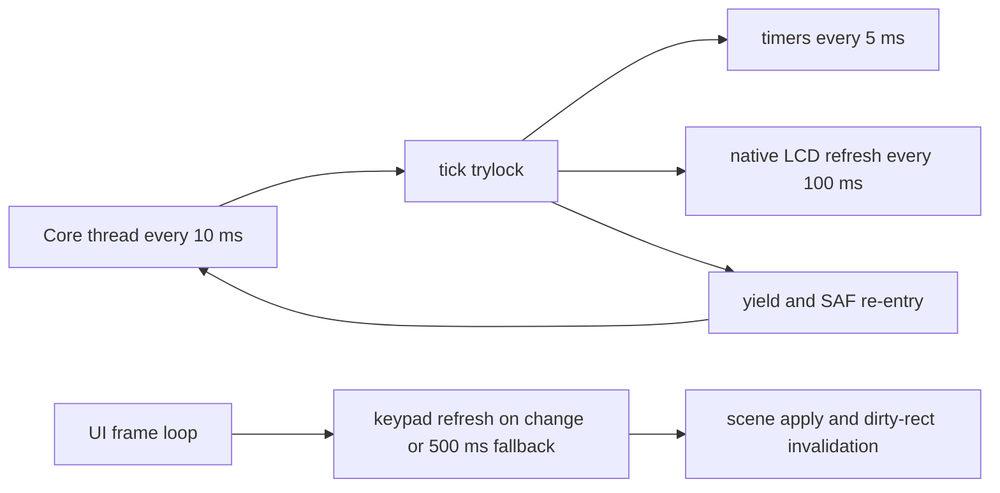

# Runtime Hot Paths

This page names the concrete runtime loops, redraw paths, cadence limits, and
lock-sensitive boundaries that are easiest to regress in the Android shell.

Read `00-project-and-upstream.md` first and
`50-upstream-interface-surfaces.md` second. This page assumes the ownership and
interface boundary is already clear. Read `80-tests-and-contracts.md` for the
contract-to-regression map that proves these loops.

## Hot Paths At A Glance

| Path | Trigger and cadence | Main files | Why it is hot | Main failure mode |
| --- | --- | --- | --- | --- |
| core-thread coordinator | `NativeCoreRuntime` loop while the app is running; drains tasks, calls `tick()`, then sleeps 10 ms | `NativeCoreRuntime.kt`, `jni_lifecycle.c` | every Android-owned action reaches the core through this loop | blocking work or queue growth stalls native progress |
| native tick and timer path | `tick()` acquires `screenMutex` with `trylock`; timers every 5 ms, LCD refresh every 100 ms | `jni_lifecycle.c` | this is the steady-state native heartbeat | turning the lock into a blocking wait or adding heavy work lengthens every cycle |
| frame refresh loop | one `Choreographer` callback per UI frame while active; LCD polling runs through packed-row export and keypad labels refresh every 500 ms or on meta change | `NativeDisplayRefreshLoop.kt`, `jni_display.c`, `ReplicaOverlay.kt` | this is the continuous UI-side polling loop | extra JNI calls, duplicate pollers, or unnecessary redraw triggers hurt frame time |
| packed LCD row decode | each accepted LCD update copies only dirty packed rows, decodes them to the bitmap, and invalidates the touched display rows | `ReplicaOverlay.kt`, `jni_display.c`, `hal/lcd.c` | this runs on the UI thread and touches the LCD bitmap path directly | forced full-snapshot redraws on passive lifecycle edges or transport-metadata coupling create visible regressions |
| keypad scene apply | scene changes update all live key views and may request layout | `ReplicaOverlayController.kt`, `ReplicaKeypadLayout.kt`, `CalculatorKeyView.kt` | keypad labels and layout are the largest recurring view updates outside the LCD | bypassing the refresh gate or forcing layout on unchanged scenes creates churn |
| lifecycle save and explicit refresh | background save waits on the core thread; explicit redraw remains opt-in for real state changes | `NativeCoreRuntime.kt`, `MainActivity.kt`, `jni_lifecycle.c` | lifecycle callbacks are easy places to hide destructive redraw work | synthetic redraws during passive save or resume mutate the LCD without a real calculator transition |
| yield and SAF I/O boundary | long native waits release `screenMutex`, service Android work, and reacquire the recursive lock | `android_runtime.c`, `jni_storage.c`, `hal/io.c` | this is the most sensitive re-entrancy boundary in the bridge | deadlock, input races, or missed wakeups stall the app |

## Runtime Loop Graph

## Core-Thread Coordinator

- `NativeCoreRuntime` owns one shared `LinkedBlockingQueue<Runnable>` named
  `coreTasks`.
- `attach()` starts the core thread once, marks the app as running, and starts
  the display refresh loop.
- The thread body in `startOrAttachCoreThread()` does three things in order:
  drain queued work, call `tick()`, then sleep for 10 ms.
- `saveStateOnPause(...)` is also routed through this queue and waits on a
  `CountDownLatch`, which means blocking or slow native save work is visible at
  the activity lifecycle boundary.

Inspect this path when Android requests appear to arrive late, state saves time
out, or the app behaves as if work is happening on multiple native threads.

## Native Tick And Timer Path

- `Java_com_example_r47_MainActivity_tick(...)` in `jni_lifecycle.c` is the
  native heartbeat reached from the Kotlin core thread.
- It exits immediately when `pthread_mutex_trylock(&screenMutex)` fails. That
  is intentional: a busy native critical section skips one tick instead of
  blocking the core thread behind the lock.
- When the lock is available, timers advance every 5 ms through
  `refreshTimer(NULL)` and the LCD refresh path runs every 100 ms through
  `refreshLcd(NULL)` plus `lcd_refresh()`.
- `r47_init_runtime(...)` seeds `nextTimerRefresh` and `nextScreenRefresh`, so
  tick cadence after boot depends on that initialization remaining intact.

Changes here affect the full runtime even when the Android UI code is untouched.

## Frame Refresh Loop

- `NativeDisplayRefreshLoop` is the only continuous UI-thread poller for live
  native state.
- Each `doFrame(...)` call reads the LCD through `getPackedDisplayBuffer(...)`,
  forwards the packed rows to `ReplicaOverlay.updatePackedLcd(...)`, then
  requests keypad metadata through `getKeypadMetaNative(...)` using the current
  main-key mode code from `ReplicaOverlayController`.
- Label refresh work runs only when either of these is true:
  - the keypad metadata differs from the last frame
  - more than 500 ms passed since `lastLabelRefresh`
- When refresh is needed, the loop converts metadata into `KeypadSnapshot` and
  forwards it to `ReplicaOverlayController.refreshDynamicKeys(...)`, which may
  also apply the softkey `graphic` or `off` mask before the renderer path runs.

Do not add a second polling loop for LCD pixels, keypad labels, or scene state.
That would duplicate the most expensive JNI reads in the shell.

## Packed LCD Row Decode Path

- `jni_display.c::getPackedDisplayBuffer(...)` short-circuits when
  `lcdBufferDirty` is false, so Kotlin does not receive a fresh packed snapshot
  on unchanged frames.
- After a successful copy, the JNI export clears each row's dirty flag in the
  packed transport buffer. That dirty flag is transport bookkeeping, not part of
  the visible LCD contract.
- `ReplicaOverlay.updatePackedLcd(...)` decodes only rows whose packed byte `0`
  is dirty, copies those rows into `lastPackedLcd`, repaints the changed rows
  into the bitmap, and invalidates the full LCD width across the touched row
  span.
- `ReplicaOverlay.redrawPackedSnapshot()` repaints the cached packed snapshot
  for palette changes without inventing a new native redraw path.

This path is sensitive because it runs on the UI thread, owns the live packed
snapshot cache, and is the easiest place to reintroduce transport-level work as
if it were visible LCD state.

## Lifecycle Save And Explicit Refresh Path

- `NativeCoreRuntime.saveStateOnPause(...)` posts `saveStateNative()` to the
  core thread and waits for completion. That makes the save helper part of the
  activity lifecycle boundary.
- `r47_save_background_state_locked()` must stay persistence-only. Background
  save and Settings entry are passive transitions and must not redraw the LCD.
- `MainActivity.onResume()` for a normal Settings return must also stay passive
  from the native LCD point of view. The display loop is already running and the
  overlay resume path can handle geometry replay without a native force refresh.
- PiP mode changes stay UI-side as well. The PiP callback must route through
  `ReplicaOverlayController` so PiP exit reuses the pending geometry replay
  path for the current keypad snapshot instead of forcing a native redraw.
- `r47_force_refresh()` remains the explicit redraw path for real state-change
  owners such as runtime init, state load, and test-owned refresh seams.

This is the place to inspect first when a theme, settings, or lifecycle change
corrupts a graph or mixes status text into an otherwise stable LCD snapshot.

## Keypad Scene-Application Path

- `ReplicaOverlayController.refreshDynamicKeys(...)` is the gatekeeper for
  scene application.
- `KeypadSnapshotRefreshGate.shouldApply(...)` skips unchanged snapshots by
  value so the shell does not relayout every time the frame loop polls.
- `ReplicaKeypadLayout.updateDynamicKeys(...)` updates every `CalculatorKeyView`
  only when `sceneContractVersion > 0`, then requests layout once.
- Geometry-affecting preference changes do not immediately replay the scene.
  `markGeometryChange()` sets a pending flag, and
  `schedulePendingGeometrySceneReplay()` waits until the next real overlay
  layout before forcing one replay.
- PiP exit now uses that same contract. The restored full-window shell marks a
  pending geometry replay and the next real overlay layout reapplies the
  current scene once.
- After layout, `applyTopLabelPlacementsAfterLayout(...)` reruns the row-local
  top-label solver only for the visible key views in the affected lanes.

This path becomes expensive when unchanged snapshots stop being filtered, when
layout is requested more than once per scene change, or when scene work is
moved into the per-frame LCD path.

## Yield And SAF I/O Boundary

- `yieldToAndroidWithMs(...)` in `android_runtime.c` is the long-running native
  yield path.
- Before sleeping, it refreshes timers when the 5 ms cadence expires,
  refreshes the LCD, fully releases the recursive `screenMutex`, calls
  `processCoreTasksNative()`, sleeps for `ms` or 1 ms, then reacquires the lock
  the same number of times.
- `requestAndroidFile(...)` in `jni_storage.c` uses the same release and later
  reacquire pattern around SAF file selection.
- While a file request is pending, `isCoreBlockingForIo` is true. The string
  keypad path in `sendSimKeyNative(...)` and `r47_send_sim_key(...)` checks that
  flag and declines new keypad work.
- `hal/io.c::ioFileOpen(...)` is what sends state, program, RTF export, and
  manual-save traffic onto this boundary in the first place.

This is the place to inspect first when the app appears hung in a long-running
program, a save or load operation, or a progress or pause loop.

## Regression And Evidence Surfaces

- `android/app/src/test/java/io/github/ppigazzini/r47/NativeCoreRuntimeTest.kt` covers
  one-time initialization, task execution, and state-save behavior on the core
  thread.
- `android/app/src/test/java/io/github/ppigazzini/r47/DynamicKeypadParityFixtureTest.kt`
  covers the unchanged-snapshot skip gate and keypad parity behavior.
- `android/app/src/test/java/io/github/ppigazzini/r47/ReplicaOverlayGoldenTest.kt`
  covers renderer stability for the native shell chrome and the legacy-mode
  fallback to native rendering.
- `scripts/workload-regressions/run_workload_regressions.sh` exercises the host
  Android-compatibility wait and progress path.
- `./scripts/android/build_android.sh --run-sim-tests` keeps the Android full
  build path aligned with the `build.sim` Meson and Ninja lane.
- `ProgramFixtureInstrumentedTest` drives canonical program fixtures through the
  Android `READP` path used by the live app.

When a task changes one of these hot paths, update the narrowest relevant
verification lane first and widen only if the first check does not cover the
regression surface.

## Hot-Path Change Rules

- Keep work off the main thread unless the Android view system requires it.
- Do not duplicate refresh loops that already exist in `NativeCoreRuntime`,
  `NativeDisplayRefreshLoop`, or `ReplicaOverlay`.
- Keep redraw work tied to real pixel, scene, or layout changes.
- Preserve the `trylock` and skip-one-cycle behavior unless a real runtime bug
  proves it is wrong.
- Make lock release and reacquire boundaries explicit before changing storage,
  pause, wait, or progress behavior.
