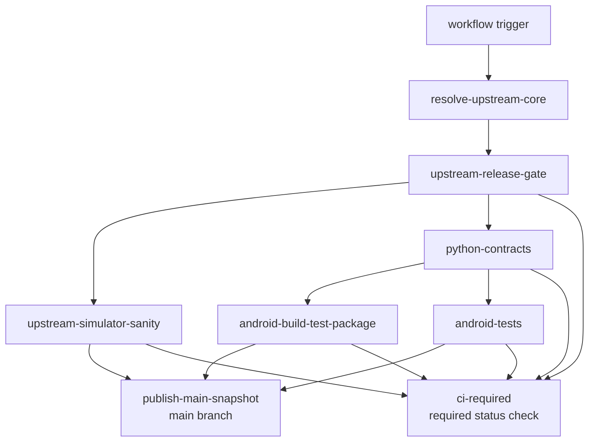
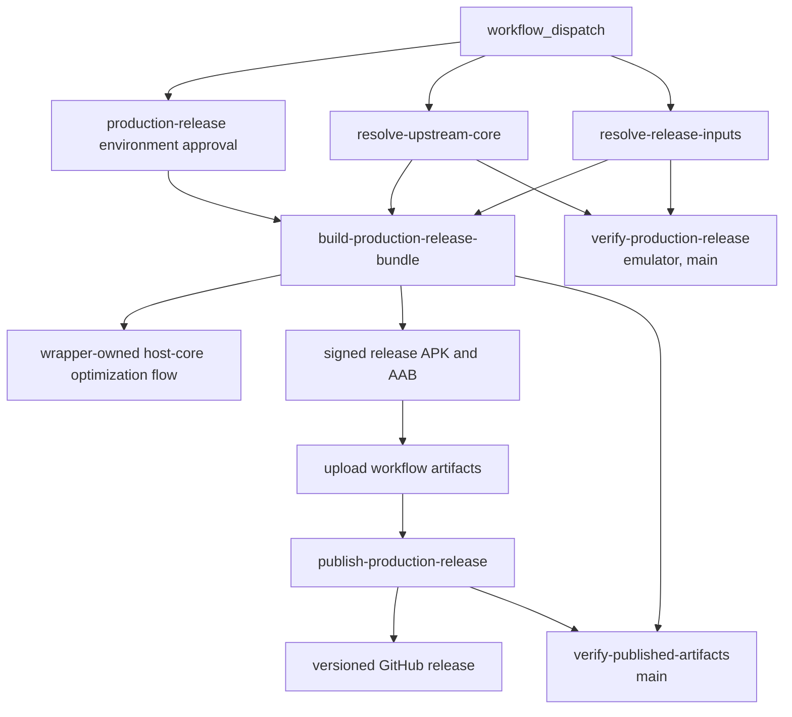

# CI And Release Workflow

This page explains the GitHub Actions lane split for the Android overlay, the
separate protected production-release workflow, what each job verifies, which
artifacts it publishes, and how to reproduce the same checks locally.

Read `00-project-and-upstream.md` first and
`10-build-and-source-layout.md` second. This page assumes the project and build
ownership boundary is already clear.

Read this page when a task touches `.github/workflows/android-ci.yml`, Android
build scripts, packaging evidence, instrumentation coverage, or release
publication. Read `80-tests-and-contracts.md` for the contract-to-suite map
behind those lanes.

## Workflow Graph



## CI At A Glance

- resolve one authoritative upstream commit per workflow run
- run the maintained Python contract suite as its own lane that gates the
  Android build and test lanes
- keep upstream simulator correctness separate from Android packaging and tests
- keep the Android build lane as the normal-CI owner of the collector-driven
  host-core PGO artifact and release-native consumer check without making that
  lane depend on emulator profiling
- make the protected release workflow rerun the same wrapper-owned host-core
  optimization flow before it signs the store bundle
- run Android lint explicitly instead of assuming Gradle builds cover it
- keep external `uses:` pins on full-length commit SHAs and keep the reviewed
  tag comment on the same line so the workflow stays auditable and
  Dependabot-readable
- publish logs and packaging evidence as first-class artifacts
- publish the main snapshot only after all required lanes pass
- keep production signing and user-facing release publication in a separate
  protected manual-only workflow

## Workflow triggers and gating

The main workflow is `.github/workflows/android-ci.yml`.

It runs on:

- manual dispatch
- pushes to `main` and `github_ci`
- pull requests

The workflow uses one concurrency group per pull request or ref and cancels
superseded runs.

Before any heavy job runs, the workflow resolves the current authoritative
upstream commit and applies a release gate:

- `resolve-upstream-core` resolves the upstream URL and commit through
  `scripts/upstream-sync/upstream.sh resolve --latest`, so the lane always
  tracks the newest upstream HEAD rather than a frozen revision. Unless an
  explicit `upstream_commit` pin is supplied, the resolver **refuses** any mode
  other than `latest` and fails loudly, so a stale or locked configuration can
  never silently ship a non-HEAD core. It also logs the resolved commit
  (`Resolved upstream commit: <sha> (mode latest)`) so the shipped revision is
  visible in the resolve job before the heavy build runs. Because GitHub builds
  the workflow file at the ref a run is dispatched from, this latest-by-default
  behaviour only applies once the change is present on that ref; a release
  dispatched from an older ref runs that ref's older resolution logic
- `upstream-release-gate` computes the downstream Android prerelease tag from
  the resolved upstream commit plus the current Android repository commit, then
  decides whether the heavy lanes run:
  - a `push` moves the Android commit and a `workflow_dispatch` is an explicit
    rebuild request, so both always proceed
  - a `schedule` run proceeds only when no GitHub release exists yet for the
    computed `release_tag`. Because the tag is keyed on the resolved upstream
    short commit and the Android overlay short commit, an unchanged upstream and
    overlay means the prerelease already exists, so the nightly run skips the
    build, test, and publish lanes (`should_run=false`). A new upstream commit
    yields a new tag, which has no release yet, so the nightly run builds and
    tests the new artifact and surfaces any upstream regression

Production signing does not run in `.github/workflows/android-ci.yml`.
The separate protected workflow `.github/workflows/android-release.yml` owns
the signed release lane for the installable APK, the Play upload AAB, and the
versioned GitHub release publication. It runs on manual dispatch only and
stays isolated behind the `production-release` environment.

## Job graph

### `upstream-simulator-sanity`

This job validates the upstream-shaped desktop or host contract before Android
packaging enters the picture.

It:

- checks out the repo
- installs Linux simulator build dependencies
- provisions Java 17 and the pinned `xlsxio` toolchain
- syncs the authoritative upstream tree
- runs `make test`

Use this lane as the first reference when a change looks like shared core,
Meson, or upstream test drift rather than Android overlay drift.

### `python-contracts`

This job runs the maintained Python contract suite that locks Kotlin geometry,
layout, and font owners to their checked-in contract sources.

It:

- checks out the repo
- syncs the authoritative upstream tree
- provisions Python 3.14 and `uv`
- runs `bash ./scripts/r47_contracts/run_contract_suite.sh`

It gates `android-build-test-package` and `android-tests`, so a contract drift
fails fast before the Android build and instrumentation lanes run. See
`80-tests-and-contracts.md` for the contract-to-suite map.

### `android-build-test-package`

This is the main Android build, packaging, and artifact lane.

It:

- provisions Java, the Gradle cache, the Android SDK, NDK, CMake, and xlsxio.
  The Android SDK provisioning (writable SDK root, setup-android for adb,
  license acceptance, pinned-package install, and SDK cache) is centralized in
  the `./.github/actions/setup-android-sdk` composite action shared by every
  Android job; an `include-emulator` input adds the emulator and system image
  for the test and release jobs and leaves them out of this build lane
- derives the Linux host LLVM major from the pinned NDK `clang`, then installs
  matching `clang-<major>`, `clang-tools-<major>`, `lld-<major>`, and
  `libclang-rt-<major>-dev` packages so the host PGO runtime shim does not
  drift onto the runner-default LLVM toolchain
- syncs the authoritative upstream tree
- runs `./scripts/android/build_android.sh --run-sim-tests --collect-host-pgo --validate-release-pgo`
- runs `cd android && ./gradlew lint` explicitly because normal Gradle builds do
  not run lint automatically
- verifies that retired app-module native snapshot paths stay absent and that
  staging remains build-only under `android/.staged-native/cpp`
- collects packaging evidence for the signed dev-prerelease APK
- uploads the build log, the host-core PGO artifact, and the Android packaging artifact bundle
  `r47zen-<upstream short>-<android short>`

That means the dev-prerelease packaging lane now owns the full
normal-pull-request
host-core optimization sequence:

- the Android wrapper testSuite rerun still proves the repo-owned simulator
  parity path before Gradle packaging
- the host-side PGO collector now runs under the same wrapper-owned lane,
  produces the `.profdata` artifact uploaded by CI, and builds instrumented
  upstream `src/testSuite/testSuite` with the maintained `broad-ci` corpus of
  `programs`, `tvm`, `jacobi_audit`, `normal_i`, `gamma`, `trig`, `prime`,
  `factorial`, and the generated `matrix_prefix_85` slice derived from
  `src/testSuite/tests/matrix.txt`
- the collector stages `res/testPgms/testPgms.bin` into its runtime root when
  `programs.txt` is present so the built-in `Prime`, `Fact`, and `SPIRAL`
  cases exercise the real generated program bundle rather than a stubbed path,
  then runs the imported `.p47` fixture overlay through the host compatibility
  path so graph, pause, wait, and LCD-style workloads are merged into the same
  uploaded `.profdata`
- the canonical host workload set of the five imported `.p47` fixtures remains
  the focused Android bridge compatibility harness exposed by
  `scripts/workload-regressions/run_workload_regressions.sh`, not the CI PGO
  corpus. The broad `broad-ci` base already covers `prime` and `factorial`
  through upstream `testSuite` inputs. That harness also runs as the dedicated
  `host-workload-regressions` lane in `linux-ci.yml` on every pull request (no
  emulator), where it both proves fixture liveness and asserts the seeded
  `NQueens.p47` (`N = 8`) numeric result against the independently verified
  8-queens solution; a wrong result fails that lane
- the same `host-workload-regressions` lane then reruns the corpus through
  `scripts/workload-regressions/run_workload_regressions_sanitized.sh`, which
  rebuilds the staged core and Android bridge under AddressSanitizer (the hard
  gate -- a memory error fails the lane) and UndefinedBehaviorSanitizer
  (recoverable report mode, so upstream-owned core UB surfaces for triage
  without failing). The dense, non-deterministic `SPIRALk` plot is bounded by
  the outer timeout and degraded to coverage; the other four fixtures must
  complete. No emulator
- the same `host-workload-regressions` lane then runs
  `scripts/workload-regressions/build_bridge_tsan_harness.sh`, which rebuilds the
  staged core and Android bridge under ThreadSanitizer and races the live input
  and refresh producer path against the UI read path -- the concurrency surface
  the single-threaded ASan/UBSan run never exercises. A data race or lock-order
  inversion in the Android-owned bridge fails the lane; upstream-core races are
  deferred to the empty, upstream-scoped `bridge_tsan_suppressions.txt`. No
  emulator
- the collector still resolves `clang` and `llvm-profdata` from that same
  pinned NDK, while the Linux lane installs the matching host
  `libclang_rt.profile` runtime for the derived LLVM major through the explicit
  CI package step
- the Android emulator lane remains narrower and still owns only the five
  staged `.p47` `PROGRAMS` fixtures
- the Android release-native PGO consumer check now runs inside that same
  wrapper-owned build step, so the build log records the full collector-to-
  consumer sequence in one place

This lane is the canonical reference for the full Android dev-prerelease build
contract.

Because this lane syncs the authoritative upstream core before staging and
native build, it is also the first owner of Android HAL drift against new
upstream `PC_BUILD` helper symbols. A recent concrete failure was the latest-
upstream addition of `create_dir`, `_ioFileNameOverride`, and
`lcd_buffer_pixel_on`; the Android lane failed at `:app:buildCMakeRelWithDebInfo`
 until the Android HAL exported all three. Treat that class of failure as a
 repo-owned Android HAL compatibility defect, not as an upstream-core bug.

### `android-tests`

This job covers the Android-owned JVM and instrumentation suites.

It:

- provisions the same toolchains and upstream sync inputs as the build lane
- runs one focused Gradle invocation for `:app:assembleRelease`,
  `:app:assembleReleaseAndroidTest`, `:app:testReleaseUnitTest`, and the Kover
  coverage reports (`:app:koverXmlReportRelease`, `:app:koverHtmlReportRelease`,
  `:app:koverLogRelease`) with `r47.releaseChannel=dev`,
  `r47.testBuildType=release`, and temporary `r47.releaseMinify=false` plus
  `r47.releaseShrinkResources=false`. The Kover step publishes a per-class JVM
  unit-test coverage report so the JNI-facing Kotlin coverage is visible
- then runs `scripts/android/coverage_gate.sh`, which parses that Kover release
  report and fails the lane if overall line coverage drops below the floor
  (default 80 %, below the current measurement so it ratchets against
  regressions) or if the live program-stop routing seam loses full line coverage
  (REPORT-24 Milestone 5)
- uses that single task graph to refresh staged native inputs, build the
  dev-release APK, assemble the instrumentation APKs, and run the JVM suite without a
  second full `build_android.sh` pass
- validates and decodes the dedicated prerelease keystore so the connected
  emulator lane installs the same signed release-path APK identity that the
  dev-prerelease lane publishes
- creates or restores an `x86_64` emulator snapshot
- runs `scripts/android/run_connected_android_tests.sh`, which invokes
  `connectedReleaseAndroidTest` once for the grouped non-fixture Android
  instrumentation class filter and once for the full
  `ProgramFixtureInstrumentedTest` class with the temporary ABI override from
  `r47.abiFilters`, the same prerelease signing inputs, and configuration cache
  enabled
- uploads logs plus JVM, instrumentation, and Kover coverage
  (`android/app/build/reports/kover`) reports in the Android test artifact
  bundle `r47zen-tests-<upstream short>-<android short>`

The hosted instrumentation lane currently relies on:

- `ProgramFixtureInstrumentedTest` plus
  `scripts/android/run_connected_android_tests.sh` for the READP load-and-run
  matrix over `BinetV3.p47`, `GudrmPL.p47`, `MANSLV2.p47`, `NQueens.p47`, and
  `SPIRALk.p47`. The wrapper keeps full fixture coverage but reduces Gradle
  startup cost by batching the five non-fixture Android instrumentation
  classes into one filtered selection and the complete
  `ProgramFixtureInstrumentedTest` class into one second bounded
  `connectedReleaseAndroidTest` selection. That grouped PROGRAMS selection
  still includes the `MANSLV2` bounded-stop regression: it resets to the
  upstream `doFnReset(CONFIRMED, false)` baseline before load, reuses the same
  native `fnStopProgram(0)` publisher as live `R/S` and `EXIT`, and fails the
  Android lane if the grouped fixture selection hits the outer timeout. The
  fixture harness itself must not call blocking `snapshotState()` after a
  timed-out `READP` worker, because that worker can still own `screenMutex`.
  The grouped harness now falls back to non-blocking state reads until the
  worker quiesces and still performs bounded stop-and-reset cleanup before the
  activity closes so one long-running fixture cannot strand the next grouped
  case on CI
- the grouped non-fixture release-path selection containing
  `FactorsInstrumentedTest`, `DisplayLifecycleInstrumentedTest`,
  `GraphRedrawInstrumentedTest`, `GraphTouchStressInstrumentedTest`, and
  `StorageAccessCoordinatorInstrumentedTest` for Android math, passive
  lifecycle LCD preservation, redraw-path sanity, extreme graph-touch
  restore-bounds stress, and SAF coordination on the same signed release test
  install path

The JVM segment of this lane also keeps graph-touch gating regression coverage
in the same run through `GraphGestureAccumulatorTest`,
`ReplicaOverlayGoldenTest`, and `MainActivityPreferenceControllerTest`,
including bounded queued-pan backlog capping, bounded per-apply pan
splitting, settings-gate behavior, multi-touch pointer continuity, graph-touch
preference dispatch, and the widened queue-clamp zoom configuration shipped by
`MainActivity`.

Use this lane when the task touches SAF, lifecycle, activity behavior,
instrumentation fixtures, or Android-only test seams.

### `publish-main-snapshot`

This job runs only on `main` after the release gate passes and all required
verification jobs succeed.

It publishes on `main` for push, schedule, and manual-dispatch CI runs after
the required verification lanes pass.

It downloads the packaged Android artifacts, archives the packaging evidence,
and publishes the signed dev-prerelease tagged
`r47zen-<upstream short>-<android short>-dev`.

This prerelease is intentionally separate from the manual production release
channel. The APK uses a dedicated prerelease signing key path and never reuses
the production release key.

### `ci-required`

This is the single job to mark as the required status check in branch
protection, not the individual test jobs. It runs with `if: always()` and
`needs` the release gate plus every test lane
(`upstream-simulator-sanity`, `python-contracts`,
`android-build-test-package`, `android-tests`).

GitHub reports a skipped required job as passing, so gating branch protection
directly on the test jobs could report green when the release gate skipped them
(a re-run of an already-released upstream and overlay state). `ci-required`
closes that: it passes when the gate legitimately skipped the lane
(`should_run != true`), and otherwise fails unless every test job genuinely
succeeded, so a skipped, cancelled, or failed test job cannot report green
through branch protection. `publish-main-snapshot` is intentionally not one of
its dependencies because it is a publish lane, not a verification lane.

## Production release workflow

The protected production workflow is `.github/workflows/android-release.yml`.



### `build-production-release-bundle`

This workflow:

- resolves the upstream commit through
  `scripts/upstream-sync/upstream.sh resolve --latest`, so a production release
  ships the same newest upstream HEAD that CI builds and tests, never a frozen
  older revision; the resolved commit is recorded in the release tag and
  `BUILD-METADATA.txt` so the artifact stays traceable after the fact
- accepts an optional `upstream_commit` dispatch input as a CI-reachable
  roadblock pin: when set to a commit SHA, `resolve-upstream-core` resolves
  `--locked --commit <sha>` and the release is built from exactly that revision.
  This is the supported way to reproduce or re-release a past
  `BUILD-METADATA.txt` commit. Leaving it blank ships the latest HEAD. Holding a
  revision locally instead is done through the Git-ignored `upstream.lock`, never
  by pinning the Git-tracked `upstream.source`
- syncs the resolved authoritative upstream tree
- derives the Linux host LLVM major from the pinned NDK `clang`, then installs
  the matching `clang-<major>`, `clang-tools-<major>`, `lld-<major>`, and
  `libclang-rt-<major>-dev` packages before collecting host profiles
- reruns `./scripts/android/build_android.sh --run-sim-tests --collect-host-pgo --validate-release-pgo`
  so the protected release lane uses the same wrapper-owned host-core
  optimization flow as the Android CI release-path lane and writes
  `ci-artifacts/pgo/r47-host-core.profdata`
- accepts Android SDK licenses non-interactively and restores the hosted test
  emulator image so the protected release lane can rerun the same Android test
  categories the Android CI release-path lane covers
- decodes the protected release keystore once, then passes the complete
  release-signing tuple only to the wrapper-owned release-PGO validation,
  release verification, connected release tests, and final signed bundle build
  so the release-path test install matches the release lane's signing identity
- runs Android lint, `:app:assembleRelease`,
  `:app:assembleReleaseAndroidTest`, and `:app:testReleaseUnitTest` with
  `r47.testBuildType=release` and CI-only
  `r47.releaseMinify=false` / `r47.releaseShrinkResources=false`
- reruns grouped `connectedReleaseAndroidTest` selections on the hosted
  emulator through `scripts/android/run_connected_android_tests.sh`, keeping
  the Android CI release-path full non-fixture and
  `ProgramFixtureInstrumentedTest` coverage on the release path before the
  final signed bundle build
- resolves `version_code` and `version_name` from manual workflow inputs
- uses a monotonic positive-integer `version_code` for Play uploads; the
  maintainer pattern is `YYYYMMDDVV`
- uses `version_name` as the user-facing release label and the derived GitHub
  tag basis; keep it semver-shaped with a signed date suffix:
  `major.minor.patch-signed.YYYYMMDDVV`
- follows the current guidance behind that pattern: Android requires each
  release to use a higher integer `versionCode`, treats `versionName` as the
  user-visible string, and points to Semantic Versioning as a common basis;
  keeping the underlying release version semver-shaped also makes the derived
  prefixed GitHub tag easier to read and maintain
- reads `R47_RELEASE_STORE_FILE_BASE64`, `R47_RELEASE_STORE_PASSWORD`,
  `R47_RELEASE_KEY_ALIAS`, and `R47_RELEASE_KEY_PASSWORD` only from the
  protected environment
- builds `:app:assembleRelease :app:bundleRelease
  -Pr47.pgoProfilePath=...` so the signed release APK and AAB consume the same
  collected host-core profile that the wrapper already validated
- uploads the release build logs, the host-core PGO artifact bundle, the
  signed AAB artifact bundle `r47zen-<upstream short>-<android short>-release`,
  and the signed APK artifact bundle
  `r47zen-<upstream short>-<android short>-release-apk`
- ships `r47zen-<upstream short>-<android short>-release.aab`,
  `r47zen-<upstream short>-<android short>-release.apk`,
  `BUILD-METADATA.txt`, `SHA256SUMS.txt`, `mapping.txt`,
  `native-debug-symbols.zip`, and the compliance-assets payload in the
  workflow artifacts

### `publish-production-release`

This workflow job:

- downloads the signed AAB and APK workflow artifact bundles after the build
  job succeeds
- repacks maintainers' packaging-evidence zips for the AAB and APK from the
  collected compliance assets, provenance, mapping, symbols, and packaging
  reports
- creates or updates the GitHub release tag
  `r47zen-v<sanitized version_name>` titled `R47 Zen <version_name>`
- keeps the derived tag predictable when `version_name` stays ASCII and follows
  the maintained semver-shaped signed-release pattern
- attaches the signed installable APK, the signed Play upload AAB, and both
  packaging-evidence archives to that GitHub release
- keeps Play Console upload manual after review; this workflow does not push to
  Google Play
- writes release notes that state the GitHub release came from the manual
  protected production lane

The manual Play handoff still requires the maintainer-owned publication inputs
that do not live in the Gradle workflow itself:

- a stable privacy-policy URL and the in-app privacy-policy surface
- a reviewed Data safety declaration
- final target-audience and content-rating answers
- final store title, description, screenshots, and feature graphic
- any account-level testing or production-access prerequisites enforced by the
  Play developer account type

Configure the `production-release` environment with the branch restrictions,
required reviewers, and the four release-signing secrets the workflow expects.

Enable the repository's **Immutable Releases** setting (Settings -> General ->
Releases). It locks a published release's tag and assets against
post-publication rewrite, closing the tag-rewrite attack class (the 2025
tj-actions and 2026 trivy-action incidents) against this repo's own releases.
It is a one-time repository setting, not a workflow change.

### `verify-production-release`

Runs on `main` under the `production-release` environment, in parallel with the
build job (it needs only `resolve-release-inputs` and `resolve-upstream-core`).
It rebuilds the release build type, signs it with a throwaway verification
keystore generated in-job (never the production key), and exercises the release
on an emulator, so a release-only regression is caught before the store handoff
rather than after publication.

### `verify-published-artifacts`

Runs on `main` after `build-production-release-bundle`. It downloads the
published release APK and AAB and verifies they match the recorded packaging
evidence (signing mode, ABIs, version, checksums) via
`scripts/android/verify_published_release_artifacts.sh`, so a mismatch between
what was built and what was attached to the release fails the lane. This is the
post-publish integrity gate that complements the SLSA provenance attestation.

## Reproducing or re-releasing a past build

Every published build records the exact upstream core revision it was built from
in `BUILD-METADATA.txt` (`upstream_commit=<sha>`), packaged inside the
`*-packaging-evidence.zip` evidence archive and linked from the release notes.
That recorded commit, fed back through the `upstream_commit` roadblock-pin input
(see `build-production-release-bundle`), is the supported way to rebuild a build
from a specific upstream revision instead of the latest HEAD.

1. **Find the upstream commit.** Open the release whose core you want to
   reproduce. Read the linked upstream commit in the release notes, or download
   its packaging-evidence archive and read `upstream_commit=` from
   `BUILD-METADATA.txt`. Note `android_source_commit=` too if you need to match
   the overlay (see the caveat below).
2. **Re-release the signed production build.** Dispatch
   `.github/workflows/android-release.yml` from `main` with the recorded commit
   as `upstream_commit`, plus a fresh monotonic `version_code` and a
   `version_name`:

   ```sh
   gh workflow run android-release.yml --ref main \
     -f upstream_commit=<recorded-sha> \
     -f version_code=<YYYYMMDDVV> \
     -f version_name=<major.minor.patch-signed.YYYYMMDDVV>
   ```

   `resolve-upstream-core` then resolves `--locked --commit <sha>`, so the build
   uses exactly that upstream revision. The new release records the same
   `upstream_commit` in its own `BUILD-METADATA.txt`, keeping the chain
   traceable. Through the GitHub UI: Actions -> Android Release -> Run workflow,
   set the same three inputs.
3. **Reproduce a dev prerelease instead.** Dispatch
   `.github/workflows/android-ci.yml` with `-f upstream_commit=<recorded-sha>`
   (optionally `dev_version_code` / `dev_version_name`). A manual dispatch always
   builds, even if a release for the derived tag already exists.
4. **Verify.** Confirm the produced `BUILD-METADATA.txt` reports
   `upstream_commit=<recorded-sha>`. Leaving `upstream_commit` blank on any
   dispatch resolves the latest HEAD, which is the normal path.

Caveat: the `upstream_commit` input pins only the **upstream calculator core**.
The Android overlay (this repository) is built from the dispatched workflow ref,
and `build-production-release-bundle` only runs on `main`
(`if: github.ref == 'refs/heads/main'`), so a production re-release combines the
pinned upstream core with the current `main` overlay. For a bit-exact rebuild of
an old artifact you would also need the overlay at the recorded
`android_source_commit`; the pin reproduces upstream drift, not the overlay.

The local-only counterpart to this CI input is the Git-ignored `upstream.lock`
(`scripts/upstream-sync/upstream.sh resolve --latest --write-lock`, then trim to
the commit you want), which pins resolution for a developer's own builds without
affecting CI.

## Shared CI inputs

The workflow keeps its shared toolchain pins in `android/r47-defaults.properties`.

Those defaults feed:

- compile and target SDK setup
- build-tools, CMake, and NDK package selection
- hosted emulator API and ABI selection
- `xlsxio` source URL and commit

Outside the Android workflows, the Linux and Windows simulator package lanes
keep their existing package or toolchain caches and add `ccache` so compiler
results survive across runs as well.

When CI behavior changes because of a toolchain update, update the defaults file
and the docs together.

## Artifacts And Logs

The workflow publishes three main artifact classes:

- Android build logs from the packaging lane
- signed dev-prerelease APK packaging evidence and compliance outputs
- Android JVM and instrumentation test reports and logs
- host-core PGO profiles from the Linux packaging lane and the protected
  release workflow; each lane's build log records the wrapper-owned collector
  and release-native validation output, and the protected release workflow also
  records the final signed-bundle consumer path
- protected-release workflow artifact bundles for the signed AAB and the signed
  APK, plus the versioned GitHub release assets published from those bundles

Android artifact names use the two-commit Android identity
`upstream short + Android short`. Linux and Windows simulator package workflows
stay upstream-only because they ship the synced core without the Android
overlay. The public production GitHub release tag uses the sanitized
`version_name` instead so user-facing version discovery does not depend on the
two commit tokens.

The build lane also records packaging metadata such as expected ABIs and source
provenance. Packaging-sensitive doc changes should stay aligned with those
artifacts, not only with the Gradle or CMake text.

## Local Reproduction Map

Use the smallest local lane that matches the failure surface:

- shared core or Meson drift in a hydrated checkout: `make test`
- diagnostic host wait or progress regression:
  `scripts/workload-regressions/run_workload_regressions.sh`
- full Android dev-prerelease build and staged-input refresh:
  `./scripts/android/build_android.sh --run-sim-tests`
- CI-matching Android build plus host-core PGO collection and release-native
  validation:
  `./scripts/android/build_android.sh --run-sim-tests --collect-host-pgo --validate-release-pgo`
- CI-matching Android pre-emulator build plus JVM slice:
  `cd android && ./gradlew :app:assembleRelease :app:assembleReleaseAndroidTest :app:testReleaseUnitTest -Pr47.releaseChannel=dev -Pr47.releaseChannelBuildToken=<token> -Pr47.testBuildType=release -Pr47.releaseMinify=false -Pr47.releaseShrinkResources=false`
- Android lint-only regression with current staged inputs:
  `cd android && ./gradlew lint`
- Android JVM tests with current staged inputs:
  `cd android && ./gradlew :app:testReleaseUnitTest -Pr47.releaseChannel=dev -Pr47.releaseChannelBuildToken=<token> -Pr47.testBuildType=release -Pr47.releaseMinify=false -Pr47.releaseShrinkResources=false`
- release-path instrumentation packaging with current staged inputs:
  `cd android && ./gradlew :app:assembleReleaseAndroidTest -Pr47.releaseChannel=dev -Pr47.releaseChannelBuildToken=<token> -Pr47.testBuildType=release -Pr47.releaseMinify=false -Pr47.releaseShrinkResources=false`
- release-path connected instrumentation with current staged inputs:
  use the same `R47_CONNECTED_ANDROID_TEST_*` and signing environment block as
  the hosted lane, then run
  `cd android && bash --noprofile --norc ../scripts/android/run_connected_android_tests.sh`
- protected-release parity with a collected host profile:
  `./scripts/android/build_android.sh --run-sim-tests --collect-host-pgo --validate-release-pgo`, then
  `cd android && ./gradlew lint :app:assembleRelease :app:assembleReleaseAndroidTest :app:testReleaseUnitTest -Pr47.testBuildType=release -Pr47.releaseMinify=false -Pr47.releaseShrinkResources=false`, then
  rerun `scripts/android/run_connected_android_tests.sh` with the same
  `R47_CONNECTED_ANDROID_TEST_*` plus `R47_RELEASE_*` environment that the
  protected workflow exports, then
  `cd android && ./gradlew :app:assembleRelease :app:bundleRelease -Pr47.pgoProfilePath=/abs/path/to/r47-host-core.profdata`
  with the `R47_RELEASE_*` environment variables plus explicit `r47.versionCode`
  and `r47.versionName` inputs
- signed production APK and bundle with current staged inputs:
  `cd android && ./gradlew :app:assembleRelease :app:bundleRelease -Pr47.pgoProfilePath=/abs/path/to/r47-host-core.profdata`
  with the `R47_RELEASE_*` environment variables plus explicit
  `r47.versionCode` and `r47.versionName` inputs

If the task touches staging, generated inputs, or upstream hydration, prefer
the full build script over isolated Gradle invocations.

## CI Change Rules

- Keep the lane split explicit. Do not hide lint, instrumentation, or packaging
  evidence behind one generic build step.
- Keep upstream resolution shared across downstream jobs so the workflow talks
  about one authoritative core revision per run.
- Keep logs uploadable even on failure. Build and emulator issues are harder to
  triage when the workflow stops before publishing its logs.
- Keep the collector-driven host-core fixture contract in
  `android-build-test-package`; do not reintroduce the plain host workload
  runner into the normal pull-request path.
- Keep emulator-only ABI overrides temporary and scoped to the Android test
  lane.
- Keep the `android-tests` pre-emulator Gradle work in one focused task graph
  unless staged-native prep becomes incrementally cheap enough to justify
  splitting it again.
- Keep full Android fixture coverage in `ProgramFixtureInstrumentedTest`; if
  runtime regresses, inspect bounded READP timeout handling and reduce repeated
  Gradle startup or release-lane overhead before cutting fixture coverage.
- Keep the protected release workflow on the same wrapper-owned host-core
  optimization flow as `android-build-test-package`, and keep the signed bundle
  on the collected `r47-host-core.profdata` path instead of silently falling
  back to a non-PGO release-native build.
- Keep the protected release workflow on the same full Android test envelope as
  the release-path dev-prerelease lane: lint, JVM tests, Android test
  packaging, and connected instrumentation must all pass before publication.
- Keep compiler-result caching in the Linux and Windows simulator lanes unless
  it is being replaced by an equivalent cache with the same warm-build benefit.
- Keep store-release signing in the dedicated protected workflow. Do not fold
  production secrets into `.github/workflows/android-ci.yml`.
- Keep the dev-prerelease lane signed with dedicated prerelease key material
  and keep it separate from production `R47_RELEASE_*` signing inputs.
- Keep the Android artifact identity separate from the upstream-only simulator
  package identity.
- Update this page when job names, release gating, artifact names, or local
  reproduction commands change.
