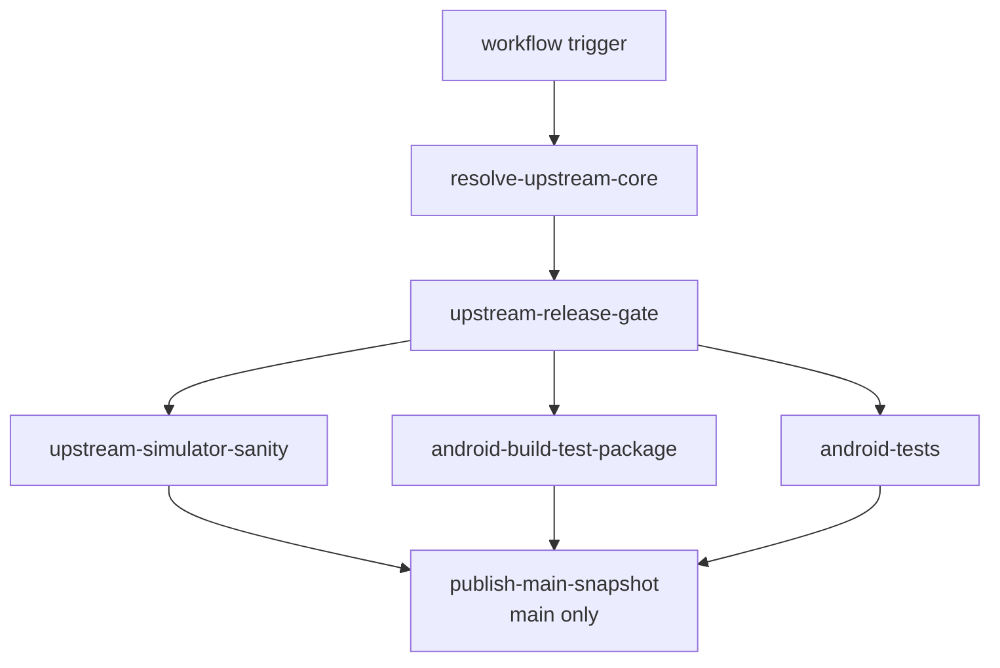

# CI And Release Workflow

This page explains the GitHub Actions lane split for the Android overlay, what
each job verifies, which artifacts it publishes, and how to reproduce the same
checks locally.

Read `00-project-and-upstream.md` first and
`10-build-and-source-layout.md` second. This page assumes the project and build
ownership boundary is already clear.

Read this page when a task touches `.github/workflows/android-ci.yml`, Android
build scripts, packaging evidence, instrumentation coverage, or release
publication. Read `80-tests-and-contracts.md` for the contract-to-suite map
behind those lanes.

## Workflow Graph

## CI At A Glance

- resolve one authoritative upstream commit per workflow run
- keep host-core sanity separate from Android packaging and tests
- run Android lint explicitly instead of assuming Gradle builds cover it
- publish logs and packaging evidence as first-class artifacts
- publish the main snapshot only after all required lanes pass

## Workflow triggers and gating

The main workflow is `.github/workflows/android-ci.yml`.

It runs on:

- manual dispatch
- a daily schedule
- pushes to `main` and `github_ci`
- pull requests

The workflow uses one concurrency group per pull request or ref and cancels
superseded runs.

Before any heavy job runs, the workflow resolves the current authoritative
upstream commit and applies a release gate:

- `resolve-upstream-core` resolves the upstream URL and commit through
  `scripts/upstream-sync/upstream.sh resolve --latest`
- `upstream-release-gate` decides whether the downstream lanes should run and,
  for scheduled executions, skips the release path when the resolved upstream
  commit already has a matching release tag in this repository

## Job graph

### `upstream-simulator-sanity`

This job validates the upstream-shaped desktop or host contract before Android
packaging enters the picture.

It:

- checks out the repo
- installs Linux simulator build dependencies
- provisions Java 17 and the pinned `xlsxio` toolchain
- syncs the authoritative upstream tree
- runs `make test`
- runs `scripts/workload-regressions/run_workload_regressions.sh`

Use this lane as the first reference when a change looks like shared core,
Meson, or wait or progress compatibility drift rather than Android UI drift.

### `android-build-test-package`

This is the main Android build, packaging, and artifact lane.

It:

- provisions Java, Gradle cache, Android SDK packages, NDK, CMake, and xlsxio
- syncs the authoritative upstream tree
- runs `./scripts/android/build_android.sh --run-sim-tests`
- runs `cd android && ./gradlew lint` explicitly because normal Gradle builds do
  not run lint automatically
- verifies that retired app-module native snapshot paths stay absent and that
  staging remains build-only under `android/.staged-native/cpp`
- collects packaging evidence for the debug APK
- uploads the build log and packaging artifacts

This lane is the canonical reference for the full Android debug-build contract.

### `android-tests`

This job covers the Android-owned JVM and instrumentation suites.

It:

- provisions the same toolchains and upstream sync inputs as the build lane
- runs a full Android build to prepare staged native inputs
- assembles the instrumentation APKs
- runs `:app:testDebugUnitTest`
- creates or restores an `x86_64` emulator snapshot
- runs `:app:connectedDebugAndroidTest` with the temporary ABI override from
  `r47.abiFilters`
- uploads logs plus JVM and instrumentation reports

Use this lane when the task touches SAF, lifecycle, activity behavior,
instrumentation fixtures, or Android-only test seams.

### `publish-main-snapshot`

This job runs only on `main` after the release gate passes and all required
verification jobs succeed.

It downloads the packaged Android artifacts, archives the packaging evidence,
and publishes the main-branch snapshot prerelease.

## Shared CI inputs

The workflow keeps its shared toolchain pins in `android/r47-defaults.properties`.

Those defaults feed:

- compile and target SDK setup
- build-tools, CMake, and NDK package selection
- hosted emulator API and ABI selection
- `xlsxio` source URL and commit

When CI behavior changes because of a toolchain update, update the defaults file
and the docs together.

## Artifacts And Logs

The workflow publishes three main artifact classes:

- Android build logs from the packaging lane
- debug APK packaging evidence and compliance outputs
- Android JVM and instrumentation test reports and logs

The build lane also records packaging metadata such as expected ABIs and source
provenance. Packaging-sensitive doc changes should stay aligned with those
artifacts, not only with the Gradle or CMake text.

## Local Reproduction Map

Use the smallest local lane that matches the failure surface:

- shared core or Meson drift in a hydrated checkout: `make test`
- host wait or progress regression: `scripts/workload-regressions/run_workload_regressions.sh`
- full Android debug build and staged-input refresh:
  `./scripts/android/build_android.sh --run-sim-tests`
- Android lint-only regression with current staged inputs:
  `cd android && ./gradlew lint`
- Android JVM tests with current staged inputs:
  `cd android && ./gradlew :app:testDebugUnitTest`
- instrumentation packaging with current staged inputs:
  `cd android && ./gradlew :app:assembleDebugAndroidTest`

If the task touches staging, generated inputs, or upstream hydration, prefer
the full build script over isolated Gradle invocations.

## CI Change Rules

- Keep the lane split explicit. Do not hide lint, instrumentation, or packaging
  evidence behind one generic build step.
- Keep upstream resolution shared across downstream jobs so the workflow talks
  about one authoritative core revision per run.
- Keep logs uploadable even on failure. Build and emulator issues are harder to
  triage when the workflow stops before publishing its logs.
- Keep emulator-only ABI overrides temporary and scoped to the Android test
  lane.
- Update this page when job names, release gating, artifact names, or local
  reproduction commands change.