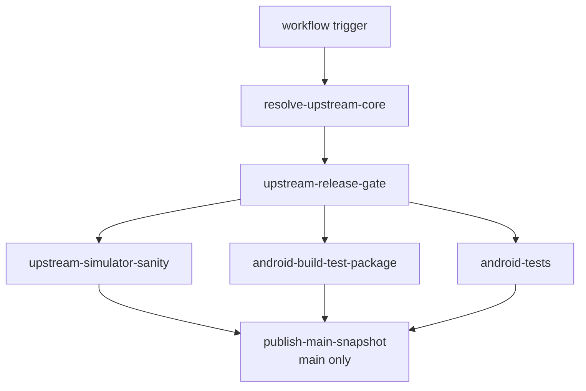
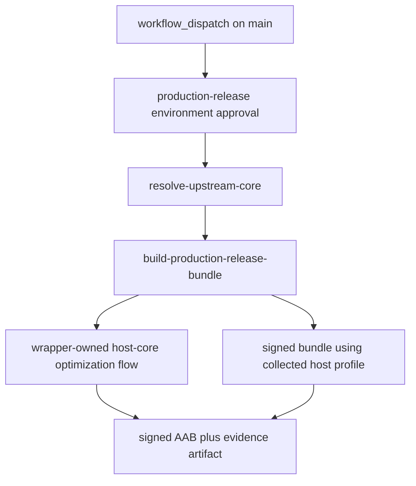

# CI And Release Workflow

This page explains the GitHub Actions lane split for the Android overlay, the
separate protected production-release workflow, what each job verifies, which
artifacts it publishes, and how to reproduce the same checks locally.

Read `00-project-and-upstream.md` first and
`10-build-and-source-layout.md` second. This page assumes the project and build
ownership boundary is already clear.

Read this page when a task touches `.github/workflows/android-ci.yml`, Android
build scripts, packaging evidence, instrumentation coverage, or release
publication. Read `80-tests-and-contracts.md` for the contract-to-suite map
behind those lanes.

## Workflow Graph

## CI At A Glance

- resolve one authoritative upstream commit per workflow run
- keep upstream simulator correctness separate from Android packaging and tests
- keep the Android build lane as the normal-CI owner of the collector-driven
  host-core PGO artifact and release-native consumer check without making that
  lane depend on emulator profiling
- make the protected release workflow rerun the same wrapper-owned host-core
  optimization flow before it signs the store bundle
- run Android lint explicitly instead of assuming Gradle builds cover it
- publish logs and packaging evidence as first-class artifacts
- publish the main snapshot only after all required lanes pass
- keep production signing in a separate protected manual workflow

## Workflow triggers and gating

The main workflow is `.github/workflows/android-ci.yml`.

It runs on:

- manual dispatch
- a daily schedule
- pushes to `main` and `github_ci`
- pull requests

The workflow uses one concurrency group per pull request or ref and cancels
superseded runs.

Before any heavy job runs, the workflow resolves the current authoritative
upstream commit and applies a release gate:

- `resolve-upstream-core` resolves the upstream URL and commit through
  `scripts/upstream-sync/upstream.sh resolve --latest`
- `upstream-release-gate` decides whether the downstream lanes should run and,
  for scheduled executions, skips the release path when the resolved upstream
  commit plus the current Android repository commit already has a matching
  Android prerelease tag in this repository

Production signing does not run in `.github/workflows/android-ci.yml`.
The separate manual workflow `.github/workflows/android-release.yml` owns the
signed store-bundle lane. It should be restricted to `main` through the
`production-release` environment and protected there with required reviewers,
deployment-branch rules, and environment secrets.

## Job graph

### `upstream-simulator-sanity`

This job validates the upstream-shaped desktop or host contract before Android
packaging enters the picture.

It:

- checks out the repo
- installs Linux simulator build dependencies
- provisions Java 17 and the pinned `xlsxio` toolchain
- syncs the authoritative upstream tree
- runs `make test`

Use this lane as the first reference when a change looks like shared core,
Meson, or upstream test drift rather than Android overlay drift.

### `android-build-test-package`

This is the main Android build, packaging, and artifact lane.

It:

- provisions Java, Gradle cache, Android SDK packages, NDK, CMake, and xlsxio
- derives the Linux host LLVM major from the pinned NDK `clang`, then installs
  matching `clang-<major>`, `clang-tools-<major>`, `lld-<major>`, and
  `libclang-rt-<major>-dev` packages so the host PGO runtime shim does not
  drift onto the runner-default LLVM toolchain
- syncs the authoritative upstream tree
- runs `./scripts/android/build_android.sh --run-sim-tests --collect-host-pgo --validate-release-pgo`
- runs `cd android && ./gradlew lint` explicitly because normal Gradle builds do
  not run lint automatically
- verifies that retired app-module native snapshot paths stay absent and that
  staging remains build-only under `android/.staged-native/cpp`
- collects packaging evidence for the debug APK
- uploads the build log, the host-core PGO artifact, and the Android packaging artifact bundle
  `r47zen-<upstream short>-<android short>`

That means the debug packaging lane now owns the full normal-pull-request
host-core optimization sequence:

- the Android wrapper testSuite rerun still proves the repo-owned simulator
  parity path before Gradle packaging
- the host-side PGO collector now runs under the same wrapper-owned lane,
  produces the `.profdata` artifact uploaded by CI, and builds instrumented
  upstream `src/testSuite/testSuite` with the maintained `broad-ci` corpus of
  `programs`, `tvm`, `jacobi_audit`, `normal_i`, `gamma`, `trig`, `prime`,
  `factorial`, and the generated `matrix_prefix_85` slice derived from
  `src/testSuite/tests/matrix.txt`
- the collector stages `res/testPgms/testPgms.bin` into its runtime root when
  `programs.txt` is present so the built-in `Prime`, `Fact`, and `SPIRAL`
  cases exercise the real generated program bundle rather than a stubbed path,
  then runs the imported `.p47` fixture overlay through the host compatibility
  path so graph, pause, wait, and LCD-style workloads are merged into the same
  uploaded `.profdata`
- the canonical host workload set of the five imported `.p47` fixtures remains
  the focused Android bridge compatibility harness exposed by
  `scripts/workload-regressions/run_workload_regressions.sh`, not the CI PGO
  corpus. The broad `broad-ci` base already covers `prime` and `factorial`
  through upstream `testSuite` inputs
- the collector still resolves `clang` and `llvm-profdata` from that same
  pinned NDK, while the Linux lane installs the matching host
  `libclang_rt.profile` runtime for the derived LLVM major through the explicit
  CI package step
- the Android emulator lane remains narrower and still owns only the five
  staged `.p47` `PROGRAMS` fixtures
- the Android release-native PGO consumer check now runs inside that same
  wrapper-owned build step, so the build log records the full collector-to-
  consumer sequence in one place

This lane is the canonical reference for the full Android debug-build contract.

### `android-tests`

This job covers the Android-owned JVM and instrumentation suites.

It:

- provisions the same toolchains and upstream sync inputs as the build lane
- runs one focused Gradle invocation for `:app:assembleDebug`,
  `:app:assembleDebugAndroidTest`, and `:app:testDebugUnitTest`
- uses that single task graph to refresh staged native inputs, build the debug
  APK, assemble the instrumentation APKs, and run the JVM suite without a
  second full `build_android.sh` pass
- creates or restores an `x86_64` emulator snapshot
- runs `scripts/android/run_connected_android_tests.sh`, which invokes
  `connectedDebugAndroidTest` once for the grouped non-fixture Android
  instrumentation class filter and once per canonical `PROGRAMS` fixture
  method with the temporary ABI override from `r47.abiFilters`
- uploads logs plus JVM and instrumentation reports in the Android test artifact
  bundle `r47zen-tests-<upstream short>-<android short>`

The hosted instrumentation lane currently relies on two distinct Android-owned
contracts:

- `ProgramFixtureInstrumentedTest` plus
  `scripts/android/run_connected_android_tests.sh` for the READP load-and-run
  matrix over `BinetV3.p47`, `GudrmPL.p47`, `MANSLV2.p47`, `NQueens.p47`, and
  `SPIRALk.p47`. The wrapper batches the five non-fixture Android
  instrumentation classes into one filtered connected-test selection, while
  each `.p47` file still runs as its own filtered
  `connectedDebugAndroidTest` selection. Non-`MANSLV2` fixture timeouts still
  sit behind GNU `timeout --kill-after` so the lane can log degraded coverage
  and keep moving, while `MANSLV2` is now the required bounded-stop Android
  regression: it resets to the upstream `doFnReset(CONFIRMED, false)` baseline
  before load, reuses the same native `fnStopProgram(0)` publisher as live
  `R/S` and `EXIT`, and fails the Android lane if its own selection hits the
  outer timeout
- `DisplayLifecycleInstrumentedTest` for passive lifecycle LCD preservation and
  first-stop graph cleanup so background save, a Settings-style pause or
  resume, activity recreation, and the first direct stop on staged `SPIRALk`
  keep or converge to the correct visible packed LCD snapshot, with retrying
  synthetic `00` resumes while paused and a `90 s` hosted-emulator budget for
  that heavier probe
- `GraphTouchStressInstrumentedTest` for the native graph-touch hardening seam,
  proving that repeated extreme pan and pinch inputs are rejected without
  mutating the current graph bounds through the instrumentation bridge

The JVM segment of this lane also keeps graph-touch gating regression coverage
in the same run through `GraphGestureAccumulatorTest`,
`ReplicaOverlayGoldenTest`, and `MainActivityPreferenceControllerTest`,
including bounded queued-pan backlog capping, bounded per-apply pan
splitting, settings-gate behavior, multi-touch pointer continuity, graph-touch
preference dispatch, and the widened queue-clamp zoom configuration shipped by
`MainActivity`.

Use this lane when the task touches SAF, lifecycle, activity behavior,
instrumentation fixtures, or Android-only test seams.

### `publish-main-snapshot`

This job runs only on `main` after the release gate passes and all required
verification jobs succeed.

It downloads the packaged Android artifacts, archives the packaging evidence,
and publishes the main-branch snapshot prerelease tagged
`r47zen-<upstream short>-<android short>` with the same template used for
the release title.

## Production release workflow

The protected production workflow is `.github/workflows/android-release.yml`.

### `build-production-release-bundle`

This workflow:

- resolves and syncs the authoritative upstream tree
- derives the Linux host LLVM major from the pinned NDK `clang`, then installs
  the matching `clang-<major>`, `clang-tools-<major>`, `lld-<major>`, and
  `libclang-rt-<major>-dev` packages before collecting host profiles
- reruns `./scripts/android/build_android.sh --run-sim-tests --collect-host-pgo --validate-release-pgo`
  so the protected release lane uses the same wrapper-owned host-core
  optimization flow as the debug CI lane and writes
  `ci-artifacts/pgo/r47-host-core.profdata`
- runs Android lint, `:app:testDebugUnitTest`, and
  `:app:assembleDebugAndroidTest` before signing the release bundle
- requires manual `version_code` and `version_name` inputs
- decodes `R47_RELEASE_STORE_FILE_BASE64` onto the runner and passes the path
  through `R47_RELEASE_STORE_FILE`
- reads `R47_RELEASE_STORE_PASSWORD`, `R47_RELEASE_KEY_ALIAS`, and
  `R47_RELEASE_KEY_PASSWORD` only from the protected environment
- builds `:app:bundleRelease -Pr47.pgoProfilePath=...` so the signed release
  bundle consumes the same collected host-core profile that the wrapper already
  validated
- uploads the release build logs, the host-core PGO artifact bundle, and the
  signed AAB artifact bundle
  `r47zen-<upstream short>-<android short>-release`
- ships `r47zen-<upstream short>-<android short>-release.aab`,
  `BUILD-METADATA.txt`, `SHA256SUMS.txt`, `mapping.txt`,
  `native-debug-symbols.zip`, and the compliance-assets payload together
- stops at artifact publication; Play Console upload remains a manual
  maintainer action after review

The manual Play handoff still requires the maintainer-owned publication inputs
that do not live in the Gradle workflow itself:

- a stable privacy-policy URL and the in-app privacy-policy surface
- a reviewed Data safety declaration
- final target-audience and content-rating answers
- final store title, description, screenshots, and feature graphic
- any account-level testing or production-access prerequisites enforced by the
  Play developer account type

Configure the `production-release` environment with the branch restrictions,
required reviewers, and the four release-signing secrets the workflow expects.

## Shared CI inputs

The workflow keeps its shared toolchain pins in `android/r47-defaults.properties`.

Those defaults feed:

- compile and target SDK setup
- build-tools, CMake, and NDK package selection
- hosted emulator API and ABI selection
- `xlsxio` source URL and commit

When CI behavior changes because of a toolchain update, update the defaults file
and the docs together.

## Artifacts And Logs

The workflow publishes three main artifact classes:

- Android build logs from the packaging lane
- debug APK packaging evidence and compliance outputs
- Android JVM and instrumentation test reports and logs
- host-core PGO profiles from the Linux packaging lane and the protected
  release workflow; each lane's build log records the wrapper-owned collector
  and release-native validation output, and the protected release workflow also
  records the final signed-bundle consumer path

Android artifact names use the two-commit Android identity
`upstream short + Android short`. Linux and Windows simulator package workflows
stay upstream-only because they ship the synced core without the Android
overlay.

The build lane also records packaging metadata such as expected ABIs and source
provenance. Packaging-sensitive doc changes should stay aligned with those
artifacts, not only with the Gradle or CMake text.

## Local Reproduction Map

Use the smallest local lane that matches the failure surface:

- shared core or Meson drift in a hydrated checkout: `make test`
- diagnostic host wait or progress regression:
  `scripts/workload-regressions/run_workload_regressions.sh`
- full Android debug build and staged-input refresh:
  `./scripts/android/build_android.sh --run-sim-tests`
- CI-matching Android build plus host-core PGO collection and release-native
  validation:
  `./scripts/android/build_android.sh --run-sim-tests --collect-host-pgo --validate-release-pgo`
- CI-matching Android pre-emulator build plus JVM slice:
  `cd android && ./gradlew :app:assembleDebug :app:assembleDebugAndroidTest :app:testDebugUnitTest`
- Android lint-only regression with current staged inputs:
  `cd android && ./gradlew lint`
- Android JVM tests with current staged inputs:
  `cd android && ./gradlew :app:testDebugUnitTest`
- instrumentation packaging with current staged inputs:
  `cd android && ./gradlew :app:assembleDebugAndroidTest`
- protected-release parity with a collected host profile:
  `./scripts/android/build_android.sh --run-sim-tests --collect-host-pgo --validate-release-pgo`, then
  `cd android && ./gradlew :app:bundleRelease -Pr47.pgoProfilePath=/abs/path/to/r47-host-core.profdata`
  with the `R47_RELEASE_*` environment variables plus explicit `r47.versionCode`
  and `r47.versionName` inputs
- signed production bundle with current staged inputs:
  `cd android && ./gradlew :app:bundleRelease -Pr47.pgoProfilePath=/abs/path/to/r47-host-core.profdata`
  with the `R47_RELEASE_*` environment variables plus explicit
  `r47.versionCode` and `r47.versionName` inputs

If the task touches staging, generated inputs, or upstream hydration, prefer
the full build script over isolated Gradle invocations.

## CI Change Rules

- Keep the lane split explicit. Do not hide lint, instrumentation, or packaging
  evidence behind one generic build step.
- Keep upstream resolution shared across downstream jobs so the workflow talks
  about one authoritative core revision per run.
- Keep logs uploadable even on failure. Build and emulator issues are harder to
  triage when the workflow stops before publishing its logs.
- Keep the collector-driven host-core fixture contract in
  `android-build-test-package`; do not reintroduce the plain host workload
  runner into the normal pull-request path.
- Keep emulator-only ABI overrides temporary and scoped to the Android test
  lane.
- Keep the `android-tests` pre-emulator Gradle work in one focused task graph
  unless staged-native prep becomes incrementally cheap enough to justify
  splitting it again.
- Keep the protected release workflow on the same wrapper-owned host-core
  optimization flow as `android-build-test-package`, and keep the signed bundle
  on the collected `r47-host-core.profdata` path instead of silently falling
  back to a non-PGO release-native build.
- Keep store-release signing in the dedicated protected workflow. Do not fold
  production secrets into `.github/workflows/android-ci.yml`.
- Keep the Android artifact identity separate from the upstream-only simulator
  package identity.
- Update this page when job names, release gating, artifact names, or local
  reproduction commands change.
