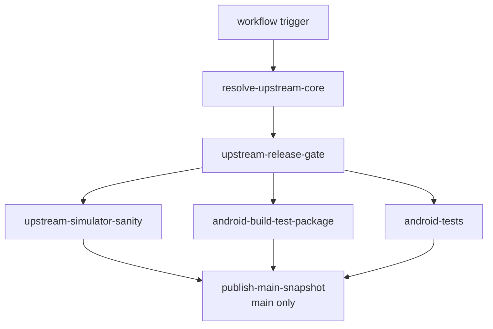
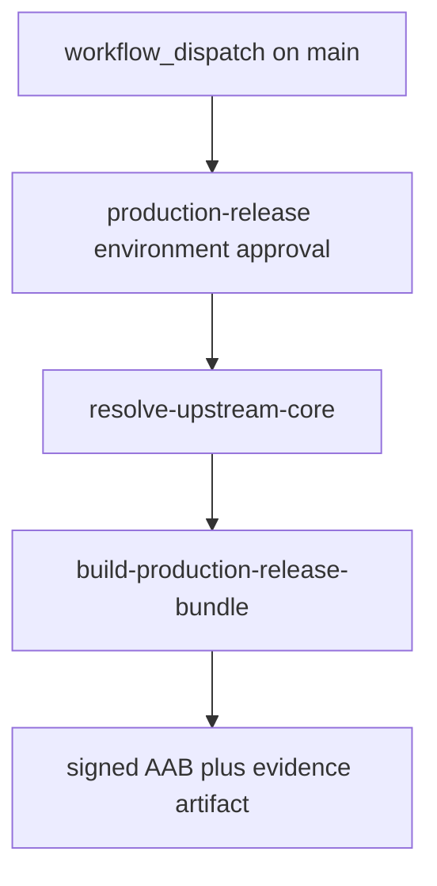

# CI And Release Workflow

This page explains the GitHub Actions lane split for the Android overlay, the
separate protected production-release workflow, what each job verifies, which
artifacts it publishes, and how to reproduce the same checks locally.

Read `00-project-and-upstream.md` first and
`10-build-and-source-layout.md` second. This page assumes the project and build
ownership boundary is already clear.

Read this page when a task touches `.github/workflows/android-ci.yml`, Android
build scripts, packaging evidence, instrumentation coverage, or release
publication. Read `80-tests-and-contracts.md` for the contract-to-suite map
behind those lanes.

## Workflow Graph

## CI At A Glance

- resolve one authoritative upstream commit per workflow run
- keep host-core sanity separate from Android packaging and tests
- run Android lint explicitly instead of assuming Gradle builds cover it
- publish logs and packaging evidence as first-class artifacts
- publish the main snapshot only after all required lanes pass
- keep production signing in a separate protected manual workflow

## Workflow triggers and gating

The main workflow is `.github/workflows/android-ci.yml`.

It runs on:

- manual dispatch
- a daily schedule
- pushes to `main` and `github_ci`
- pull requests

The workflow uses one concurrency group per pull request or ref and cancels
superseded runs.

Before any heavy job runs, the workflow resolves the current authoritative
upstream commit and applies a release gate:

- `resolve-upstream-core` resolves the upstream URL and commit through
  `scripts/upstream-sync/upstream.sh resolve --latest`
- `upstream-release-gate` decides whether the downstream lanes should run and,
  for scheduled executions, skips the release path when the resolved upstream
  commit plus the current Android repository commit already has a matching
  Android prerelease tag in this repository

Production signing does not run in `.github/workflows/android-ci.yml`.
The separate manual workflow `.github/workflows/android-release.yml` owns the
signed store-bundle lane. It should be restricted to `main` through the
`production-release` environment and protected there with required reviewers,
deployment-branch rules, and environment secrets.

## Job graph

### `upstream-simulator-sanity`

This job validates the upstream-shaped desktop or host contract before Android
packaging enters the picture.

It:

- checks out the repo
- installs Linux simulator build dependencies
- provisions Java 17 and the pinned `xlsxio` toolchain
- syncs the authoritative upstream tree
- runs `make test`
- runs `scripts/workload-regressions/run_workload_regressions.sh`

Use this lane as the first reference when a change looks like shared core,
Meson, or wait or progress compatibility drift rather than Android UI drift.

### `android-build-test-package`

This is the main Android build, packaging, and artifact lane.

It:

- provisions Java, Gradle cache, Android SDK packages, NDK, CMake, and xlsxio
- syncs the authoritative upstream tree
- runs `./scripts/android/build_android.sh --run-sim-tests`
- runs `cd android && ./gradlew lint` explicitly because normal Gradle builds do
  not run lint automatically
- verifies that retired app-module native snapshot paths stay absent and that
  staging remains build-only under `android/.staged-native/cpp`
- collects packaging evidence for the debug APK
- uploads the build log and the Android packaging artifact bundle
  `r47-android-<upstream short>-<android short>`

This lane is the canonical reference for the full Android debug-build contract.

### `android-tests`

This job covers the Android-owned JVM and instrumentation suites.

It:

- provisions the same toolchains and upstream sync inputs as the build lane
- runs a full Android build to prepare staged native inputs
- assembles the instrumentation APKs
- runs `:app:testDebugUnitTest`
- creates or restores an `x86_64` emulator snapshot
- runs `:app:connectedDebugAndroidTest` with the temporary ABI override from
  `r47.abiFilters`
- uploads logs plus JVM and instrumentation reports in the Android test artifact
  bundle `r47-android-tests-<upstream short>-<android short>`

The hosted instrumentation lane currently relies on two distinct Android-owned
contracts:

- `ProgramFixtureInstrumentedTest` for the READP load-and-run matrix over
  `BinetV3.p47`, `GudrmPL.p47`, `NQueens.p47`, and `SPIRALk.p47`
- `DisplayLifecycleInstrumentedTest` for passive lifecycle LCD preservation so
  background save and a Settings-style pause or resume keep the visible packed
  LCD snapshot stable on a staged `SPIRALk` graph, with retrying synthetic
  `00` resumes while paused and a `90 s` hosted-emulator budget for that
  heavier probe

Use this lane when the task touches SAF, lifecycle, activity behavior,
instrumentation fixtures, or Android-only test seams.

### `publish-main-snapshot`

This job runs only on `main` after the release gate passes and all required
verification jobs succeed.

It downloads the packaged Android artifacts, archives the packaging evidence,
and publishes the main-branch snapshot prerelease tagged
`r47-android-<upstream short>-<android short>` with the same template used for
the release title.

## Production release workflow

The protected production workflow is `.github/workflows/android-release.yml`.

### `build-production-release-bundle`

This workflow:

- resolves and syncs the authoritative upstream tree
- reruns `./scripts/android/build_android.sh --run-sim-tests` so release builds
  start from the same staged-native contract as the debug CI lane
- runs Android lint, `:app:testDebugUnitTest`, and
  `:app:assembleDebugAndroidTest` before signing the release bundle
- requires manual `version_code` and `version_name` inputs
- decodes `R47_RELEASE_STORE_FILE_BASE64` onto the runner and passes the path
  through `R47_RELEASE_STORE_FILE`
- reads `R47_RELEASE_STORE_PASSWORD`, `R47_RELEASE_KEY_ALIAS`, and
  `R47_RELEASE_KEY_PASSWORD` only from the protected environment
- builds `:app:bundleRelease` and uploads the signed AAB artifact bundle
  `r47-android-<upstream short>-<android short>-release`
- ships `r47-android-<upstream short>-<android short>-release.aab`,
  `BUILD-METADATA.txt`, `SHA256SUMS.txt`, `mapping.txt`,
  `native-debug-symbols.zip`, and the compliance-assets payload together
- stops at artifact publication; Play Console upload remains a manual
  maintainer action after review

The manual Play handoff still requires the maintainer-owned publication inputs
that do not live in the Gradle workflow itself:

- a stable privacy-policy URL and the in-app privacy-policy surface
- a reviewed Data safety declaration
- final target-audience and content-rating answers
- final store title, description, screenshots, and feature graphic
- any account-level testing or production-access prerequisites enforced by the
  Play developer account type

Configure the `production-release` environment with the branch restrictions,
required reviewers, and the four release-signing secrets the workflow expects.

## Shared CI inputs

The workflow keeps its shared toolchain pins in `android/r47-defaults.properties`.

Those defaults feed:

- compile and target SDK setup
- build-tools, CMake, and NDK package selection
- hosted emulator API and ABI selection
- `xlsxio` source URL and commit

When CI behavior changes because of a toolchain update, update the defaults file
and the docs together.

## Artifacts And Logs

The workflow publishes three main artifact classes:

- Android build logs from the packaging lane
- debug APK packaging evidence and compliance outputs
- Android JVM and instrumentation test reports and logs

Android artifact names use the two-commit Android identity
`upstream short + Android short`. Linux and Windows simulator package workflows
stay upstream-only because they ship the synced core without the Android
overlay.

The build lane also records packaging metadata such as expected ABIs and source
provenance. Packaging-sensitive doc changes should stay aligned with those
artifacts, not only with the Gradle or CMake text.

## Local Reproduction Map

Use the smallest local lane that matches the failure surface:

- shared core or Meson drift in a hydrated checkout: `make test`
- host wait or progress regression: `scripts/workload-regressions/run_workload_regressions.sh`
- full Android debug build and staged-input refresh:
  `./scripts/android/build_android.sh --run-sim-tests`
- Android lint-only regression with current staged inputs:
  `cd android && ./gradlew lint`
- Android JVM tests with current staged inputs:
  `cd android && ./gradlew :app:testDebugUnitTest`
- instrumentation packaging with current staged inputs:
  `cd android && ./gradlew :app:assembleDebugAndroidTest`
- signed production bundle with current staged inputs:
  `cd android && ./gradlew :app:bundleRelease` with the `R47_RELEASE_*`
  environment variables plus explicit `r47.versionCode` and `r47.versionName`
  inputs

If the task touches staging, generated inputs, or upstream hydration, prefer
the full build script over isolated Gradle invocations.

## CI Change Rules

- Keep the lane split explicit. Do not hide lint, instrumentation, or packaging
  evidence behind one generic build step.
- Keep upstream resolution shared across downstream jobs so the workflow talks
  about one authoritative core revision per run.
- Keep logs uploadable even on failure. Build and emulator issues are harder to
  triage when the workflow stops before publishing its logs.
- Keep emulator-only ABI overrides temporary and scoped to the Android test
  lane.
- Keep store-release signing in the dedicated protected workflow. Do not fold
  production secrets into `.github/workflows/android-ci.yml`.
- Keep the Android artifact identity separate from the upstream-only simulator
  package identity.
- Update this page when job names, release gating, artifact names, or local
  reproduction commands change.
