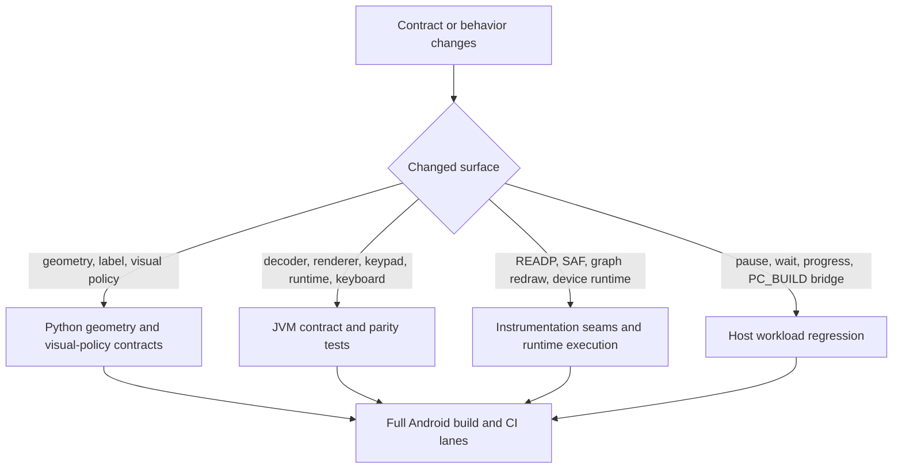

# Tests And Contracts

This page maps the maintainer verification surfaces, the contracts they lock,
and the smallest rerun lane that should move with each kind of change.

Read `10-build-and-source-layout.md` first. This page assumes the build,
ownership, and CI lane split are already clear.

Read this page when a task changes geometry, keypad snapshots, JNI seams,
storage flow, READP program loading, runtime cadence, or CI verification.

## Verification Flow

## Contract Inventory

| Contract surface | Source of truth | Focused verification surfaces | First rerun lane |
| --- | --- | --- | --- |
| shell geometry and LCD frame | `__DEV/R47/compute_shell_geometry.py`, `R47Geometry.kt` | `__DEV/R47/test_shell_geometry.py` | grouped `__DEV/R47` Python contract scripts |
| key-label and visual policy constants | `__DEV/R47/compute_key_label_geometry.py`, `compute_key_visual_policy.py`, `CalculatorKeyView.kt` | `test_key_label_geometry.py`, `test_key_visual_policy.py` | grouped `__DEV/R47` Python contract scripts |
| top-label lane solve and alpha-case label export | `compute_top_label_lane_layout.py`, staged `assign.c` and `items.c`, `jni_display.c`, `ReplicaKeypadLayout.kt`, `CalculatorKeyView.kt` | `test_top_label_lane_layout.py`, `test_keypad_alpha_case_labels.py`, `DynamicKeypadParityFixtureTest.kt` | Python contracts first, then `:app:testDebugUnitTest` |
| keypad scene export manifest and decoder | `KeypadSnapshot`, exported keypad fixtures, `jni_display.c` | `KeypadFixtureContractTest.kt`, `KeypadSnapshotDecoderTest.kt` | `cd android && ./gradlew :app:testDebugUnitTest` |
| rendered keypad and softkey semantics | `ReplicaKeypadLayout.kt`, `CalculatorKeyView.kt`, `CalculatorSoftkeyPainter.kt` | `ExportedKeypadFixtureRenderTest.kt`, `CalculatorSoftkeyPainterContractTest.kt`, `CalculatorSoftkeyPainterCanvasTest.kt`, `ReplicaOverlayGoldenTest.kt` | `cd android && ./gradlew :app:testDebugUnitTest` |
| physical keyboard mapping | `PhysicalKeyboardMapper`, `PhysicalKeyboardInputController` | `PhysicalKeyboardInputParityTest.kt` | `cd android && ./gradlew :app:testDebugUnitTest` |
| core thread, display loop, and runtime gate behavior | `NativeCoreRuntime.kt`, `NativeDisplayRefreshLoop.kt`, `jni_lifecycle.c`, `android_runtime.c` | `NativeCoreRuntimeTest.kt`, `GraphRedrawInstrumentedTest.kt`, `run_workload_regressions.sh` | JVM test or host workload lane depending on the owner path |
| SAF picker, detached-fd handoff, and work-directory tree routing | `StorageAccessCoordinator.kt`, `WorkDirectory.kt`, `jni_storage.c`, `hal/io.c` | `StorageAccessCoordinatorTest.kt`, `WorkDirectoryTest.kt`, `StorageAccessCoordinatorInstrumentedTest.kt` | JVM tests first, then instrumentation when the device seam moved |
| program load and run through Android READP | `ProgramLoadTestBridge.kt`, `jni_program_load_test.c`, staged `PROGRAMS` fixtures | `ProgramFixtureInstrumentedTest.kt`, `FactorsInstrumentedTest.kt` | `:app:assembleDebugAndroidTest` plus `:app:connectedDebugAndroidTest` |
| pause, wait, and progress compatibility in `PC_BUILD` mode | `android_runtime.c`, staged core, workload harness | `scripts/workload-regressions/run_workload_regressions.sh`, `host_workload_regression.c` | host workload regression, then `./scripts/android/build_android.sh --run-sim-tests` |

## Python Contract Suite

The `__DEV/R47/` Python scripts are the contract generators and geometry or
policy checks that keep Android Kotlin constants aligned with measured payloads.

The checked-in test set currently covers:

- `test_shell_geometry.py`: logical canvas, drawable density buckets, LCD frame,
  and shell constants against `R47Geometry.kt`
- `test_key_label_geometry.py`: key-label and key-surface constants against
  `CalculatorKeyView.kt` and `R47Geometry.kt`
- `test_top_label_lane_layout.py`: spacing, corridor, screen-edge, and scale
  rules for the top-label solver
- `test_key_visual_policy.py`: visual-policy constants against
  `CalculatorKeyView.kt`
- `test_keypad_alpha_case_labels.py`: staged core alpha-label export rules in
  `assign.c`, `items.c`, and `jni_display.c`, plus the Kotlin alpha-layout
  handling in `CalculatorKeyView.kt` and `ReplicaKeypadLayout.kt`

These Python tests are the first contract surface to inspect when a geometry or
label rule change begins in the checked-in calculators-specific payloads rather
than in Android runtime glue.

## Android JVM Contract Suite

The focused JVM suite under `android/app/src/test/java/com/example/r47/` is the
main parity surface for Kotlin-side decoder, renderer, lifecycle, and input
contracts.

Important contract files include:

- `KeypadFixtureContractTest.kt`: asserts that the exported keypad-fixture
  manifest still matches `KeypadSnapshot` contract values such as scene version,
  metadata length, key count, and labels-per-key
- `KeypadSnapshotDecoderTest.kt`: asserts the fixed metadata-lane decode and
  label fallback behavior of `KeypadSnapshot.fromNative(...)`
- `DynamicKeypadParityFixtureTest.kt`: locks unchanged-snapshot skip behavior,
  alpha-layout behavior, and layout-class-sensitive keypad rendering
- `ExportedKeypadFixtureRenderTest.kt`: proves exported keypad fixtures apply to
  both main keys and softkeys in the live renderer path
- `CalculatorSoftkeyPainterContractTest.kt` and
  `CalculatorSoftkeyPainterCanvasTest.kt`: lock softkey content-description,
  overlay, preview, and strike rendering rules
- `ReplicaOverlayGoldenTest.kt`: keeps chrome-mode rendering stable through
  golden hashes
- `PhysicalKeyboardInputParityTest.kt`: locks printable, function-key,
  shortcut, and modifier-tap mapping behavior
- `NativeCoreRuntimeTest.kt`: locks single-init, queued-task, and
  save-on-pause behavior on the core thread
- `StorageAccessCoordinatorTest.kt` and `WorkDirectoryTest.kt`: lock SAF intent
  routing, prompt behavior, detached-fd cancellation, and work-directory tree
  subfolder rules

Use `cd android && ./gradlew :app:testDebugUnitTest` as the smallest grouped
lane when one of those Kotlin- or Robolectric-owned contracts changes.

## Android Instrumentation Contract Suite

The instrumentation suite under
`android/app/src/androidTest/java/com/example/r47/` is the device or emulator
surface for Android-only runtime seams.

Important files include:

- `ProgramLoadTestBridge.kt`: exposes the instrumentation-only native bridge for
  runtime readiness, async function execution, redraw flags, seeding helpers,
  and state snapshots
- `ProgramFixtureInstrumentedTest.kt`: stages canonical `PROGRAMS` fixtures and
  drives `READP` plus `RUN` through the live Android runtime for
  `BinetV3.p47`, `GudrmPL.p47`, `NQueens.p47`, and `SPIRALk.p47`
- `FactorsInstrumentedTest.kt`: asserts that the `FACTORS` runtime path runs to
  completion and leaves X in the expected result type
- `GraphRedrawInstrumentedTest.kt`: locks the redraw-gate contract behind
  `forceRefreshNative()`
- `StorageAccessCoordinatorInstrumentedTest.kt`: locks detached-fd handoff and
  cancellation behavior through the Android file-descriptor seam

Use `cd android && ./gradlew :app:assembleDebugAndroidTest` first, then
`cd android && ./gradlew :app:connectedDebugAndroidTest` when the task touches
the Android-only runtime seam.

## Host Regression And Build Contracts

The repo also keeps non-device contract surfaces for the shared core and the
Android compatibility layer.

- `scripts/workload-regressions/run_workload_regressions.sh` builds the staged
  core plus Android bridge in `HOST_TOOL_BUILD` and `PC_BUILD`, then loads and
  runs the canonical workload fixtures through the host compatibility path
- `scripts/workload-regressions/host_workload_regression.c` is the harness that
  probes the wait, pause, progress, and workload-run behavior behind that lane
- `./scripts/android/build_android.sh --run-sim-tests` rebuilds `build.sim`,
  stages `testPgms.bin`, and runs the explicit Android-lane simulator parity
  path before Gradle packaging
- the CI workflow keeps three main verification jobs distinct:
  `upstream-simulator-sanity`, `android-build-test-package`, and
  `android-tests`

When a change touches staged-core compatibility, `yieldToAndroidWithMs(...)`,
or wait and progress behavior, start with the host workload harness before you
assume the problem is Android UI code.

## Which Lane To Run First

- geometry or label-policy change rooted in `__DEV/R47/` payloads: run the
  Python contract scripts first
- keypad-scene export, decoder, renderer, keyboard, or runtime-coordinator
  change in Kotlin: run `cd android && ./gradlew :app:testDebugUnitTest`
- SAF, `READP`, redraw-gate, or other Android-only runtime seam change: run
  `:app:assembleDebugAndroidTest`, then `:app:connectedDebugAndroidTest`
- pause, wait, progress, or `PC_BUILD` event-loop compatibility change: run
  `scripts/workload-regressions/run_workload_regressions.sh`
- staged-native, simulator, or CI-critical verification change: run
  `./scripts/android/build_android.sh --run-sim-tests`

## Contract Change Rules

- Update the owning contract file and the owning verification surface in the
  same change.
- Keep generated or exported manifest values such as scene contract version,
  metadata length, and labels-per-key aligned across the producer and decoder.
- Treat `ProgramLoadTestBridge.kt` and `jni_program_load_test.c` as a paired
  instrumentation seam.
- When a geometry rule changes, update both the checked-in Python payload logic
  and the Kotlin owner or parity tests that consume it.
- Do not claim a contract change is safe until the smallest relevant local lane
  and the matching CI lane are both identified.