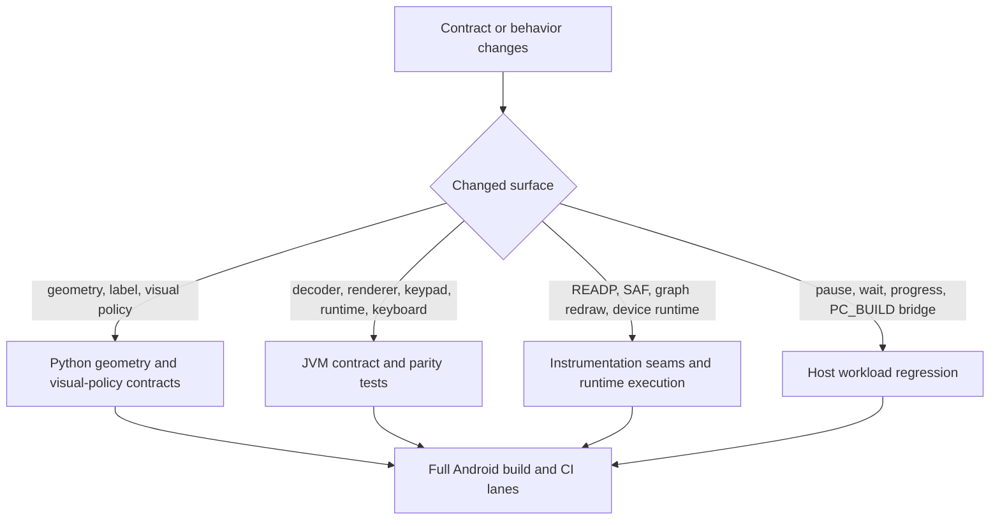

# Tests And Contracts

This page maps the maintainer verification surfaces, the contracts they lock,
and the smallest rerun lane that should move with each kind of change.

Read `10-build-and-source-layout.md` first. This page assumes the build,
ownership, and CI lane split are already clear.

Read this page when a task changes geometry, keypad snapshots, JNI seams,
storage flow, READP program loading, runtime cadence, or CI verification.

## Verification Flow

## Contract Inventory

| Contract surface | Source of truth | Focused verification surfaces | First rerun lane |
| --- | --- | --- | --- |
| shell geometry, top-right menu bounds, and LCD frame | `scripts/r47_contracts/derive_shell_geometry.py`, `R47Geometry.kt` | `scripts/r47_contracts/test_shell_geometry_contract.py`, `ReplicaOverlayGoldenTest.kt`, `MainShellThemeTest.kt` | grouped `scripts/r47_contracts` validation lane, then `:app:testDebugUnitTest --tests io.github.ppigazzini.r47zen.ReplicaOverlayGoldenTest --tests io.github.ppigazzini.r47zen.MainShellThemeTest` |
| key-label and visual policy constants | `scripts/r47_contracts/derive_key_label_geometry.py`, `scripts/r47_contracts/derive_key_visual_policy.py`, `scripts/r47_contracts/data/r47zen_ui_contract.json`, `KeyRenderSpec.kt`, `KeyRenderPainter.kt`, `CalculatorKeyView.kt`, `CalculatorSoftkeyPainter.kt` | `scripts/r47_contracts/test_key_label_geometry_contract.py`, `scripts/r47_contracts/test_key_visual_policy_contract.py`, `CalculatorKeyViewRenderSpecTest.kt`, `CalculatorSoftkeyPainterCanvasTest.kt` | grouped `scripts/r47_contracts` validation lane, then focused JVM render-spec tests when the Kotlin builder or shared painter stage moved |
| keypad font policy and C47 font coverage | `scripts/r47_contracts/data/r47_key_font_policy_contract.json`, `scripts/r47_contracts/derive_key_font_policy.py`, `ReplicaKeypadLayout.kt`, `CalculatorKeyView.kt`, `CalculatorSoftkeyPainter.kt`, `C47TypefacePolicy.kt` | `scripts/r47_contracts/test_key_font_policy_contract.py`, `CalculatorKeyViewFontSelectionTest.kt` | grouped `scripts/r47_contracts` validation lane, then `:app:testDebugUnitTest --tests io.github.ppigazzini.r47zen.CalculatorKeyViewFontSelectionTest` |
| top-label lane solve and alpha-case label export | `scripts/r47_contracts/derive_top_label_lane_layout.py`, staged `assign.c` and `items.c`, `jni_display.c`, `ReplicaKeypadLayout.kt`, `CalculatorKeyView.kt` | `scripts/r47_contracts/test_top_label_lane_layout_contract.py`, `scripts/r47_contracts/test_alpha_case_export_contract.py`, `DynamicKeypadParityFixtureTest.kt` | grouped contract scripts first, then `:app:testDebugUnitTest` |
| `assign.c` layout tables, `items.c` display vocabulary, shared keyboard-layout JSON, and Android local override boundary | `scripts/r47_contracts/derive_keyboard_layout_contract.py`, `scripts/r47_contracts/data/r47_keyboard_layout_contract.json`, root `src/c47/assign.c`, root `src/c47/items.c`, and `jni_display.c` | `scripts/r47_contracts/test_keyboard_layout_contract.py`, `KeyboardLayoutContractRenderTest.kt` | grouped `scripts/r47_contracts` validation lane, then `:app:testDebugUnitTest --tests io.github.ppigazzini.r47zen.KeyboardLayoutContractRenderTest` when Android-local label export, render parity, or the shared contract payload moved |
| overlay geometry replay for unchanged keypad scenes | `MainActivity.kt`, `ReplicaOverlayController.kt`, `ReplicaOverlay.kt`, `ReplicaKeypadLayout.kt` | `DynamicKeypadParityFixtureTest.kt` | `cd android && ./gradlew :app:testDebugUnitTest` |
| keypad scene export manifest and decoder | `KeypadSnapshot`, exported keypad fixtures, `jni_display.c` | `KeypadFixtureContractTest.kt`, `KeypadSnapshotDecoderTest.kt` | `cd android && ./gradlew :app:testDebugUnitTest` |
| rendered keypad and softkey semantics | `ReplicaKeypadLayout.kt`, `CalculatorKeyView.kt`, `CalculatorSoftkeyPainter.kt`, `KeyRenderSpec.kt`, `ReplicaOverlayController.kt`, `KeypadLabelModes.kt`, `C47TypefacePolicy.kt` | `CalculatorKeyViewRenderSpecTest.kt`, `CalculatorKeyViewFontSelectionTest.kt`, `ExportedKeypadFixtureRenderTest.kt`, `CalculatorSoftkeyPainterContractTest.kt`, `CalculatorSoftkeyPainterCanvasTest.kt`, `ReplicaOverlayGoldenTest.kt`, `ReplicaOverlayControllerLabelModeTest.kt` | `cd android && ./gradlew :app:testDebugUnitTest` |
| physical keyboard mapping and first-key shell focus routing | `PhysicalKeyboardBindingTables.kt`, `PhysicalKeyboardMapper`, `PhysicalKeyboardInputController`, `ReplicaOverlay.kt` | `PhysicalKeyboardInputParityTest.kt`, `ReplicaOverlayVisualPolicyTest.kt` | `cd android && ./gradlew :app:testDebugUnitTest --tests io.github.ppigazzini.r47zen.PhysicalKeyboardInputParityTest --tests io.github.ppigazzini.r47zen.ReplicaOverlayVisualPolicyTest` |
| core thread, display loop, and runtime gate behavior | `NativeCoreRuntime.kt`, `NativeDisplayRefreshLoop.kt`, `NativeKeypadSnapshotStore.kt`, `jni_lifecycle.c`, `jni_display.c`, `android_runtime.c` | `NativeCoreRuntimeTest.kt`, `NativeDisplayRefreshLoopTest.kt`, `GraphRedrawInstrumentedTest.kt`, `run_workload_regressions.sh` | focused JVM tests first, then the host workload lane when the compatibility path moved |
| live program-stop key routing (which keys publish the out-of-band direct stop, which run states accept it, and whether a key is forwarded or swallowed) | `LiveProgramStopKeyPolicy.kt`, `LiveKeyRouter.kt`, `MainActivity.kt` `dispatchLiveKey`, `jni_input.c` `r47_direct_stop_allowed`, upstream `src/c47/programming/input.c` (`key == 36 || key == 33` while `*prevStop == PGM_RUNNING`) | `scripts/r47_contracts/test_live_stop_key_policy_contract.py` (cross-source lock of the Kotlin policy to upstream `input.c`), `LiveProgramStopKeyPolicyTest.kt` (literal-code key-set sweep), `LiveKeyRouterTest.kt` (forward when the gate declines, swallow only when it accepts, never query the gate for non-stop keys), `DisplayLifecycleInstrumentedTest.directStopGateDeclinesInteractiveWaitStates` (pure run-state gate predicate) and `requestStopProgramHonorsRunStateGateEndToEnd` (the real `requestStopProgramNative` exercised end to end across every run state via deterministic `setProgramRunStop` injection, replacing the former emergent 90 s SPIRALk busy-stop wait), `ProgramFixtureInstrumentedTest` (rejects a direct stop accepted while parked in an interactive wait) | `scripts/r47_contracts/run_contract_suite.sh` and `:app:testReleaseUnitTest --tests io.github.ppigazzini.r47zen.LiveProgramStopKeyPolicyTest --tests io.github.ppigazzini.r47zen.LiveKeyRouterTest`, then the connected lane when the native gate or bridge moved |
| developer performance HUD preference, configurable sample-window slider, snapshot transport, and shell visibility | `DeveloperPerformanceSnapshot.kt`, `NativeDisplayRefreshLoop.kt`, `MainActivityPreferenceController.kt`, `MainActivity.kt`, `ReplicaOverlay.kt`, `android/app/src/main/res/xml/root_preferences.xml`, `android/app/src/main/res/values/strings.xml` | `NativeDisplayRefreshLoopTest.kt`, `MainActivityPreferenceControllerTest.kt`, `SettingsPreferenceSummaryTest.kt`, `ReplicaOverlayGoldenTest.kt` | `cd android && ./gradlew :app:testDebugUnitTest --tests io.github.ppigazzini.r47zen.NativeDisplayRefreshLoopTest --tests io.github.ppigazzini.r47zen.MainActivityPreferenceControllerTest --tests io.github.ppigazzini.r47zen.SettingsPreferenceSummaryTest --tests io.github.ppigazzini.r47zen.ReplicaOverlayGoldenTest` |
| graph LCD touch gate (proven `CM_GRAPH` path with `-MNU_PLOT_FUNC` and `-MNU_GRAPHS`), multi-touch pointer continuity, post-start continuation deadband for stationary-finger jitter, bounded queued-pan backlog capping (`<= 4.0f` normalized backlog per axis), bounded per-apply pan splitting (`<= 1.0f` normalized per native apply), widened pinch queue clamp (`0.4f..2.5f`), native oversized-input rejection, transactional finite graph-bounds commit checks (`+/-1.0e38f`), restore-time graph-bounds sanitization after `restoreCalc()`, and LCD graph-touch settings copy | `ReplicaOverlay.kt`, `MainActivityPreferenceController.kt`, `MainActivity.kt`, `GraphGestureAccumulator.kt`, `android/app/src/main/cpp/r47zen/jni_input.c`, `android/app/src/main/cpp/r47zen/jni_lifecycle.c`, `android/app/src/main/cpp/r47zen/jni_program_load_test.c`, `android/app/src/main/res/values/strings.xml` | `GraphGestureAccumulatorTest.kt`, `ReplicaOverlayGoldenTest.kt`, `MainActivityPreferenceControllerTest.kt`, `SettingsPreferenceSummaryTest.kt`, `GraphTouchStressInstrumentedTest.kt` | `cd android && ./gradlew :app:testDebugUnitTest --tests io.github.ppigazzini.r47zen.GraphGestureAccumulatorTest --tests io.github.ppigazzini.r47zen.ReplicaOverlayGoldenTest --tests io.github.ppigazzini.r47zen.MainActivityPreferenceControllerTest --tests io.github.ppigazzini.r47zen.SettingsPreferenceSummaryTest && ./gradlew :app:assembleDebugAndroidTest :app:connectedDebugAndroidTest --tests io.github.ppigazzini.r47zen.GraphTouchStressInstrumentedTest` |
| stop delivery and first-stop LCD cleanup during long-running program execution | `MainActivity.kt`, `LiveProgramStopKeyPolicy.kt`, `ProgramLoadTestBridge.kt`, `jni_program_load_test.c`, `ReplicaOverlayController.kt`, `NativeDisplayRefreshLoop.kt`, `NativeKeypadSnapshotStore.kt`, `NativeCoreRuntime.kt`, `jni_display.c`, `jni_input.c`, `jni_lifecycle.c`, `android_runtime.c` | `LiveProgramStopKeyPolicyTest.kt`, `NativeDisplayRefreshLoopTest.kt`, `ReplicaOverlayControllerLabelModeTest.kt`, `ProgramFixtureInstrumentedTest.kt`, `DisplayLifecycleInstrumentedTest.kt`, `scripts/workload-regressions/run_workload_regressions.sh`, and focused JVM stop-routing checks | rerun `LiveProgramStopKeyPolicyTest` first, then the host workload lane, then `:app:assembleDebugAndroidTest` plus `:app:connectedDebugAndroidTest` when the Android-owned stop or first-stop refresh seam moved |
| settings lifecycle and activity recreation LCD preservation | `MainActivity.kt`, `NativeCoreRuntime.kt`, `jni_activity_bridge.c`, `jni_lifecycle.c`, `ProgramLoadTestBridge.kt` | `DisplayLifecycleInstrumentedTest.kt`, `scripts/android/run_16kb_runtime_smoke.sh` | `:app:assembleDebugAndroidTest` plus `:app:connectedDebugAndroidTest`, or `bash ./scripts/android/run_16kb_runtime_smoke.sh` when 16 KB runtime proof matters |
| settings behavior copy, main-shell menu copy, follow-up copy-popup parity, developer performance HUD copy, fixed dark shell and popup theme invariants, the explicit checked settings-switch orange-track and blue-thumb tint mapping, adaptive settings host layout, and dependent keypress haptic default-toggle plus custom-duration copy | `SettingsActivity.kt`, `SettingsSwitchPreference.kt`, `MainActivity.kt`, `DisplayActionController.kt`, `android/app/src/main/cpp/r47zen/jni_display.c`, `android/app/src/main/cpp/r47zen/android_helpers.c`, `android/app/src/main/res/layout/settings_activity.xml`, `android/app/src/main/res/layout-w600dp/settings_activity.xml`, `android/app/src/main/res/xml/root_preferences.xml`, `android/app/src/main/res/values/strings.xml`, `AndroidManifest.xml`, `android/app/src/main/res/values/themes.xml` | `DisplayActionControllerTest.kt`, `SettingsActivityThemeTest.kt`, `SettingsPreferenceSummaryTest.kt`, `MainShellThemeTest.kt` | `cd android && ./gradlew :app:testDebugUnitTest --tests io.github.ppigazzini.r47zen.DisplayActionControllerTest --tests io.github.ppigazzini.r47zen.SettingsActivityThemeTest --tests io.github.ppigazzini.r47zen.SettingsPreferenceSummaryTest --tests io.github.ppigazzini.r47zen.MainShellThemeTest` |
| keypad haptic gate, Android-default toggle versus custom `0..100 ms` override, and press-only keypad cadence | `HapticFeedbackController.kt`, `ReplicaKeypadLayout.kt`, `MainActivity.kt`, `SettingsActivity.kt`, `android/app/src/main/res/xml/root_preferences.xml`, `android/app/src/main/res/values/strings.xml`, `AndroidManifest.xml` | `HapticFeedbackControllerTest.kt`, `ReplicaKeypadLayoutHapticsTest.kt`, `SettingsPreferenceSummaryTest.kt` | `cd android && ./gradlew :app:testDebugUnitTest --tests io.github.ppigazzini.r47zen.HapticFeedbackControllerTest --tests io.github.ppigazzini.r47zen.ReplicaKeypadLayoutHapticsTest --tests io.github.ppigazzini.r47zen.SettingsPreferenceSummaryTest` |
| beeper volume normalization and audio settings dispatch | `MainActivityPreferenceController.kt`, `android/app/src/main/res/xml/root_preferences.xml`, `MainActivity.kt` | `MainActivityPreferenceControllerTest.kt` | `cd android && ./gradlew :app:testDebugUnitTest --tests io.github.ppigazzini.r47zen.MainActivityPreferenceControllerTest` |
| LCD display theme normalization, inverse polarity, and palette contrast | `LcdThemePolicy.kt`, `MainActivityPreferenceController.kt`, `MainActivity.kt`, `android/app/src/main/res/xml/root_preferences.xml`, `android/app/src/main/res/values/arrays.xml`, `android/app/src/main/res/values/strings.xml` | `LcdThemePolicyTest.kt`, `MainActivityPreferenceControllerTest.kt`, `SettingsPreferenceSummaryTest.kt` | `cd android && ./gradlew :app:testDebugUnitTest --tests io.github.ppigazzini.r47zen.LcdThemePolicyTest --tests io.github.ppigazzini.r47zen.MainActivityPreferenceControllerTest --tests io.github.ppigazzini.r47zen.SettingsPreferenceSummaryTest` |
| main shell visible bars, fixed shell-menu copy, orange-blue touch-target placement, copy-popup shape, first-touch discovery-hint dismissal, and any retained discovery-hint surfaces | `MainActivity.kt`, `DisplayActionController.kt`, `WindowModeController.kt`, `ReplicaOverlay.kt`, `android/app/src/main/res/values/strings.xml`, `android/app/src/main/res/values/themes.xml` | `DisplayActionControllerTest.kt`, `MainShellThemeTest.kt`, `ReplicaOverlayVisualPolicyTest.kt` | `cd android && ./gradlew :app:testDebugUnitTest --tests io.github.ppigazzini.r47zen.DisplayActionControllerTest --tests io.github.ppigazzini.r47zen.MainShellThemeTest --tests io.github.ppigazzini.r47zen.ReplicaOverlayVisualPolicyTest` |
| SAF picker, startup work-directory routing, detached-fd handoff, and work-directory tree persistence | `StorageAccessCoordinator.kt`, `SettingsActivity.kt`, `WorkDirectory.kt`, `jni_storage.c`, `hal/io.c` | `StorageAccessCoordinatorTest.kt`, `WorkDirectoryTest.kt`, `StorageAccessCoordinatorInstrumentedTest.kt` | JVM tests first, then `:app:assembleDebugAndroidTest` and instrumentation when the Android-only seam moved |
| program load and run through Android READP | `android/app/build.gradle` `requestedProgramFixtureNames`, `ProgramLoadTestBridge.kt`, `jni_program_load_test.c`, staged `PROGRAMS` fixtures | `ProgramFixtureInstrumentedTest.kt`, `FactorsInstrumentedTest.kt` | `:app:compileReleaseAndroidTestKotlin` first for harness edits, then the grouped `ProgramFixtureInstrumentation` connected selection through `scripts/android/run_connected_android_tests.sh` |
| pause, wait, and progress compatibility in `PC_BUILD` mode, plus per-fixture numeric program results | `android_runtime.c`, staged core, workload harness, imported `.p47` fixtures | `scripts/workload-regressions/run_workload_regressions.sh`, `host_workload_regression.c` (liveness for every fixture plus an X-register oracle: `NQueens.p47` seeded with `N = 8` must return the independently verified valid 8-queens solution) | the `host-workload-regressions` lane in `linux-ci.yml` (no emulator), then `./scripts/android/build_android.sh --run-sim-tests --collect-host-pgo --validate-release-pgo` when the collector-driven CI contract moved |
| Android HAL compatibility with upstream `PC_BUILD` helper exports | `android/app/src/main/cpp/r47zen/hal/io.c`, `android/app/src/main/cpp/r47zen/hal/lcd.c`, staged core headers under `src/c47/hal/` | `:app:buildCMakeRelWithDebInfo`, `:app:externalNativeBuildRelease`, and latest-upstream scratch reproduction after `upstream.sh sync --latest` plus `hydrate_submodules.sh` when the staged core moved | rerun the narrow native Gradle build first, then the latest-upstream Android build lane when new upstream HAL symbols appear |
| upstream sync restore boundary | `scripts/upstream-sync/upstream.sh` | `scripts/upstream-sync/upstream.sh verify-restore-boundary` | `bash ./scripts/upstream-sync/upstream.sh verify-restore-boundary` |

`Theme.R47` and `Theme.R47.PopupMenu` are intentional fixed-dark contracts.
If a future change makes the shell or popup menus follow the device light or
dark setting again, treat that as a regression and restore
`SettingsActivityThemeTest.kt` and `MainShellThemeTest.kt` before merging.

## Python Contract Suite

The canonical R47 contract suite lives under `scripts/r47_contracts/`.
The maintained entry point is
`bash ./scripts/r47_contracts/run_contract_suite.sh`.
That runner uses the repo-managed Python environment through
`uv run --group dev ...` so `ruff`, `ty`, and the `fontTools`-backed font
derivation scripts all use the same maintained dependency set.
The checked-in VS Code task and Android CI workflow both call that runner so
the keyboard-layout audit stays in the standard execution lane.
If a one-off maintainer check needs an untracked package, prefer
`uv run --with <packages list> ...` instead of mutating `pyproject.toml`.
Only pin the dependency in `pyproject.toml` when the package becomes part of a
maintained repo lane such as a checked-in contract, repeatable local workflow,
or CI-owned verification surface.
It keeps two canonical checked-in source files:
`scripts/r47_contracts/data/r47_physical_geometry.json` for measured
physical-R47 geometry and
`scripts/r47_contracts/data/r47zen_ui_contract.json` for the implemented
Android logical canvas, chrome, key-surface, label layout, and solver policy.
The font pass adds a third checked-in contract document,
`scripts/r47_contracts/data/r47_key_font_policy_contract.json`, for the shipped
C47 font asset names, lane fallback policy, runtime cmap expectations, and the
live keypad-label coverage corpus that backs the standard-first keypad rule.
Each `font_fallback_policy` array is ordered by runtime preference, not
alphabetically.
The same JSON keeps `numeric` in `font_assets` and lane `font_coverage` as a
measured font alias for coverage evidence, but `numeric` is not part of the
runtime fallback arrays.
When a historical external GIMP export needs checking, pass its JSON path directly to
`validate_geometry_dataset.py`; no checked-in GIMP dataset exists in this
repository.

A checked-in contract JSON is verified at two layers so it is not a
self-blessing snapshot. A `*_payload_matches_contract_json` test is only a
**freshness** guard: it proves the committed JSON is a faithful re-derivation,
but on its own it is circular because re-running the deriver re-blesses any
change. Each such snapshot must therefore also have a **correctness** oracle --
tests that root in facts outside the snapshot (the real upstream `assign.c` /
`items.c` rows, the real font files on disk, documented keypad constants, or the
Kotlin constants) so a re-blessed wrong value fails even when the freshness
guard passes. `test_keyboard_layout_contract.py` (per-key value assertions) and
`test_key_font_policy_contract.py` (font files, fallback validity, and keypad
constants) follow this pairing; a new snapshot contract must add its correctness
oracle before it is trusted (REPORT-24 Milestone 4).

The grouped Python lane currently covers:

- `validate_geometry_dataset.py`: structural and spacing checks for the
  physical dataset plus Android UI contract validation against `R47Geometry.kt`,
  `R47KeypadPolicy.kt`, and `CalculatorKeyView.kt`; this now includes the
  native-only `chrome.lcd_windows.native` contract, the top-right
  `chrome.main_menu_button` rectangle, the native `400 x 240` aspect-ratio
  lock, integer width and height for native mode, and the rule that
  `chrome.lcd_windows` exposes only the native LCD window
- `derive_touch_grid.py`: shared touch-grid payload derivation from measured key
  centers
- `test_shell_geometry_contract.py`: logical canvas, the visible main-menu
  button rectangle, the native LCD rectangle, the native LCD aspect-ratio and
  centered integer-bounds contract, and shell constants against
  `R47Geometry.kt`
- `test_key_label_geometry_contract.py`: key-label and key-surface constants,
  the shared render-spec vocabulary, the main-key left-anchored body-layout
  seam, the shared `KeyRenderPainter` stage, and softkey render-spec geometry
  fields, against `CalculatorKeyView.kt`, `CalculatorSoftkeyPainter.kt`,
  `KeyRenderSpec.kt`, `KeyRenderPainter.kt`, `R47KeypadPolicy.kt`, and
  `R47Geometry.kt`
- `test_top_label_lane_layout_contract.py`: spacing, corridor, screen-edge, and
  scale rules for the top-label solver
- `test_key_visual_policy_contract.py`: visual-policy constants against
  `R47KeypadPolicy.kt`
- `derive_keyboard_layout_contract.py`: the four R47 variant tables from
  `assign.c`, representative `assign.c` rows, the current `items.c` display
  vocabulary for the audited slice, Android static and formatter assists, and
  representative exported keypad scenes, all derived from the live tree into the shared
  `scripts/r47_contracts/data/r47_keyboard_layout_contract.json` payload
- `derive_key_font_policy.py`: runtime font asset paths, Unicode cmaps,
  fallback-owner snippets, and lane-by-lane keypad label coverage against the
  exported keypad fixtures
- `test_key_font_policy_contract.py`: the checked-in keypad font-policy JSON
  against the live Python-derived payload and Kotlin owner snippets
- `test_alpha_case_export_contract.py`: staged core alpha-label export rules in
  `assign.c`, `items.c`, and `jni_display.c`, plus the Kotlin alpha-layout
  handling in `CalculatorKeyView.kt` and `ReplicaKeypadLayout.kt`
- `test_keyboard_layout_contract.py`: `assign.c` layout-truth rules, `items.c`
  shift and display vocabulary for the audited slice, representative generated
  `assign.c` semantics, the Android single-badge `HOME` or `MyM`, blank-G,
  visible-space `·_·` placeholder, and formatter assists, and drift between
  the live payload and the checked-in `r47_keyboard_layout_contract.json`
  document

These Python tests are the first contract surface to inspect when a geometry or
label rule change begins in the checked-in calculators-specific payloads rather
than in Android runtime glue.

## Android JVM Contract Suite

The focused JVM suite under `android/app/src/test/java/io/github/ppigazzini/r47zen/` is the
main parity surface for Kotlin-side decoder, renderer, lifecycle, and input
contracts.

Important contract files include:

- `KeypadFixtureContractTest.kt`: asserts that the exported keypad-fixture
  manifest still matches `KeypadSnapshot` contract values such as scene version,
  metadata length, key count, and labels-per-key
- `KeypadSnapshotDecoderTest.kt`: asserts the fixed metadata-lane decode and
  label fallback behavior of `KeypadSnapshot.fromNative(...)`
- `KeypadSnapshotDecoderPropertyTest.kt`: a seeded Kotest property test that
  proves `KeypadSnapshot.fromNative(...)` stays total for an arbitrary, possibly
  malformed, `meta`/`labels` pair -- never throws, falls back to `EMPTY` on
  short `meta`, and never indexes out of bounds for any key code
- `DynamicKeypadParityFixtureTest.kt`: locks unchanged-snapshot skip behavior,
  alpha-layout behavior, layout-class-sensitive keypad rendering,
  render-spec stability for rejected snapshots, and controller-owned
  same-snapshot replay after PiP exit
- `CalculatorKeyViewFontSelectionTest.kt`: locks the Android-local
  standard-first policy so primary, top-label, and fourth-label text stay on
  the standard calculator font and only fall back to the tiny font when the
  standard face is unavailable; the Python font-policy contract keeps the
  shipped font data, lane fallback chains, and keypad corpus in sync with that
  JVM proof surface
- `C47TextRendererTest.kt`: locks the shared text-paint flags, fitted-text
  minimum scale, and the equivalence between the fitted-label path and a direct
  label-spec build at the resolved final size
- `KeyRenderSpecSlotTest.kt`: locks the typed Kotlin label-slot and adornment-
  slot accessors while preserving the stable serialized `id` strings consumed
  by the Python and JSON-backed contract surfaces
- `ExportedKeypadFixtureRenderTest.kt`: proves exported keypad fixtures apply to
  both main keys and softkeys in the live renderer path
- `KeyboardLayoutContractRenderTest.kt`: loads the shared
  `r47_keyboard_layout_contract.json` classpath resource, keeps representative
  exported keypad scenes aligned with that shared payload, and proves
  `CalculatorKeyView` still renders the contract-owned primary, shifted, and
  static single-label states for keys `11`, `12`, `35`, `36`, and `37`
- `CalculatorKeyViewRenderSpecTest.kt`: locks the spec-layer main-key body
  bounds, including the left-anchored percent-width body layout, primary
  anchor, top-label group bounds, fourth-label anchor, detached mirror-sync
  bounds, and accessibility text before pixels are drawn
- `CalculatorSoftkeyPainterContractTest.kt` and
  `CalculatorSoftkeyPainterCanvasTest.kt`: lock softkey content-description,
  overlay, preview, strike rendering rules, the grey-32 empty-slot versus
  grey-64 populated-slot fill split, including dotted-row and preview-target
  decorations on native empty slots, the lower-left to upper-right barred
  strike-out slash, the shared softkey text-paint antialias bit, and the
  spec-layer value-field and overlay geometry seam
- `SoftkeyOverlayPainterTest.kt`: locks the extracted overlay-painter stage for
  the menu-badge label and underline path without routing through the larger
  softkey renderer owner
- `ReplicaOverlayGoldenTest.kt`: keeps the native shell rendering stable. The
  LCD raster is locked pixel-for-pixel against an independently decoded reference
  (`packedLcd_matchesArgbRendering`) and by a structural colour oracle
  (`nativeChrome_compositesLcdRasterColours`); the overall chrome is locked by
  `nativeChrome_matchesTextGolden`, a **code-only** ASCII-luminance downsample of
  the render held in `CHROME_TEXT_GOLDEN` (REPORT-24 Milestone 5 Slice B). The
  text golden replaces the former re-blessable SHA hash: its `assertEquals` diff
  shows the visual change as a grid diff a reviewer can confirm, and it adds no
  binary reference image to the repository. It also locks the removal of the old
  full-width top-bezel interception, covers developer-performance HUD visibility
  when the setting is enabled, and verifies LCD graph-touch setting gating,
  accumulated-slop pan start, post-start jitter deadband, plus multi-touch
  pointer replacement continuity after primary-pointer release
- `MainShellThemeTest.kt`: locks the `WindowModeController` PiP request to the
  native LCD `400 x 240` aspect ratio and keeps the visible-system-bar theme
  contract covered in the same focused JVM lane while also locking the fixed
  shell-menu copy and the retained dark settings-discovery hint surfaces in
  light system mode
- `ReplicaOverlayControllerLabelModeTest.kt`: locks main-key mode routing into
  the app-facing whole-snapshot export, the landed single-snapshot USER-mode
  contract that still keeps printed main-key legends, the Virtuoso blank-keycap
  composition, and the Kotlin-side softkey `graphic` and `off` scene masks,
  including the requirement that those masks keep enabled blank capsules
  distinct from native empty-slot scenes, plus runtime non-null snapshot
  refresh normalization so selected softkey mode does not regress back to
  dynamic full labels
- `PhysicalKeyboardInputParityTest.kt`: locks printable, function-key,
  shortcut, and modifier-tap mapping behavior across the Android-owned mapping
  and shortcut tables
- `ReplicaOverlayVisualPolicyTest.kt`: locks shell-owned keyboard focus,
  including `FOCUS_BLOCK_DESCENDANTS`, so the first DPAD event is routed to the
  calculator instead of Android focus search
- `NativeCoreRuntimeTest.kt`: locks single-init, queued-task,
  save-on-pause, and native-deadline waiting behavior on the core thread
- `NativeDisplayRefreshLoopTest.kt`: locks packed-display generation gating,
  unchanged-frame skip behavior, keypad-generation retry-after-busy-copy,
  cached-snapshot reuse, no-synthetic-empty refresh behavior, and the default
  `500 ms` plus configurable `100..1000 ms` developer-performance HUD window
  semantics on the UI observer loop
- `StorageAccessCoordinatorTest.kt` and `WorkDirectoryTest.kt`: lock the
  first-run welcome-dialog picker route, missing-directory recovery,
  work-directory tree persistence, detached-fd cancellation, and work-directory
  tree subfolder rules
- `SettingsActivityThemeTest.kt`: locks the settings-owned dark surface theme
  contract, the explicit checked switch tint mapping of orange track plus blue
  thumb, and the wide-window `layout-w600dp` host layout that centers the
  preferences inside a bounded Material panel
- `SettingsPreferenceSummaryTest.kt`: locks fixed settings copy, including the
  developer performance HUD summary and sample-window slider range, without
  depending on runtime on/off state
- `HapticFeedbackControllerTest.kt` and `ReplicaKeypadLayoutHapticsTest.kt`:
  lock the `haptic_enabled` gate, the `haptic_use_android_default` toggle, the
  `haptic_keypress_duration_ms` `0..100` clamp, the Android-default versus
  custom override split, the press-only view-based
  `HapticFeedbackConstants.VIRTUAL_KEY` keypad cadence, the
  release-without-haptic path, the cancel-without-haptic path, and the
  predefined-vibrator or short one-shot override when the view path declines,
  when the user opts into a custom keypress-duration override, or when custom
  mode is set to `0 ms`
- `MainActivityPreferenceControllerTest.kt`: locks persisted `beeper_volume`
  normalization against the XML-declared `0..100` range, plus `lcd_theme`
  fallback to the supported display-theme set, legacy `lcd_mode` migration,
  `lcd_luminance` clamp to the XML-declared `20..120` range, `lcd_negative`
  dispatch, `show_developer_performance_hud` dispatch, and deferred overlay
  apply and preference-change dispatch
- `GraphGestureAccumulatorTest.kt`: locks the Android-owned graph-touch queue
  accumulator so non-finite pan input is dropped, queued pinch scale stays
  clamped to `0.4f..2.5f`, and oversized queued pan is split into bounded
  per-apply chunks before JNI apply
- `GraphGestureAccumulatorPropertyTest.kt`: a seeded Kotest property test that
  proves the same clamp, split, drop, and bounded-drain invariants hold across a
  randomized finite and non-finite input space, not just the example endpoints
- `LcdThemePolicyTest.kt`: locks unknown theme fallback to the default display
  theme and keeps every shipped normal and inverse LCD palette above its
  declared contrast floor across the supported luminance range

Use `cd android && ./gradlew :app:testDebugUnitTest` as the smallest grouped
lane when one of those Kotlin- or Robolectric-owned contracts changes.

## Android Instrumentation Contract Suite

The instrumentation suite under
`android/app/src/androidTest/java/io/github/ppigazzini/r47zen/` is the device or emulator
surface for Android-only runtime seams.

Important files include:

- `ProgramLoadTestBridge.kt`: exposes the instrumentation-only native bridge for
  runtime readiness, async function execution, redraw flags, seeding helpers,
  direct-stop publication, and state snapshots, including a visible-LCD
  snapshot hash that ignores transport dirty flags, plus an extreme graph-touch
  stress hook used to prove oversized pan and pinch inputs are rejected without
  mutating graph bounds under repeated extremes, plus a restore-sanitization
  hook that injects invalid graph bounds and verifies the restore path repairs
  them before refresh
- `ProgramFixtureInstrumentedTest.kt`: stages canonical `PROGRAMS` fixtures and
  exposes one Android test method per required fixture so the hosted emulator
  lane can batch `BinetV3.p47`, `GudrmPL.p47`, `MANSLV2.p47`, `NQueens.p47`,
  and `SPIRALk.p47` inside the grouped `ProgramFixtureInstrumentation`
  selection while still reporting fixture-local progress through the
  instrumentation stream
- `scripts/android/run_connected_android_tests.sh`: owns the hosted emulator
  wrapper that runs the five non-fixture instrumentation classes as one
  grouped class-filter selection and executes the complete
  `ProgramFixtureInstrumentedTest` class under one bounded outer timeout,
  failing the lane if that grouped PROGRAMS selection hangs
- `GraphTouchStressInstrumentedTest.kt`: launches `MainActivity`, waits for
  runtime readiness, runs extreme native graph-touch stress iterations through
  `ProgramLoadTestBridge.runExtremeGraphTouchStress(...)` to prove
  graph-bounds stability under repeated very large pan and pinch deltas, and
  separately verifies the restore path sanitizes injected invalid graph bounds
  before refresh
- The connected-device lane now includes a required `MANSLV2.p47`
  bounded-stop regression inside that shared per-fixture wrapper: after
  observed post-load activity it requests a direct stop through
  `ProgramLoadTestBridge.requestStopProgram()`, which reuses the same upstream
  `fnStopProgram(0)` publisher as live `R/S` and `EXIT`. The Android fixture
  now resets every staged run to the upstream `doFnReset(CONFIRMED, false)`
  baseline before load and skips blocked state snapshots instead of stalling
  the test thread behind `screenMutex`, including the terminal load-timeout
  path after a `READP` worker exceeds its budget. Blocking `snapshotState()` is
  only safe after the worker is idle; when the worker still owns
  `screenMutex`, the harness must fall back to `trySnapshotState()` and report
  failure without waiting on the mutex. The direct-stop publisher itself must
  also stay lock-free, because `MANSLV2` can still be running inside the
  asynchronous `R/S` worker while that worker owns `screenMutex`. That keeps
  the harness publishing the
  bounded stop request while the shared core is busy. That proves the required
  Android bounded-stop delivery path through the owned seam, and the hosted
  wrapper now fails the lane if `MANSLV2` times out instead of downgrading it
  to degraded coverage. The grouped PROGRAMS harness now also waits for actual
  calculator `programRunStop` quiescence rather than the short-lived `R/S`
  key-dispatch worker and performs cleanup before the activity closes: it
  drains only genuinely-busy `PGM_RUNNING`/`PGM_PAUSED` fixtures through the
  out-of-band stop and lets the forceful `resetRuntime()` (`doFnReset`) clear
  any program parked in the interactive `PGM_WAITING`/`PGM_RESUMING` states,
  which prevents one hung fixture from leaking runtime state into the next CI
  case without spinning on a stop the parked program is entitled to decline. The remaining gap is narrower: there is still no
  focused device lane proving that a
  forced-busy keypad snapshot path stays responsive under every non-yielding
  shared-core loop.
- `DisplayLifecycleInstrumentedTest.kt`: locks the lifecycle LCD contract so a
  background save, a Settings-style pause or resume, and full
  `ActivityScenario.recreate()` preserve the visible packed LCD snapshot. The
  background save is **display-passive** (`saveCalc()` never touches
  `packedDisplayBuffer`), so `backgroundSavePreservesInjectedDisplaySnapshot`
  injects a non-trivial framebuffer via
  `ProgramLoadTestBridge.backgroundSaveKeepsInjectedDisplayBuffer` and asserts the
  save leaves it unchanged, with no program run (REPORT-24 Milestone 4b Slice B).
  Pause/resume and recreation both **re-render `packedDisplayBuffer` from
  calculator state** against the current upstream HEAD (CI proved a raw injected
  framebuffer is not preserved across either; for pause/resume this changed when
  CI advanced to the latest upstream, REPORT-24 §25/§32), so
  `pauseResumePreservesSpiralkGraphSnapshot` and
  `activityRecreationPreservesSpiralkGraphSnapshot` both drive a real `SPIRALk`
  graph -- a cursor-free, byte-stable display whose re-render from the persisted
  graph state reproduces the same framebuffer (REPORT-24 §22/§32). Its
  `directStopGateDeclinesInteractiveWaitStates` case is the REPORT-23
  runtime-regression guard: it probes the pure `r47_direct_stop_allowed`
  predicate (via `ProgramLoadTestBridge.directStopAllowedForRunState`) across
  every run state and asserts the out-of-band direct stop is **declined** for
  the interactive `PGM_WAITING`/`PGM_RESUMING` waits (so the live keypad cannot
  swallow `R/S`/`EXIT` mid-program) and accepted only for busy
  `PGM_RUNNING`/`PGM_PAUSED`. `requestStopProgramHonorsRunStateGateEndToEnd` then
  injects each run state via `setProgramRunStop` and asserts the real
  `requestStopProgram()` accepts the busy states and declines the rest end to
  end, tying the predicate to the real seam without a program run. (Earlier
  emergent SPIRALk-based forms of these tests codified or destabilised the
  contract -- see §30/§31 and §18/§20/§21 of the regression annex.)
- `FactorsInstrumentedTest.kt`: asserts that the `FACTORS` runtime path runs to
  completion and leaves X in the expected result type
- `GraphRedrawInstrumentedTest.kt`: locks the redraw-gate contract behind
  `forceRefreshNative()`
- `StorageAccessCoordinatorInstrumentedTest.kt`: locks detached-fd handoff and
  cancellation behavior through the Android file-descriptor seam
- `scripts/android/run_16kb_runtime_smoke.sh`: asserts that a connected device
  or emulator reports `16384`-byte pages before it runs the focused activity
  recreation lifecycle probe on the live Android runtime

Use `cd android && ./gradlew :app:assembleDebugAndroidTest` first, then
`cd android && ./gradlew :app:connectedDebugAndroidTest` when the task touches
the Android-only runtime seam.

## Host Regression And Build Contracts

The repo also keeps non-device contract surfaces for the shared core and the
Android compatibility layer.

- `scripts/workload-regressions/run_workload_regressions.sh` builds the staged
  core plus Android bridge in `HOST_TOOL_BUILD` and `PC_BUILD`, then runs the
  canonical host workload set through the host compatibility path: the
  imported `.p47` fixtures `BinetV3.p47`, `GudrmPL.p47`, `MANSLV2.p47`,
  `NQueens.p47`, and `SPIRALk.p47`. Every imported fixture now runs in its own
  host process under the same outer timeout-and-kill safety net, while
  `MANSLV2` remains the bounded direct-stop-after-activity probe inside that
  framework. It runs as the dedicated `host-workload-regressions` lane in
  `linux-ci.yml` on every pull request (no emulator), in addition to remaining
  the focused host compatibility rerun surface
- `host_workload_regression.c` now reads the X register after each fixture and
  logs it (`INFO: <fixture> X register = <type>:<value>`), so a changed result
  is visible. `NQueens.p47` is a per-fixture numeric oracle: seeded with `N = 8`
  it runs a full 8-queens search to completion and its X-register result is
  asserted against the independently verified valid solution
  `→ 8., 4., 1., 3., 6., 2., 7., 5.`. A wrong result fails the lane (the harness
  exits non-zero, which `run_workload_regressions.sh` propagates -- only bounded
  timeouts are downgraded to degraded coverage). The other fixtures stay
  liveness-only because their single-`R/S` parked state is degenerate
  (`BinetV3`/`GudrmPL`), interrupted (`MANSLV2`), or non-deterministic
  (`SPIRALk` graph); a full multi-step result oracle for those is a follow-up
- That host probe does not prove the Android stop-delivery or UI-thread ANR
  contract. It does prove that the shared compatibility path can start the five
  imported fixtures, compute the verified 8-queens result, and accept a bounded
  direct stop for `MANSLV2`, or record degraded coverage for any individual hung
  workload without hanging the lane, before Android-shell responsiveness enters
  the picture.
- That host-only compatibility path does not widen the Android emulator
  `PROGRAMS` fixture matrix.
- `scripts/workload-regressions/run_workload_regressions_sanitized.sh` reruns
  the same corpus with the staged core and Android bridge built under
  AddressSanitizer and UndefinedBehaviorSanitizer, so the most-executed
  shared-core paths run against a memory and undefined-behavior adversary.
  AddressSanitizer is the hard gate: a use-after-free, overflow, or bad free
  fails the lane. UndefinedBehaviorSanitizer runs in recoverable report mode
  (the alignment check off, leak detection off) because the upstream-owned core
  trips portable-but-undefined constructs this repo cannot fix in `src/`; those
  surface for triage without failing. `SPIRALk` is pathologically slow under
  ASan, so it is bounded by the outer timeout and degraded to coverage while the
  other four fixtures must complete. It runs in the `host-workload-regressions`
  lane beside the plain run.
- `scripts/workload-regressions/build_graph_crash_harness.sh` builds the same
  tree under AddressSanitizer and UndefinedBehaviorSanitizer and hammers the
  graph re-solve path the way a fast pan/zoom does. The upstream solver leak that
  once overflowed the RAM free-memory-region list is fixed, so it now confirms
  the fix holds (`numberOfFreeMemoryRegions` stays flat) and would catch a
  re-regression after an upstream sync; `R47_GRAPH_HARNESS_ITERS` bounds the run.
  It is a manual maintainer tool, not a CI lane.
- `scripts/workload-regressions/build_bridge_tsan_harness.sh` builds the staged
  core and Android bridge under ThreadSanitizer and races the live input and
  refresh producer path against the UI read path, the one concurrency surface
  the single-threaded ASan/UBSan lanes never exercise: a dedicated producer
  thread drives `sendKey` plus `r47_force_refresh` while a consumer thread
  samples the generation counters and runs the `pthread_mutex_trylock` read path
  the way `getPackedDisplayBuffer` and `r47_get_keypad_meta` do. A data race or
  lock-order inversion in the Android-owned bridge is the hard gate and aborts
  the run; `bridge_tsan_suppressions.txt` is the upstream-core-only escape hatch
  (currently empty -- the bridge's `screenMutex`/`packedDisplayMutex` fully
  serialize the core, so no upstream race surfaces), matching how the sanitized
  workload lane defers un-ownable upstream undefined behavior. The harness is
  what proves the `hal/lcd.c` display-change signals (`lcdBufferDirty`,
  `packedDisplayGeneration`, `keypadSnapshotGeneration`) are race-free under
  their lock-free read path; those are C11 relaxed atomics, not plain `volatile`,
  because plain `volatile` leaves the concurrent access a data race the harness
  flags. It runs in the `host-workload-regressions` lane beside the ASan/UBSan
  run (`setarch -R` disables ASLR so ThreadSanitizer can map its shadow);
  `R47_TSAN_HARNESS_ITERS` bounds the run.
- `scripts/android/mutation_spot_check.sh` measures assertion strength on the
  hardened pure seams: it applies known compile-clean semantic mutations to
  `LiveProgramStopKeyPolicy.kt`, `LiveKeyRouter.kt`, `KeypadSnapshot.kt`,
  `LcdThemePolicy.kt`, and `GraphGestureAccumulator.kt` and asserts each is
  killed by the matching JVM test (`LiveProgramStopKeyPolicyTest`,
  `LiveKeyRouterTest`, `KeypadSnapshotDecoderTest`, `LcdThemePolicyTest`,
  `GraphGestureAccumulatorTest`). A surviving mutant marks an assertion gap. It
  recompiles per mutation, so it is a manual maintainer tool, not a CI gate; run
  it after changing one of those seams or its tests. All ten current mutants are
  killed. The decoder and gesture seams also carry seeded Kotest property tests
  (`KeypadSnapshotDecoderPropertyTest`, `GraphGestureAccumulatorPropertyTest`)
  that assert the same clamp, split, drop, and totality invariants across a
  randomized input space.
- The maintained PGO collector now uses a separate merged profile surface: the
  `broad-ci` `testSuite` base of `programs`, `tvm`, `jacobi_audit`,
  `normal_i`, `gamma`, `trig`, `prime`, `factorial`, and the generated
  `matrix_prefix_85` slice from `src/testSuite/tests/matrix.txt`, plus the
  imported `.p47` fixture overlay through the host compatibility path, so the
  compatibility harness and the CI PGO corpus are intentionally different
  verification surfaces.
- `scripts/workload-regressions/collect_host_pgo_profile.sh` builds upstream
  `src/testSuite/testSuite` in Meson `release` with the pinned NDK Clang,
  ThinLTO, and LLVM IRPGO instrumentation, stages
  `res/testPgms/testPgms.bin` into a runtime root for the `programs.txt`
  cases, runs the imported `.p47` fixture overlay through the host
  compatibility path, reuses a host-installed `libclang_rt.profile` archive
  through a temporary resource-dir shim, and merges the resulting raw profiles
  into the indexed `.profdata` artifact consumed by the Android release-native
  build
- `scripts/workload-regressions/host_workload_regression.c` is the harness that
  probes the wait, pause, progress, and workload-run behavior behind that lane
- `./scripts/android/build_android.sh --run-sim-tests --collect-host-pgo --validate-release-pgo`
  is now the normal pull-request owner of the Android wrapper testSuite rerun,
  the host-side PGO collector, and the Android release-native PGO consumer
  check in one lane. The lower-level collector script remains available for
  focused debugging.
- `scripts/upstream-sync/upstream.sh verify-restore-boundary` fails when the
  repo-owned restore allowlist would re-own authoritative upstream root
  surfaces, and `sync` runs that same guard before it restores tracked paths
- the CI workflow keeps three main verification jobs distinct:
  `upstream-simulator-sanity`, `android-build-test-package`, and
  `android-tests`
- `.github/workflows/android-release.yml` reruns the same wrapper-owned
  host-core optimization flow as `android-build-test-package`, then runs lint,
  JVM tests, instrumentation assembly, and
  `:app:bundleRelease -Pr47.pgoProfilePath=...` before it publishes signed
  release evidence

When a change touches staged-core compatibility, `yieldToAndroidWithMs(...)`,
or wait and progress behavior, start with the host workload harness before you
assume the problem is Android UI code.

## Which Lane To Run First

- geometry or label-policy change rooted in `scripts/r47_contracts/`: run the
  grouped contract-script lane first
- keypad-scene export, decoder, renderer, keyboard, or runtime-coordinator
  change in Kotlin: run `cd android && ./gradlew :app:testDebugUnitTest`
- SAF, `READP`, redraw-gate, direct-stop LCD cleanup, or other Android-only
  runtime seam change: run
  `:app:assembleDebugAndroidTest`, then `:app:connectedDebugAndroidTest`
- 16 KB runtime proof on a connected target: run
  `bash ./scripts/android/run_16kb_runtime_smoke.sh`
- sync allowlist or upstream overlay contract change: run
  `bash ./scripts/upstream-sync/upstream.sh verify-restore-boundary`
- pause, wait, progress, or `PC_BUILD` event-loop compatibility change: run
  `scripts/workload-regressions/run_workload_regressions.sh`
- host-core PGO collector or release-native consumer change: run
  `./scripts/android/build_android.sh --run-sim-tests --collect-host-pgo --validate-release-pgo`
- staged-native, simulator, or CI-critical verification change: run
  `./scripts/android/build_android.sh --run-sim-tests`
- release identity, signing, or packaging change: run lint,
  `:app:testDebugUnitTest`, `:app:assembleDebugAndroidTest`,
  `./scripts/android/build_android.sh --run-sim-tests --collect-host-pgo --validate-release-pgo`, and
  `:app:bundleRelease -Pr47.pgoProfilePath=/abs/path/to/r47-host-core.profdata`,
  then collect packaging evidence when the release artifact contract moves

## Contract Change Rules

- Update the owning contract file and the owning verification surface in the
  same change.
- Keep generated or exported manifest values such as scene contract version,
  metadata length, and labels-per-key aligned across the producer and decoder.
- Treat `ProgramLoadTestBridge.kt` and `jni_program_load_test.c` as a paired
  instrumentation seam.
- When a geometry rule changes, update both the checked-in Python payload logic
  and the Kotlin owner or parity tests that consume it.
- Do not claim a contract change is safe until the smallest relevant local lane
  and the matching CI lane are both identified.
