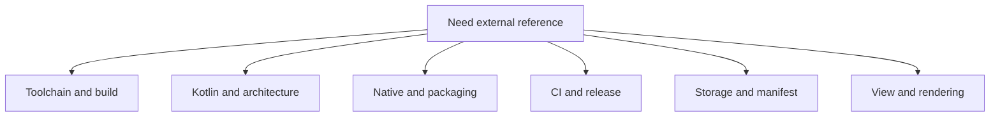

# Official References

This page groups the canonical external references that back the maintainer
docs and the checked-in Android workflow.

## Reference Map

## Upstream project surfaces

- [C47 GitLab project](https://gitlab.com/rpncalculators/c43): the authoritative
  upstream source repository consumed by this Android overlay. The GitLab path
  still uses the historical `c43` name even though the project identifies
  itself as C47.
- [C47 project wiki](https://gitlab.com/rpncalculators/c43/-/wikis/home):
  upstream project-maintained wiki surface linked from the upstream GitLab
  project when project-specific behavior or history matters.
- [C47 community wiki](https://gitlab.com/h2x/c47-wiki/-/wikis/home): community
  documentation hub that covers the broader C47 ecosystem, including R47
  variant context and user-facing project documentation.

## Spring 2026 toolchain references

- [Android Gradle plugin 9.2.0 release notes](https://developer.android.com/build/releases/agp-9-2-0-release-notes):
  official Android build release notes for the AGP line used by this repo;
  the current compatibility table lists JDK `17`, SDK Build Tools `36.0.0`,
  and API `36.1` support for the checked-in AGP line.
- [Kotlin release process](https://kotlinlang.org/docs/releases.html):
  official JetBrains release page documenting the language, tooling, and bug-fix
  cadence; the current page shows Kotlin `2.3.21` as the latest stable line in
  Spring 2026.
- [Gradle 9.5.0 release notes](https://docs.gradle.org/9.5.0/release-notes.html):
  official Gradle release notes for the wrapper version now checked in.
- [Version catalogs](https://docs.gradle.org/current/userguide/version_catalogs.html):
  Gradle guidance for centralizing dependency coordinates in
  `gradle/libs.versions.toml` and consuming them through `libs` accessors.
- [Android 16](https://developer.android.com/about/versions/16): official
  platform overview for API `36`, the checked-in compile and target SDK level.
- [CMake release notes index](https://cmake.org/cmake/help/latest/release/index.html):
  official release-note index for tracking when it is worth leaving the current
  checked-in CMake line.

## Architecture and Kotlin

- [Guide to app architecture](https://developer.android.com/topic/architecture):
  separation of concerns, state ownership, lifecycle boundaries, and
  single-source-of-truth guidance.
- [Get a result from an activity](https://developer.android.com/training/basics/intents/result):
  Activity Result API registration and lifecycle contract for SAF launchers.
- [ActivityResultCaller](https://developer.android.com/reference/androidx/activity/result/ActivityResultCaller):
  AndroidX API reference for `registerForActivityResult()` and unconditional
  registration rules.
- [Develop Android apps with Kotlin](https://developer.android.com/kotlin):
  Android-specific Kotlin guidance and tooling entry point.
- [Kotlin language documentation](https://kotlinlang.org/docs/home.html):
  language-level reference.

## Native and build integration

- [Configure your app module](https://developer.android.com/build/configure-app-module):
  package identity, SDK levels, and build-type fundamentals.
- [Add C and C++ code to your project](https://developer.android.com/studio/projects/add-native-code):
  the official Gradle plus CMake integration path.
- [Configure the NDK for the Android Gradle plugin](https://developer.android.com/studio/projects/configure-agp-ndk):
  `ndkVersion` guidance for AGP-based projects, including the command-line
  `sdkmanager` package syntax this repo uses in CI.
- [JNI tips](https://developer.android.com/ndk/guides/jni-tips): explicit
  registration, thread attachment, reference management, and exception rules.
- [Support 16 KB page sizes](https://developer.android.com/guide/practices/page-sizes):
  packaging, ELF alignment, and testing guidance for native apps.

## CI and release plumbing

- [Build your app for release to users](https://developer.android.com/build/build-for-release):
  APK, AAB, and signing guidance for the release lane defined by this repo.
- [Enable app optimization with R8](https://developer.android.com/build/shrink-code):
  current Android guidance to enable minify and resource shrinking for release
  builds.
- [Building and testing Java with Gradle](https://docs.github.com/en/actions/tutorials/build-and-test-code/java-with-gradle):
  GitHub Actions guidance for Gradle cache setup, Java toolchain setup, and
  Gradle-oriented workflow structure.
- [Passing information between jobs](https://docs.github.com/en/actions/how-tos/write-workflows/choose-what-workflows-do/pass-job-outputs):
  GitHub Actions guidance for promoting step outputs through
  `jobs.<job_id>.outputs` and consuming them in dependent jobs through
  `needs.<job_id>.outputs.*`.
- [Control workflow concurrency](https://docs.github.com/en/actions/how-tos/write-workflows/choose-when-workflows-run/control-workflow-concurrency):
  workflow-level concurrency controls used to cancel superseded runs for the
  same pull request or ref.
- [Store and share data with workflow artifacts](https://docs.github.com/en/actions/how-tos/writing-workflows/choosing-what-your-workflow-does/storing-and-sharing-data-from-a-workflow):
  artifact upload and download behavior for GitHub Actions.
- [Manage releases in a repository](https://docs.github.com/en/repositories/releasing-projects-on-github/managing-releases-in-a-repository):
  the release model used by the main-branch snapshot lane.

## Storage and file access

- [Access documents and other files from shared storage](https://developer.android.com/training/data-storage/shared/documents-files):
  SAF create, open, tree access, and persistable URI permissions.
- [Back up user data with Auto Backup](https://developer.android.com/identity/data/autobackup):
  backup defaults plus the `fullBackupContent` and `dataExtractionRules`
  formats used by the manifest.

## Manifest and platform behavior

- [<activity>](https://developer.android.com/guide/topics/manifest/activity-element):
  exported, `resizeableActivity`, `screenOrientation`, `configChanges`, and
  `onNewIntent()`-relevant launch-mode behavior.

## View-based UI and rendering

- [Responsive/adaptive design with views](https://developer.android.com/develop/ui/views/layout/responsive-adaptive-design-with-views):
  official large-screen and multi-window guidance for view-based apps.
- [Use window size classes](https://developer.android.com/develop/ui/views/layout/use-window-size-classes):
  breakpoint model for adaptive layouts.
- [Layout basics](https://m3.material.io/foundations/layout/understanding-layout/overview):
  current Material 3 guidance for canonical-layout-first design, panes,
  spacers, and window-size-class thinking.
- [Lists](https://m3.material.io/components/lists/overview):
  current Material 3 guidance for list scanning, slots, and the December 2025
  expressive update to list selection treatment.
- [Button groups](https://m3.material.io/components/button-groups/overview):
  current Material 3 replacement for deprecated segmented buttons when a future
  custom settings surface needs grouped option controls.
- [Create a custom drawing](https://developer.android.com/develop/ui/views/layout/custom-views/custom-drawing):
  `Canvas`, `Paint`, measurement, and drawing guidance for custom views.
- [Make custom views more accessible (Views)](https://developer.android.com/guide/topics/ui/accessibility/views/custom-views):
  directional-controller, click-action, accessibility-event, and
  accessibility-node guidance for custom interactive views.
