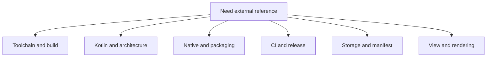

# Official References

This page groups the canonical external references that back the maintainer
docs and the checked-in Android workflow.

## Reference Map

## Upstream project surfaces

- [C47 GitLab project](https://gitlab.com/rpncalculators/c43): the authoritative
  upstream source repository consumed by this Android overlay. The GitLab path
  still uses the historical `c43` name even though the project identifies
  itself as C47.
- [C47 project wiki](https://gitlab.com/rpncalculators/c43/-/wikis/home):
  upstream project-maintained wiki surface linked from the upstream GitLab
  project when project-specific behavior or history matters.
- [C47 community wiki](https://gitlab.com/h2x/c47-wiki/-/wikis/home): community
  documentation hub that covers the broader C47 ecosystem, including R47
  variant context and user-facing project documentation.

## Spring 2026 toolchain references

- [Android Gradle plugin 9.2.0 release notes](https://developer.android.com/build/releases/agp-9-2-0-release-notes):
  official Android build release notes for the AGP line used by this repo;
  the current compatibility table lists JDK `17`, SDK Build Tools `36.0.0`,
  and API `36.1` support for the checked-in AGP line.
- [Kotlin release process](https://kotlinlang.org/docs/releases.html):
  official JetBrains release page documenting the language, tooling, and bug-fix
  cadence; the current page shows Kotlin `2.3.21` as the latest stable line in
  Spring 2026.
- [Gradle 9.5.0 release notes](https://docs.gradle.org/9.5.0/release-notes.html):
  official Gradle release notes for the wrapper version now checked in.
- [Version catalogs](https://docs.gradle.org/current/userguide/version_catalogs.html):
  Gradle guidance for centralizing dependency coordinates in
  `gradle/libs.versions.toml` and consuming them through `libs` accessors.
- [Android 16](https://developer.android.com/about/versions/16): official
  platform overview for API `36`, the checked-in compile and target SDK level.
- [CMake release notes index](https://cmake.org/cmake/help/latest/release/index.html):
  official release-note index for tracking when it is worth leaving the current
  checked-in CMake line.

## Architecture and Kotlin

- [Guide to app architecture](https://developer.android.com/topic/architecture):
  separation of concerns, state ownership, lifecycle boundaries, and
  single-source-of-truth guidance.
- [Fundamentals of testing Android apps](https://developer.android.com/training/testing/fundamentals):
  official Android guidance for local versus instrumented tests, test scope,
  and dependency decoupling; use this when deciding whether a repo contract
  belongs in Robolectric, instrumentation, or a host script.
- [Test your app's accessibility](https://developer.android.com/guide/topics/ui/accessibility/testing):
  official Android guidance for TalkBack, Switch Access, Accessibility
  Scanner, pre-launch accessibility reports, and other verification surfaces to
  use when a UI change claims accessibility improvement.
- [Get a result from an activity](https://developer.android.com/training/basics/intents/result):
  Activity Result API registration and lifecycle contract for SAF launchers.
- [ActivityResultCaller](https://developer.android.com/reference/androidx/activity/result/ActivityResultCaller):
  AndroidX API reference for `registerForActivityResult()` and unconditional
  registration rules.
- [Develop Android apps with Kotlin](https://developer.android.com/kotlin):
  Android-specific Kotlin guidance and tooling entry point.
- [Kotlin language documentation](https://kotlinlang.org/docs/home.html):
  language-level reference.

## Native and build integration

- [Configure your app module](https://developer.android.com/build/configure-app-module):
  package identity, SDK levels, and build-type fundamentals.
- [Add C and C++ code to your project](https://developer.android.com/studio/projects/add-native-code):
  the official Gradle plus CMake integration path.
- [Android ABIs](https://developer.android.com/ndk/guides/abis): ABI baselines,
  `abiFilters`, and the generic `arm64-v8a` contract this repo keeps for the
  shipped default artifact.
- [Android CPU features](https://developer.android.com/ndk/guides/cpu-features):
  native feature-probing guidance to use only if the repo ever adds same-ABI
  runtime dispatch.
- [Profile-guided Optimization](https://developer.android.com/ndk/guides/pgo):
  official NDK guidance for host-driven core optimization after the maintained
  Android ThinLTO baseline, including the note that library profiles are
  generally reusable across architectures unless the library has
  architecture-specific code paths.
- [Configure the NDK for the Android Gradle plugin](https://developer.android.com/studio/projects/configure-agp-ndk):
  `ndkVersion` guidance for AGP-based projects, including the command-line
  `sdkmanager` package syntax this repo uses in CI.
- [JNI tips](https://developer.android.com/ndk/guides/jni-tips): explicit
  registration, thread attachment, reference management, and exception rules.
- [target_compile_options](https://cmake.org/cmake/help/latest/command/target_compile_options.html):
  target-scoped compile-flag ownership, including config-specific generator
  expressions.
- [target_link_options](https://cmake.org/cmake/help/latest/command/target_link_options.html):
  target-scoped link-flag ownership for the Android ThinLTO plus `lld` path.
- [Support 16 KB page sizes](https://developer.android.com/guide/practices/page-sizes):
  packaging, ELF alignment, and testing guidance for native apps.

## CI and release plumbing

- [Build your app for release to users](https://developer.android.com/build/build-for-release):
  APK, AAB, and signing guidance for the release lane defined by this repo.
- [Use Play App Signing](https://support.google.com/googleplay/android-developer/answer/9842756):
  official Google Play guidance for upload keys, app-signing-key custody,
  bundle-first release flow, and upload-key reset behavior.
- [Enable app optimization with R8](https://developer.android.com/build/shrink-code):
  current Android guidance to enable minify and resource shrinking for release
  builds.
- [Building and testing Java with Gradle](https://docs.github.com/en/actions/tutorials/build-and-test-code/java-with-gradle):
  GitHub Actions guidance for Gradle cache setup, Java toolchain setup, and
  Gradle-oriented workflow structure.
- [Using secrets in GitHub Actions](https://docs.github.com/en/actions/security-for-github-actions/security-guides/using-secrets-in-github-actions):
  GitHub guidance for repository and environment secrets, shell-safe secret
  handling, and the Base64 binary-blob pattern used for small upload keystores.
- [Deployments and environments](https://docs.github.com/en/actions/reference/workflows-and-actions/deployments-and-environments):
  environment protection rules, required reviewers, deployment branch
  restrictions, and environment-secret gating for the protected release lane.
- [Passing information between jobs](https://docs.github.com/en/actions/how-tos/write-workflows/choose-what-workflows-do/pass-job-outputs):
  GitHub Actions guidance for promoting step outputs through
  `jobs.<job_id>.outputs` and consuming them in dependent jobs through
  `needs.<job_id>.outputs.*`.
- [Control workflow concurrency](https://docs.github.com/en/actions/how-tos/write-workflows/choose-when-workflows-run/control-workflow-concurrency):
  workflow-level concurrency controls used to cancel superseded runs for the
  same pull request or ref.
- [Store and share data with workflow artifacts](https://docs.github.com/en/actions/how-tos/writing-workflows/choosing-what-your-workflow-does/storing-and-sharing-data-from-a-workflow):
  artifact upload and download behavior for GitHub Actions.
- [Manage releases in a repository](https://docs.github.com/en/repositories/releasing-projects-on-github/managing-releases-in-a-repository):
  the release model used by the main-branch snapshot lane.

## Google Play setup and policy

- [Create and set up your app](https://support.google.com/googleplay/android-developer/answer/9859152):
  Play Console app creation, package-name permanence, app contact details, and
  the initial Play App Signing and declaration flow.
- [Prepare your app for review](https://support.google.com/googleplay/android-developer/answer/9859455):
  App content requirements such as privacy policy, ads declaration, app access,
  target audience, content ratings, and special declarations.
- [Provide information for Google Play's Data safety section](https://support.google.com/googleplay/android-developer/answer/10787469):
  required Data safety submission flow, including the requirement that every
  Play app completes the form.
- [User Data](https://support.google.com/googleplay/android-developer/answer/10144311):
  privacy-policy requirements, data-use restrictions, disclosure rules, and the
  account-deletion rule when an app creates user accounts.
- [Target API level requirements for Google Play apps](https://support.google.com/googleplay/android-developer/answer/11926878):
  current new-app and update target SDK floors for Google Play distribution.
- [Best practices for your store listing](https://support.google.com/googleplay/android-developer/answer/13393723):
  app title, short description, full description, icon, screenshot, and feature
  graphic rules used for store-facing naming and anti-impersonation review.
- [Manage target audience and app content settings](https://support.google.com/googleplay/android-developer/answer/9867159):
  target-age selection, neutral age screen guidance, and child-directed scope
  boundaries.
- [Google Play Families Policies](https://support.google.com/googleplay/android-developer/answer/9893335):
  child-directed app rules, underage data limits, ad constraints, and legal
  obligations when a product targets children.
- [Content rating requirements for apps, games, and the ads served on both](https://support.google.com/googleplay/android-developer/answer/9859655):
  IARC questionnaire and rating-authority flow for Play publication.
- [App testing requirements for new personal developer accounts](https://support.google.com/googleplay/android-developer/answer/14151465):
  closed-test and production-access gate that can block first release even when
  the bundle is otherwise ready.

## Storage and file access

- [Access documents and other files from shared storage](https://developer.android.com/training/data-storage/shared/documents-files):
  SAF create, open, tree access, and persistable URI permissions.
- [Back up user data with Auto Backup](https://developer.android.com/identity/data/autobackup):
  backup defaults plus the `fullBackupContent` and `dataExtractionRules`
  formats used by the manifest.

## Manifest and platform behavior

- [<activity>](https://developer.android.com/guide/topics/manifest/activity-element):
  exported, `resizeableActivity`, `screenOrientation`, `configChanges`, and
  `onNewIntent()`-relevant launch-mode behavior.

## View-based UI and rendering

- [Add haptic feedback to events](https://developer.android.com/develop/ui/views/haptics/haptic-feedback):
  official Android haptics guidance for view-based feedback, predefined
  `VibrationEffect` usage, fallback tradeoffs, and keypress interaction
  constants. The doc includes press/release examples, but this app now keeps a
  press-only keypad pulse for calculator interaction, defaults to the Android
  system response through a dedicated toggle, and reserves the custom
  `0..100 ms` slider for explicit app-owned override behavior.
- [Haptics design principles](https://developer.android.com/develop/ui/views/haptics/haptics-principles):
  official Android guidance for subtle frequent touch feedback, matching
  effect strength to event importance, and avoiding overly long or buzzy
  keypress vibrations.
- [VibrationEffect](https://developer.android.com/reference/android/os/VibrationEffect):
  Android API reference for one-shot and waveform amplitude bounds, predefined
  effects, and newer composition APIs.
- [Implement dark theme](https://developer.android.com/develop/ui/views/theming/darktheme):
  official DayNight, dark-theme, and Force Dark guidance for view-based apps;
  use this when deciding whether a settings surface should follow the system,
  opt into a dedicated dark theme, or expose an in-app override.
- [AppCompatDelegate](https://developer.android.com/reference/androidx/appcompat/app/AppCompatDelegate):
  official AppCompat night-mode override API reference, including
  `setLocalNightMode()` and its `uiMode` recreation behavior.
- [Display content edge-to-edge in views](https://developer.android.com/develop/ui/views/layout/edge-to-edge):
  visible-system-bar, inset, icon-contrast, and scrim guidance for view-based
  activities that draw behind or alongside system bars.
- [Hide system bars for immersive mode](https://developer.android.com/develop/ui/views/layout/immersive):
  `WindowInsetsControllerCompat.hide()` and `show()` behavior plus transient
  bar guidance for fullscreen content.
- [Responsive/adaptive design with views](https://developer.android.com/develop/ui/views/layout/responsive-adaptive-design-with-views):
  official large-screen and multi-window guidance for view-based apps,
  including `ConstraintLayout` recommendations and alternative layout-resource
  qualifiers such as `layout-w600dp`.
- [Use window size classes](https://developer.android.com/develop/ui/views/layout/use-window-size-classes):
  breakpoint model for adaptive layouts.
- [Add a font as an XML resource](https://developer.android.com/develop/ui/views/text-and-emoji/fonts-in-xml):
  official Android guidance for bundling font files or families and retrieving
  them as `Typeface` resources; use this when evaluating future Android-only
  font-family packaging, but keep in mind that this repo also uses the same
  canonical TTFs as native raster-font inputs under repo-root `res/fonts`.
- [Autosize TextViews](https://developer.android.com/develop/ui/views/text-and-emoji/autosizing-textview):
  official Android guidance for bounded dynamic `TextView` content, uniform
  autosize ranges, and preset sizes; use this when a text surface becomes truly
  dynamic, but keep keypad legends on the contract-owned fitted-sizing path
  unless the geometry contract is intentionally reopened.
- [Preference components and attributes](https://developer.android.com/develop/ui/views/components/settings/components-and-attributes):
  `PreferenceScreen`, `PreferenceCategory`, `SwitchPreferenceCompat`, summary
  attributes, dependency relationships, `SeekBarPreference`, and XML ownership
  guidance for settings screens.
- [Use saved Preference values](https://developer.android.com/develop/ui/views/components/settings/use-saved-values):
  preference persistence plus `OnPreferenceChangeListener` and
  `OnSharedPreferenceChangeListener` guidance when settings text, summary
  providers, or behavior must update at runtime.
- [Principles for improving app accessibility](https://developer.android.com/guide/topics/ui/accessibility/principles):
  official Android guidance for meaningful labels, built-in accessibility
  features, and using cues other than color; use this when settings copy or
  display themes risk relying on color alone.
- [WCAG 2.2 Contrast (Minimum)](https://www.w3.org/WAI/WCAG22/Understanding/contrast-minimum.html):
  canonical secondary accessibility reference for minimum text contrast ratios;
  use this after the Android implementation docs when a palette decision needs
  an explicit contrast floor.
- [WCAG 2.2 Use of Color](https://www.w3.org/WAI/WCAG22/Understanding/use-of-color.html):
  canonical secondary accessibility reference for avoiding color-only meaning;
  use this after the Android implementation docs when evaluating whether a UI
  surface still communicates through text, shape, or layout.
- [Layout basics](https://m3.material.io/foundations/layout/understanding-layout/overview):
  current Material 3 guidance for canonical-layout-first design, panes,
  spacers, and window-size-class thinking.
- [Lists](https://m3.material.io/components/lists/overview):
  current Material 3 guidance for list scanning, slots, and the December 2025
  expressive update to list selection treatment.
- [Button groups](https://m3.material.io/components/button-groups/overview):
  current Material 3 replacement for deprecated segmented buttons when a future
  custom settings surface needs grouped option controls.
- [Create a custom drawing](https://developer.android.com/develop/ui/views/layout/custom-views/custom-drawing):
  `Canvas`, `Paint`, measurement, and drawing guidance for custom views,
  including the rule to create drawing objects ahead of time and move
  size-dependent geometry into `onSizeChanged()`.
- [Optimize a custom view](https://developer.android.com/develop/ui/views/layout/custom-views/optimizing-view):
  official custom-view hot-path guidance for keeping `onDraw()` lean,
  eliminating avoidable allocations during drawing, minimizing unnecessary
  `invalidate()` calls, and avoiding stray `requestLayout()` churn.
- [How Android draws views](https://developer.android.com/guide/topics/ui/how-android-draws):
  official measure, layout, and draw-pass overview for View-based rendering,
  including invalid-region behavior and when `requestLayout()` rather than
  `invalidate()` is the correct owner path.
- [Canvas.drawText](https://developer.android.com/reference/android/graphics/Canvas#drawText(java.lang.String,float,float,android.graphics.Paint)):
  direct text-draw API for custom `Canvas` owners that render text with a
  caller-supplied `Paint`.
- [Paint](https://developer.android.com/reference/android/graphics/Paint):
  official Android API reference for `ANTI_ALIAS_FLAG`,
  `SUBPIXEL_TEXT_FLAG`, `LINEAR_TEXT_FLAG`, `measureText(...)`, and the text
  measurement and font-metrics APIs that can change both glyph metrics and draw
  behavior; the `LINEAR_TEXT_FLAG` entry explicitly notes that it disables font
  hinting and is intended for smooth scale transitions rather than as a default
  steady-state keypad legend flag.
- [TextPaint](https://developer.android.com/reference/android/text/TextPaint):
  `Paint` subclass used for text measurement and drawing in widget text paths.
- [AOSP TextView.java](https://android.googlesource.com/platform/frameworks/base/+/refs/heads/main/core/java/android/widget/TextView.java):
  current platform source initializes widget text with
  `mTextPaint = new TextPaint(Paint.ANTI_ALIAS_FLAG)`, which explains why the
  earlier explicit antialias experiment on this repo's widget-backed main-key
  path could appear to do nothing before the keypad text path was unified under
  custom painting.
- [Layout](https://developer.android.com/reference/android/text/Layout):
  Android's base text-layout class for visual elements on screen; built with a
  `TextPaint`, exposes `draw(Canvas)`, and documents that its `TextPaint`
  remains in active use for drawing and measuring text.
- [StaticLayout](https://developer.android.com/reference/android/text/StaticLayout):
  widget-oriented text layout path that Android explicitly contrasts with the
  direct `Canvas.drawText(...)` route for custom display objects.
- [PrecomputedText.Params](https://developer.android.com/reference/android/text/PrecomputedText.Params):
  Android text-measurement contract object that packages the `TextPaint`, break
  strategy, hyphenation, and text-direction inputs used for layout work outside
  a final `TextView` or `StaticLayout`.
- [Slow rendering](https://developer.android.com/topic/performance/vitals/render):
  official Android vitals guidance for keeping View-based rendering under the
  frame budget and for avoiding avoidable UI-thread allocation or draw-path
  work when investigating jank.
- [Make custom views more accessible (Views)](https://developer.android.com/guide/topics/ui/accessibility/views/custom-views):
  directional-controller, click-action, accessibility-event, and
  accessibility-node guidance for custom interactive views.
