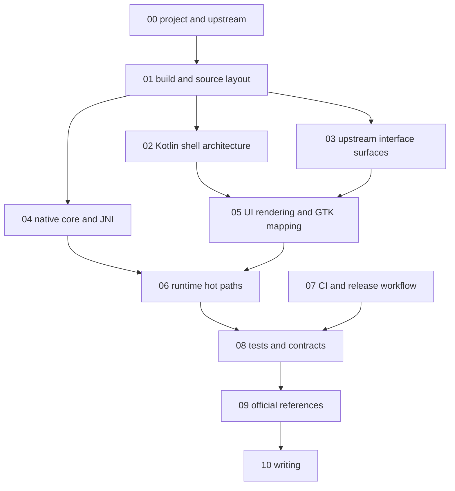

# Android Development Docs

This directory is the active Android maintainer documentation surface for the
checked-in R47 shell.

These pages are code-facing maintainer docs, not end-user usage docs.

Start with the project page, then the build page. The rest of the set assumes
you already know what this repo owns, what the upstream C47 project owns, and
where the Android overlay boundary sits.

## Maintainer Doc Flow

## Read In Order

- [00-project-and-upstream.md](00-project-and-upstream.md): what this repo is,
  what the upstream C47 project is, what this repo owns, and how the Android
  overlay interfaces with upstream-owned sources and runtime behavior.
- [01-build-and-source-layout.md](01-build-and-source-layout.md): build
  entrypoints, ownership boundaries, staged inputs, compile flow, and
  checkout-sensitive root surfaces.
- [02-kotlin-shell-architecture.md](02-kotlin-shell-architecture.md): Android
  lifecycle, helper ownership, storage, settings, slot flow, input flow, and
  direct live-stop routing.
- [03-upstream-interface-surfaces.md](03-upstream-interface-surfaces.md): the
  detailed interface from the Android shell into upstream-owned runtime
  behavior.
- [04-native-core-and-jni.md](04-native-core-and-jni.md): CMake, JNI
  registration, Android HAL seams, SAF bridge behavior, and native packaging.
- [05-ui-rendering-and-gtk-mapping.md](05-ui-rendering-and-gtk-mapping.md):
  logical canvas, LCD projection, keypad geometry, and renderer rules.
- [06-runtime-hot-paths.md](06-runtime-hot-paths.md): the main hot loops,
  redraw paths, and regression-sensitive lock boundaries.
- [07-ci-and-release-workflow.md](07-ci-and-release-workflow.md): GitHub
  Actions lane split, release gating, artifacts, and local reproduction.
- [08-tests-and-contracts.md](08-tests-and-contracts.md): the maintainer map
  of verification surfaces, contract owners, focused test suites, and first
  rerun lanes.
- [09-official-references.md](09-official-references.md): official Android,
  NDK, Gradle, Kotlin, GitHub Actions, and upstream reference surfaces.
- [10-writing.md](10-writing.md): the rules for the doc pages, the code
  comments, and the commit messages, plus which pages run hot.
- [backlog.md](backlog.md): durable in-tree list of known-deferred work.
- [release-history.md](release-history.md): the upstream-commit-per-release
  traceability log.

## By Task

- build break, stale staged inputs, or checkout drift:
  [01-build-and-source-layout.md](01-build-and-source-layout.md)
- JNI, SAF, or Android-native bridge change:
  [03-upstream-interface-surfaces.md](03-upstream-interface-surfaces.md) and
  [04-native-core-and-jni.md](04-native-core-and-jni.md)
- renderer, geometry, or keypad-scene drift:
  [05-ui-rendering-and-gtk-mapping.md](05-ui-rendering-and-gtk-mapping.md),
  [06-runtime-hot-paths.md](06-runtime-hot-paths.md), and
  [08-tests-and-contracts.md](08-tests-and-contracts.md)
- verification planning, contract ownership, or CI test routing:
  [08-tests-and-contracts.md](08-tests-and-contracts.md) and
  [07-ci-and-release-workflow.md](07-ci-and-release-workflow.md)
- long-running stop parity, live touch `EXIT` handling, or desktop-stop
  comparisons:
  [02-kotlin-shell-architecture.md](02-kotlin-shell-architecture.md),
  [03-upstream-interface-surfaces.md](03-upstream-interface-surfaces.md),
  [06-runtime-hot-paths.md](06-runtime-hot-paths.md),
  [08-tests-and-contracts.md](08-tests-and-contracts.md), and
  [09-official-references.md](09-official-references.md)
- writing a page, a code comment, or a commit message:
  [10-writing.md](10-writing.md)

## Maintainer Update Workflow

Use one promotion workflow when a non-trivial task changes Android behavior,
contracts, or verification.

1. Record the task analysis, options, implementation notes, and verification in
  the current iteration working doc first.
2. Keep exploratory notes and provisional claims there while the code and test
  result are still moving.
3. After the implementation and focused verification settle, promote the final
  contract changes into every affected maintained page in one pass.
4. Keep these pages authoritative and durable. Leave dead ends, experiments,
  and superseded commit ideas in the working doc instead of carrying them into
  the maintained reference set.

[10-writing.md](10-writing.md) owns how these pages are written and marks which
of them run hot; it is not restated here.

## Build Entry Points

Maintainer entrypoints:

- `./scripts/upstream-sync/upstream.sh sync --auto --write-lock` hydrates or
  refreshes the authoritative upstream core inputs.
- `./scripts/android/build_android.sh` is the canonical Android debug-build
  path.
- `cd android && ./gradlew lint` is the maintained module-local lint lane when
  Kotlin, Java, manifest, resource, or Android Gradle changes are in scope and
  the staged native inputs are already current.
- `cd android && ./gradlew ...` is the fast module-local maintenance lane only
  when the staged native inputs are already current.

Two rules govern most Android work in this repository:

1. Shared calculator behavior stays rooted in the synced upstream-shaped tree
   plus generated outputs from `build.sim`.
2. The build-only Android native input tree lives under
   `android/.staged-native/cpp`, while
  `android/app/src/main/cpp/r47zen` stays the Android-owned bridge, HAL,
   and stub surface.

## Repo-Owned Automation Layout

- `scripts/` owns repo-only automation.
- `scripts/upstream-sync/` owns grouped upstream resolution and sync helpers.
- `scripts/android/` owns Android build, staging, packaging, and helper
  implementation.
- `scripts/r47_contracts/` owns the checked-in physical and Android UI
  contract sources plus the Python derivation and validation tools that lock
  Kotlin geometry and layout owners to those sources, including the shared
  keyboard-layout contract JSON consumed by JVM parity tests. The grouped
  maintained entry point is `bash ./scripts/r47_contracts/run_contract_suite.sh`.
- `scripts/keypad-fixtures/`, `scripts/package-notices/`, and
  `scripts/workload-regressions/` own the fixture export, notice generation,
  and host workload lanes.

Use `./scripts/android/build_android.sh --doctor` to inspect host and staging
readiness, and `./scripts/android/build_android.sh --android-only` for the fast
module-local lane when staged native inputs are current.

If a change crosses Kotlin, JNI, and rendering ownership at the same time, read
the project page, the build page, the Kotlin page, the JNI page, and the
upstream-interface page before editing.
