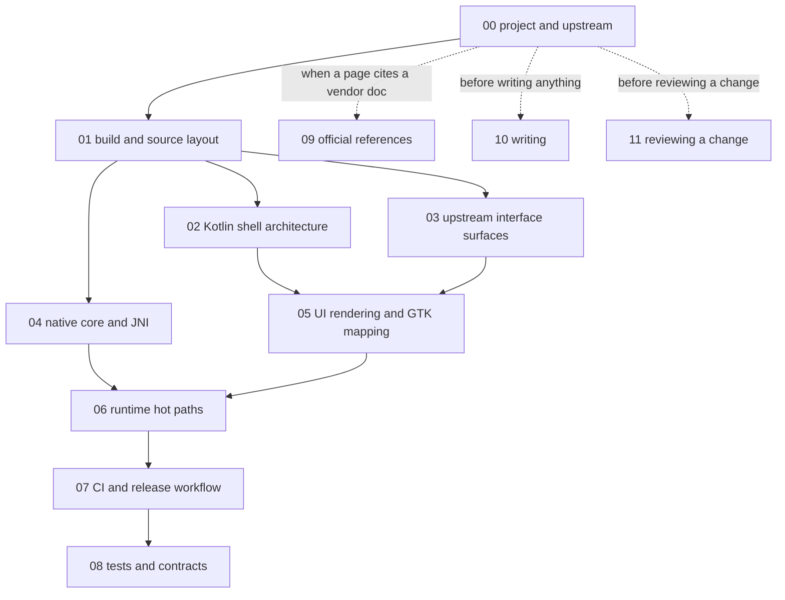

# Android Development Docs

These pages are the maintainer reference for R47 Zen, the Android shell, build
pipeline, and maintainer overlay around the upstream C47 calculator core. The
core is not tracked here: a sync hydrates it from upstream, and the build
stages a copy of it for the NDK. The pages are code-facing, not end-user
usage docs.

[AGENTS.md](../../../AGENTS.md) at the repository root is the one-page short
form: the commands, the traps, and the rules, each linked to the page here
that owns it. Read it first, then the project page and the build page; the
rest of the set assumes you know what this repo owns, what upstream owns, and
where the overlay boundary sits.

## Maintainer Doc Flow

```mermaid
flowchart TD
  A[00 project and upstream]
  B[01 build and source layout]
  C[02 Kotlin shell architecture]
  D[03 upstream interface surfaces]
  E[04 native core and JNI]
  F[05 UI rendering and GTK mapping]
  G[06 runtime hot paths]
  H[07 CI and release workflow]
  I[08 tests and contracts]
  J[09 official references]
  K[10 writing]
  L[11 reviewing a change]

  A --> B
  B --> C
  B --> D
  B --> E
  C --> F
  D --> F
  E --> G
  F --> G
  G --> H
  H --> I
  A -.->|before writing anything| K
  A -.->|before reviewing a change| L
  A -.->|when a page cites a vendor doc| J
```

The solid path is the reading order for the code. 10 and 11 are not the end
of it: read 10 before you write a page, a comment, or a commit, and 11 before
you review one.

## Read In Order

- [00-project-and-upstream.md](00-project-and-upstream.md): what this repo is,
  what the upstream C47 project is, what this repo owns, and how the Android
  overlay interfaces with upstream-owned sources and runtime behavior.
- [01-build-and-source-layout.md](01-build-and-source-layout.md): build
  entrypoints, ownership boundaries, staged inputs, compile flow, and
  checkout-sensitive root surfaces.
- [02-kotlin-shell-architecture.md](02-kotlin-shell-architecture.md): Android
  lifecycle, helper ownership, storage, settings, slot flow, input flow, and
  direct live-stop routing.
- [03-upstream-interface-surfaces.md](03-upstream-interface-surfaces.md): the
  detailed interface from the Android shell into upstream-owned runtime
  behavior.
- [04-native-core-and-jni.md](04-native-core-and-jni.md): CMake, JNI
  registration, Android HAL seams, SAF bridge behavior, and native packaging.
- [05-ui-rendering-and-gtk-mapping.md](05-ui-rendering-and-gtk-mapping.md):
  logical canvas, LCD projection, keypad geometry, and renderer rules.
- [06-runtime-hot-paths.md](06-runtime-hot-paths.md): the main hot loops,
  redraw paths, and regression-sensitive lock boundaries.
- [07-ci-and-release-workflow.md](07-ci-and-release-workflow.md): GitHub
  Actions lane split, release gating, artifacts, and local reproduction.
- [08-tests-and-contracts.md](08-tests-and-contracts.md): the maintainer map
  of verification surfaces, contract owners, focused test suites, and first
  rerun lanes.
- [09-official-references.md](09-official-references.md): official Android,
  NDK, Gradle, Kotlin, GitHub Actions, and upstream reference surfaces.
- [10-writing.md](10-writing.md): the rules for the doc pages, the code
  comments, and the commit messages, plus which pages run hot.
- [11-reviewing-a-change.md](11-reviewing-a-change.md): the four checks for a
  change or an audit that crosses a seam, and where each seam's state
  inventory lives.

## By Task

- build break, stale staged inputs, or checkout drift:
  [01-build-and-source-layout.md](01-build-and-source-layout.md)
- JNI, SAF, or Android-native bridge change:
  [03-upstream-interface-surfaces.md](03-upstream-interface-surfaces.md) and
  [04-native-core-and-jni.md](04-native-core-and-jni.md)
- renderer, geometry, or keypad-scene drift:
  [05-ui-rendering-and-gtk-mapping.md](05-ui-rendering-and-gtk-mapping.md),
  [06-runtime-hot-paths.md](06-runtime-hot-paths.md), and
  [08-tests-and-contracts.md](08-tests-and-contracts.md)
- verification planning, contract ownership, or CI test routing:
  [08-tests-and-contracts.md](08-tests-and-contracts.md) and
  [07-ci-and-release-workflow.md](07-ci-and-release-workflow.md)
- long-running stop parity, live touch `EXIT` handling, or desktop-stop
  comparisons:
  [02-kotlin-shell-architecture.md](02-kotlin-shell-architecture.md),
  [03-upstream-interface-surfaces.md](03-upstream-interface-surfaces.md),
  [06-runtime-hot-paths.md](06-runtime-hot-paths.md),
  [08-tests-and-contracts.md](08-tests-and-contracts.md), and
  [09-official-references.md](09-official-references.md)
- writing a page, a code comment, or a commit message:
  [10-writing.md](10-writing.md)
- reviewing a change, or auditing code, where state crosses a thread, the JNI
  boundary, or a cache: [11-reviewing-a-change.md](11-reviewing-a-change.md)

## Maintainer Update Workflow

Use one promotion workflow when a non-trivial task changes Android behavior,
contracts, or verification.

1. Draft the task analysis, options, implementation notes, and verification
  outside the maintained pages first; nothing a reader needs may live only in
  a draft.
2. Keep exploratory notes and provisional claims in the draft while the code
  and test result are still moving.
3. After the implementation and focused verification settle, promote the final
  contract changes into every affected maintained page in one pass.
4. Keep these pages authoritative and durable. Leave dead ends, experiments,
  and superseded commit ideas in the draft instead of carrying them into
  the maintained reference set.

[10-writing.md](10-writing.md) owns how these pages are written and marks which
of them run hot; it is not restated here.

## Build Entry Points

AGENTS.md's short workflow lists the commands.
[01-build-and-source-layout.md](01-build-and-source-layout.md#build-entry-points)
owns what each one does, and when the module-local Gradle lane is valid;
[canonical versus staged native inputs](01-build-and-source-layout.md#canonical-versus-staged-native-inputs)
owns which tree to edit.

## Repo-Owned Automation Layout

- `scripts/` owns repo-only automation.
- `scripts/upstream-sync/` owns grouped upstream resolution and sync helpers.
- `scripts/android/` owns Android build, staging, packaging, and helper
  implementation.
- `scripts/r47_contracts/` owns the checked-in physical and Android UI
  contract sources plus the Python derivation and validation tools that lock
  Kotlin geometry and layout owners to those sources, including the shared
  keyboard-layout contract JSON consumed by JVM parity tests. The grouped
  maintained entry point is `bash ./scripts/r47_contracts/run_contract_suite.sh`.
- `scripts/keypad-fixtures/`, `scripts/package-notices/`, and
  `scripts/workload-regressions/` own the fixture export, notice generation,
  and host workload lanes.

If a change crosses Kotlin, JNI, and rendering ownership at the same time, read
the project page, the build page, the Kotlin page, the JNI page, and the
upstream-interface page before editing.
